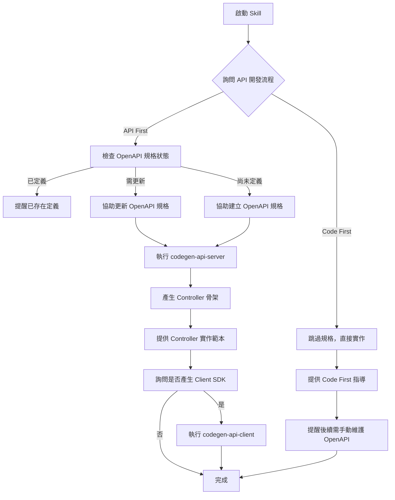

### ⚠️ 前置條件
本 SKILL 須搭配閱讀：
- [開發規則](../../development-rules.md)
- [決策框架 - API 開發流程](../../decision-framework.md#api-開發流程決策)

# API Development Skill

## 描述
API 開發流程引導技能，協助開發者選擇合適的開發流程（API First 或 Code First），並提供 OpenAPI 規格管理、程式碼產生等自動化支援。

## 職責
- 引導選擇 API First 或 Code First 開發流程
- 協助更新/建立 OpenAPI 規格（doc/openapi.yml，相對於套用範本後的目標專案根目錄）；OpenAPI 規格會自動透過 FileResolver 取得，開發者可在本地 `dotnet-project-template/doc/openapi.yml` 編輯
  - **取得規格**: `node .claude/skills/shared/FileResolver.js get-content dotnet-project-template/doc/openapi.yml`
- 產生 Server Controller 骨架
- 產生 Client SDK
- 提供 Controller 實作指導

## 能力

### 1. 開發流程決策引導
協助開發者根據專案需求選擇合適的 API 開發流程：
- **API First（推薦）**：契約優先，文件與實作同步
- **Code First**：快速開發，後續維護文件

### 2. OpenAPI 規格管理
- 使用 FileResolver 自動解析 doc/openapi.yml（本地優先，找不到時自動從 GitHub 取得，無需手動下載範本專案）
- 引導新增/修改 API 端點定義
- 提供 OpenAPI 3.0 規格範本
- 驗證規格檔案格式

### 3. 程式碼自動產生
- **Server Controller 產生**：執行 `task codegen-api-server`
- **Client SDK 產生**：執行 `task codegen-api-client`
- 產生位置自動化管理

### 4. Controller 實作協助
- 提供 Controller 實作範本
- Result Pattern 整合指導
- HTTP 狀態碼映射建議

## 使用方式

### 在 GitHub Copilot 中使用
```
@workspace 我想要開發新的 API 端點
```

### 直接呼叫 Skill
```
使用 api-development 開發 API
```

## 互動流程



## 互動問答範例

### 問題 1：API 開發流程選擇

```
請選擇 API 開發流程：

1️⃣ API First（推薦）
   ✅ API 文件與實作 100% 同步
   ✅ 前後端可並行開發
   ✅ 自動產生 Client SDK
   ✅ 編譯時契約檢查
   ⚠️ 需先設計 API 規格

   適用場景：
   - 前後端分離且團隊並行開發
   - 需要提供 Client SDK 給第三方
   - API 穩定性要求高
   - 多個客戶端（Web、Mobile、Desktop）

2️⃣ Code First
   ✅ 快速啟動開發
   ✅ 直接實作程式碼
   ⚠️ 需手動維護 API 文件
   ⚠️ 文件與實作可能不同步

   適用場景：
   - 快速原型驗證
   - 內部小型專案
   - API 結構仍在快速變動中
   - 單人開發或小團隊
```

### 問題 2：OpenAPI 規格定義狀態（僅 API First）

```
請確認 OpenAPI 規格狀態：

1️⃣ 已定義
   - doc/openapi.yml 已包含此 API 的端點定義
   - 我只需要產生程式碼

2️⃣ 需要更新
   - doc/openapi.yml 存在但需要加入新的端點
   - 我需要協助修改規格

3️⃣ 尚未定義
   - doc/openapi.yml 不存在或沒有此端點
   - 我需要從頭建立規格
```

### 問題 2.5：確認 API 開發方式

```
請確認此專案的 API 開發方式：

1️⃣ API First（推薦用於團隊協作、Client SDK 需求）
   - 預先定義 OpenAPI 規格（openapi.yaml）
   - 自動產生 Controller 骨架
   - 命名約定：XxxControllerImpl
   - 適用：公開 API、大型團隊、Client SDK 分發

2️⃣ Code First（推薦用於快速原型、內部小型專案）
   - 直接編寫 Controller 類別，無預先規格
   - 使用 Route 和 HttpMethod 特性定義端點
   - 命名約定：XxxController（無 Impl 後綴）
   - 適用：快速原型、內部 API、小型團隊

⚠️ 重要：同一專案內只能選擇一種方式，不得混用
```

### 問題 3：需要實作的分層

```
請選擇需要實作的分層（可多選）：

☑️ Controller
   - HTTP 請求處理與路由
   - 請求驗證
   - HTTP 狀態碼對應

☑️ Handler
   - 業務邏輯處理
   - 流程協調
   - 錯誤處理與結果封裝

☑️ Repository
   - 資料存取邏輯
   - EF Core 操作
   - 資料庫查詢封裝

提示：通常需要三層都實作以完成完整功能
```

### 問題 4：是否產生 Client SDK

```
是否需要產生 Client SDK？

1️⃣ 是，產生 Client SDK
   - 自動產生強型別 API 客戶端
   - 前端可直接使用
   - 完整的 IntelliSense 支援
   - 產生位置：JobBank1111.Job.Contract/AutoGenerated/

2️⃣ 否，暫不產生
   - 僅產生 Server Controller
   - 後續可隨時執行 task codegen-api-client
```

## OpenAPI 規格範本

### 端點定義範例

```yaml
paths:
  /api/v1/members:
    post:
      summary: 建立新會員
      operationId: CreateMember
      tags:
        - Member
      requestBody:
        required: true
        content:
          application/json:
            schema:
              $ref: '#/components/schemas/CreateMemberRequest'
      responses:
        '201':
          description: 會員建立成功
          content:
            application/json:
              schema:
                $ref: '#/components/schemas/MemberResponse'
        '400':
          description: 請求驗證失敗
          content:
            application/json:
              schema:
                $ref: '#/components/schemas/Failure'
        '409':
          description: Email 已被使用
          content:
            application/json:
              schema:
                $ref: '#/components/schemas/Failure'
        '500':
          description: 內部伺服器錯誤
          content:
            application/json:
              schema:
                $ref: '#/components/schemas/Failure'

components:
  schemas:
    CreateMemberRequest:
      type: object
      required:
        - email
        - name
      properties:
        email:
          type: string
          format: email
          example: "user@example.com"
        name:
          type: string
          minLength: 1
          maxLength: 100
          example: "張三"
        phone:
          type: string
          pattern: '^\d{10}$'
          example: "0912345678"

    MemberResponse:
      type: object
      properties:
        id:
          type: string
          format: uuid
        email:
          type: string
        name:
          type: string
        createdAt:
          type: string
          format: date-time
```

## 程式碼產生命令

### Server Controller 產生
```bash
# 執行 Taskfile 命令
task codegen-api-server

# 產生位置
# JobBank1111.Job.WebAPI/Contract/AutoGenerated/
```

### Client SDK 產生
```bash
# 執行 Taskfile 命令
task codegen-api-client

# 產生位置
# JobBank1111.Job.Contract/AutoGenerated/
```

## Controller 實作指導

### API First: 實作自動產生的介面

產生的 Controller 骨架需要實作自動產生的介面，整合以下元件：

1. **Handler 整合**：呼叫業務邏輯層
2. **Result Pattern 處理**：轉換 Result 為 HTTP 回應
3. **HTTP 狀態碼映射**：使用 FailureCodeMapper

**命名約定**：使用 `XxxControllerImpl` 命名（Impl 後綴表示 API First 實作）

完整實作範本請參考生產代碼（透過 FileResolver）：
```bash
node .claude/skills/shared/FileResolver.js get-content \
  JobBank1111.Job.WebAPI/Member/MemberV1ControllerImpl.cs
```

### Code First: 直接實作無預先介面

無需實作自動產生的介面，直接建立 Controller 類別實作業務邏輯：

1. **直接定義 API 端點**：使用 Route 和 HttpMethod 特性
2. **Handler 整合**：同樣呼叫業務邏輯層
3. **Result Pattern 處理**：同樣轉換 Result 為 HTTP 回應
4. **HTTP 狀態碼映射**：同樣使用 FailureCodeMapper

**命名約定**：使用 `XxxController` 命名（無 Impl 後綴表示 Code First 實作）

**重要提醒**：Code First 開發完成後，需手動維護 OpenAPI 規格文件以保持文件同步。

## API First vs Code First 對比

| 比較項目 | API First（推薦） | Code First |
|---------|------------------|-----------|
| **文件同步** | ✅ 自動 100% 同步 | ❌ 需手動維護 |
| **前後端協作** | ✅ 可並行開發 | ⚠️ 需等後端完成 |
| **契約保證** | ✅ 編譯時檢查 | ❌ 執行時才發現 |
| **Client SDK** | ✅ 自動產生 | ❌ 需手動實作 |
| **開發速度** | ⚠️ 需先設計 API | ✅ 快速啟動 |
| **維護成本** | ✅ 低（自動同步） | ❌ 高（手動維護） |
| **團隊協作** | ✅ 優秀 | ⚠️ 一般 |
| **適用場景** | 中大型專案、團隊協作 | 小型專案、快速原型 |

## 完整開發流程範例（API First）

### 步驟 1：定義 OpenAPI 規格
編輯 `doc/openapi.yml`，新增 API 端點定義。

> OpenAPI 規格會自動透過 FileResolver 取得（本地優先，找不到時從 GitHub 下載並快取）。開發者可在本地 `dotnet-project-template/doc/openapi.yml` 直接編輯。

### 步驟 2：產生 Server Controller
```bash
task codegen-api-server
```

產生檔案：
- `JobBank1111.Job.WebAPI/Contract/AutoGenerated/IMemberApi.cs`（介面）

### 步驟 3：實作 Controller
建立 `MemberController.cs` 實作自動產生的介面：

```csharp
[ApiController]
[Route("api/v1/members")]
public class MemberController(MemberHandler handler) : ControllerBase, IMemberApi
{
    public async Task<IActionResult> CreateMember(
        CreateMemberRequest request,
        CancellationToken cancellationToken = default)
    {
        var result = await handler.CreateMemberAsync(request, cancellationToken);

        return result.Match(
            success => StatusCode(201, success),
            failure => StatusCode(
                FailureCodeMapper.ToHttpStatusCode(failure.Code),
                failure)
        );
    }
}
```

## Code First 完整開發流程

Code First 開發方式適用於快速原型、內部小型專案或需要高度定制的場景。與 API First 不同，Code First 無需預先定義 OpenAPI 規格，而是直接撰寫 Controller 類別。

### 開發流程步驟

#### Code First 步驟 1：直接建立 Controller 類別

無需預先產生 OpenAPI 規格，直接建立 `MemberController.cs`（無 Impl 後綴）：

```csharp
[ApiController]
[Route("api/v2/members")]
public class MemberController(MemberHandler handler) : ControllerBase
{
    [HttpPost]
    [ProducesResponseType(typeof(MemberDto), StatusCodes.Status201Created)]
    [ProducesResponseType(typeof(FailureResponse), StatusCodes.Status400BadRequest)]
    public async Task<IActionResult> CreateMember(
        [FromBody] CreateMemberRequest request,
        CancellationToken cancellationToken = default)
    {
        var result = await handler.CreateMemberAsync(request, cancellationToken);

        return result.Match(
            success => StatusCode(201, success),
            failure => StatusCode(
                FailureCodeMapper.ToHttpStatusCode(failure.Code),
                failure)
        );
    }

    [HttpGet("{id}")]
    [ProducesResponseType(typeof(MemberDto), StatusCodes.Status200OK)]
    [ProducesResponseType(typeof(FailureResponse), StatusCodes.Status404NotFound)]
    public async Task<IActionResult> GetMember(
        [FromRoute] int id,
        CancellationToken cancellationToken = default)
    {
        var result = await handler.GetMemberAsync(id, cancellationToken);

        return result.Match(
            success => Ok(success),
            failure => StatusCode(
                FailureCodeMapper.ToHttpStatusCode(failure.Code),
                failure)
        );
    }

    [HttpPut("{id}")]
    [ProducesResponseType(StatusCodes.Status204NoContent)]
    [ProducesResponseType(typeof(FailureResponse), StatusCodes.Status404NotFound)]
    public async Task<IActionResult> UpdateMember(
        [FromRoute] int id,
        [FromBody] UpdateMemberRequest request,
        CancellationToken cancellationToken = default)
    {
        var result = await handler.UpdateMemberAsync(id, request, cancellationToken);

        return result.Match(
            success => NoContent(),
            failure => StatusCode(
                FailureCodeMapper.ToHttpStatusCode(failure.Code),
                failure)
        );
    }

    [HttpDelete("{id}")]
    [ProducesResponseType(StatusCodes.Status204NoContent)]
    [ProducesResponseType(typeof(FailureResponse), StatusCodes.Status404NotFound)]
    public async Task<IActionResult> DeleteMember(
        [FromRoute] int id,
        CancellationToken cancellationToken = default)
    {
        var result = await handler.DeleteMemberAsync(id, cancellationToken);

        return result.Match(
            success => NoContent(),
            failure => StatusCode(
                FailureCodeMapper.ToHttpStatusCode(failure.Code),
                failure)
        );
    }
}
```

**關鍵特徵**：
- 無需實作任何介面
- 使用 Route 和 HttpMethod 特性（HttpPost、HttpGet 等）直接定義端點
- 使用 ProducesResponseType 特性文件化 HTTP 回應
- 與 API First 相同的 Handler 整合和 Result Pattern 處理

#### Code First 步驟 2：實作 Handler 和業務邏輯

與 API First 完全相同，實作 `MemberHandler` 和相關的 DTO、實體。

#### Code First 步驟 3：維護 OpenAPI 規格文件

使用工具產生初始 OpenAPI 規格，或手動編寫規格文件以保持一致性：

- **自動產生**：Swashbuckle 從 Controller 特性自動產生 OpenAPI 規格
- **手動維護**：在 `docs/openapi.yaml` 手動編寫規格，並定期與代碼同步

#### Code First 步驟 4：客戶端整合

Code First 開發完成後，可選擇自動產生 Client SDK 或手動實作 HTTP 客戶端。

### 開發時間線對比

| 階段 | API First | Code First |
|------|-----------|-----------|
| 規格設計 | 1-2 小時 | 0 小時（無預先規格） |
| Code 產生 | 10 分鐘 | 0 小時（無自動產生） |
| 實作階段 | 2-3 小時 | 2-3 小時 |
| 文件同步 | 0 小時 | 1-2 小時（手動維護） |

### 適用場景

**Code First 推薦**：
- 快速原型開發（時間優先）
- 內部 API（無需外部 SDK 分發）
- 小型團隊（無需複雜的 API 溝通流程）
- 實驗性功能（規格可能頻繁變動）

**API First 推薦**：
- 公開 API（需要穩定的規格契約）
- 大型團隊協作（預先溝通 API 結構）
- Client SDK 分發（自動產生多種語言）
- 文件優先開發（詳細的 API 文件）

### Code First 實作參考

生產代碼範例（透過 FileResolver）：
```bash
node .claude/skills/shared/FileResolver.js get-content \
  JobBank1111.Job.WebAPI/Member/MemberController.cs
```

### 步驟 4：產生 Client SDK（可選）
```bash
task codegen-api-client
```

產生檔案：
- `JobBank1111.Job.Contract/AutoGenerated/IMemberApi.cs`（Client 介面）
- `JobBank1111.Job.Contract/AutoGenerated/MemberApiClient.cs`（Client 實作）

## 參考檔案

> 💡 **獨立用戶提示**：所有檔案參考自動使用 FileResolver 工具。
> 即使您沒有下載完整專案，SKILL 也會自動從 GitHub 取得所需的範本與文檔。
> 無需手動下載 `dotnet-project-template`。

### 參考文件
- [API 開發工作流程詳解](./references/api-development-workflow.md)

### 參考代碼

> 💡 所有範本已改為使用 FileResolver 動態取得真實項目代碼，確保始終同步更新。

**取得真實實作範例**：
```bash
# Controller 實作
node .claude/skills/shared/FileResolver.js get-content \
  JobBank1111.Job.WebAPI/Member/MemberV1ControllerImpl.cs

# Handler 實作  
node .claude/skills/shared/FileResolver.js get-content \
  JobBank1111.Job.WebAPI/Member/MemberHandler.cs
```

## 注意事項

### 🔒 核心原則
1. **強制詢問**：不得擅自假設開發流程，必須明確詢問使用者選擇 API First 或 Code First
2. **文件優先（API First）**：API First 開發時，OpenAPI 規格定義必須在實作之前
3. **文件同步（Code First）**：Code First 開發時，完成實作後必須手動維護 OpenAPI 規格文件以保持一致性
4. **禁止混用**：同一專案內只能選擇一種開發方式（API First 或 Code First），不得混用
5. **命名約定**：
   - API First：使用 `XxxControllerImpl` 命名（Impl 後綴表示由規格自動產生的實作）
   - Code First：使用 `XxxController` 命名（無 Impl 後綴表示直接實作）
   - 自動產生的程式碼不可手動編輯，位於 AutoGenerated 資料夾

### 📋 最佳實踐
1. **API First 優先**：除非有特殊理由，建議使用 API First
2. **規格完整性**：確保 OpenAPI 規格包含完整的錯誤回應定義
3. **版本控制**：API 路徑應包含版本號（如 /api/v1/）
4. **一致性**：遵循現有 API 的命名與結構風格

### ✅ 成功指標
- [ ] OpenAPI 規格正確定義（API First）
- [ ] Server Controller 成功產生
- [ ] Controller 正確實作介面
- [ ] Client SDK 成功產生（如需要）
- [ ] API 文件與實作同步

## 錯誤處理

### codegen 命令失敗
```
❌ 錯誤：無法產生程式碼

執行命令：task codegen-api-server
錯誤訊息：OpenAPI 規格格式錯誤

建議：
1. 檢查 doc/openapi.yml 格式是否正確
2. 使用線上驗證工具：https://editor.swagger.io/
3. 確認 YAML 縮排正確（使用空格，不使用 Tab）
```

### 產生的 Controller 編譯失敗
```
❌ 錯誤：Controller 編譯失敗

錯誤訊息：CS0535: 'MemberController' does not implement interface member 'IMemberApi.CreateMember'

建議：
1. 確認方法簽章與介面定義完全一致
2. 檢查參數名稱、類型、回傳類型
3. 參考專案內的實際 Controller 實作
```

## 相關 Skills

**API 開發方式相關**：
- `/api-development` - API First vs Code First 決策與流程選擇

**與開發方式無關的實作 Skills**（API First 和 Code First 均適用）：
- `/handler` - Handler 業務邏輯實作（兩種方式通用）
- `/error-handling` - Result Pattern 錯誤處理（兩種方式通用）
- `/bdd-testing` - API 端點 BDD 測試（兩種方式通用）
- `/repository-design` - 資料存取層設計（兩種方式通用）
- `/ef-core` - EF Core 最佳化（兩種方式通用）
- `/caching-strategy` - 快取設計（兩種方式通用）

**相關文檔**：
- [development-rules.md](../../development-rules.md) - 開發規則與 Controller 命名約定
- [decision-framework.md](../../decision-framework.md) - API 決策框架

## 相關 Agents
- `feature-development-agent` - 完整功能開發流程（整合此 skill 的決策節點）
- `architecture-review-agent` - 架構檢視（驗證 API 層設計是否遵循原則）
