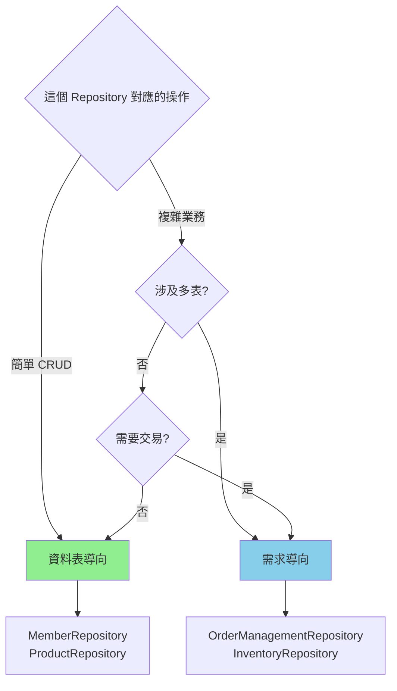
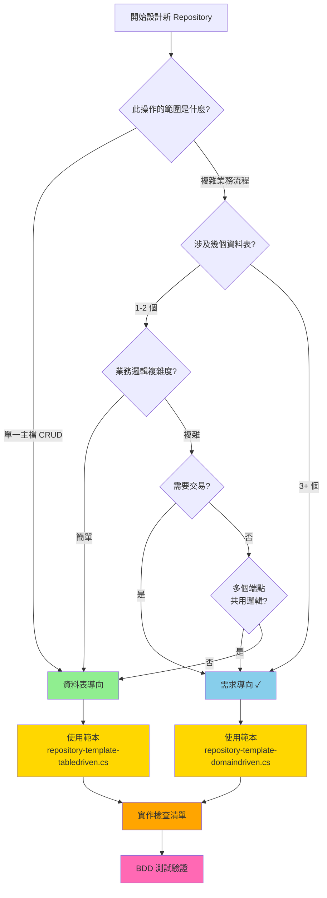

# Repository 模式對比與遷移策略

## 模式完整說明

### 資料表導向 Repository（Table-Driven Pattern）

#### 定義
針對單一資料表的 CRUD 操作設計，每個 Repository 對應一個資料表，職責明確、邏輯簡單。

#### 典型代碼結構
```csharp
public class MemberRepository
{
    // 基本 CRUD 操作
    public async Task<Result<Member>> GetAsync(Guid id, CancellationToken cancel = default);
    public async Task<Result<IEnumerable<Member>>> QueryAsync(
        int skip, int take, CancellationToken cancel = default);
    public async Task<Result<Member>> InsertAsync(Member member, CancellationToken cancel = default);
    public async Task<Result<Member>> UpdateAsync(Member member, CancellationToken cancel = default);
    public async Task<Result> DeleteAsync(Guid id, CancellationToken cancel = default);
    
    // 查詢方法
    public async Task<Result<Member>> GetByEmailAsync(string email, CancellationToken cancel = default);
    public async Task<Result<IEnumerable<Member>>> GetByStatusAsync(
        MemberStatus status, int skip, int take, CancellationToken cancel = default);
}
```

#### 適用場景
✅ 簡單主檔管理（會員、產品、分類、部門）
✅ 無跨表業務規則
✅ 單一資料表 CRUD
✅ 初期快速原型開發
✅ 小型專案（<10 個資料表）

#### 優點
- 簡單直觀，容易理解
- 開發速度快，適合原型
- 單一職責清晰
- 易於單元測試（Mock DbContext）
- 學習成本低

#### 缺點
- 業務邏輯分散在多個層級
- 難以複用複雜邏輯
- 多表操作需協調多個 Repository
- 無法保證分散操作的原子性
- 難以應對業務複雜度增長

#### 演進路徑
```
簡單 CRUD 
    ↓
業務規則增加
    ↓
多表操作出現
    ↓
重構為需求導向 Repository
```

---

### 需求導向 Repository（Domain-Driven Pattern）

#### 定義
按業務需求和聚合根設計，一個 Repository 對應一個業務域或聚合根，封裝完整的業務操作邏輯。

#### 典型代碼結構
```csharp
public class OrderManagementRepository
{
    // 高層業務方法，完整的業務操作
    public async Task<Result<OrderDetail>> CreateCompleteOrderAsync(
        CreateOrderRequest request, CancellationToken cancel = default);
    
    public async Task<Result<OrderDetail>> GetOrderDetailAsync(
        Guid orderId, CancellationToken cancel = default);
    
    public async Task<Result> UpdateOrderStatusAsync(
        Guid orderId, OrderStatus newStatus, CancellationToken cancel = default);
    
    public async Task<Result> CancelOrderWithRefundAsync(
        Guid orderId, string reason, CancellationToken cancel = default);
    
    // 內部輔助方法（private）
    private async Task AllocateInventoryAsync(
        IEnumerable<OrderItem> items, DbContext context, CancellationToken cancel);
    
    private async Task CreatePaymentRecordAsync(
        Payment payment, DbContext context, CancellationToken cancel);
}
```

#### 適用場景
✅ 複雜業務邏輯（訂單、付款、庫存協調）
✅ 多表操作（3+ 個表）
✅ 需要交易保證的操作
✅ 多個 API 端點複用相同邏輯
✅ 中大型專案（>10 個資料表）
✅ 長期維護的核心功能

#### 優點
- 業務邏輯集中，易於維護
- 完整的交易保護
- 複雜操作原子性保證
- 易於複用（Handler 直接呼叫高層方法）
- 清晰的業務語意（方法名即業務操作）
- 便於測試（Testcontainers 真實環境）
- 可擴展性強

#### 缺點
- 設計複雜，需要充分規劃
- 學習曲線陡峭
- 初期開發時間較長
- 需要更多的代碼註解
- 對團隊技能要求更高

#### 演進路徑
```
複雜業務需求明確
    ↓
確認多表操作與交易需求
    ↓
設計聚合根與邊界
    ↓
實作需求導向 Repository
```

---

## 模式對比表格

### 複雜度對比

| 維度 | 資料表導向 | 需求導向 |
|------|----------|---------|
| **設計複雜度** | ⭐ 簡單 | ⭐⭐⭐⭐ 複雜 |
| **代碼量** | 50-100 行 | 150-300+ 行 |
| **方法數量** | 5-8 個 | 10-20+ 個 |
| **交易管理** | 簡單 | 複雜（多步驟） |
| **測試難度** | ⭐⭐ 簡單 | ⭐⭐⭐ 中等 |
| **學習成本** | ⭐ 低 | ⭐⭐⭐⭐ 高 |

### 效能對比

| 維度 | 資料表導向 | 需求導向 |
|------|----------|---------|
| **查詢速度** | 快（單表） | 一般（可優化） |
| **N+1 問題** | 易出現 | 易避免（Include/Join） |
| **記憶體使用** | 低 | 中等（可控） |
| **並發問題** | 需外部保護 | 內部交易保護 |

### 可維護性對比

| 維度 | 資料表導向 | 需求導向 |
|------|----------|---------|
| **業務邏輯位置** | 分散 | 集中 |
| **代碼重用** | 低 | 高 |
| **功能擴展** | 困難 | 相對容易 |
| **缺陷定位** | 難 | 易 |
| **文檔需求** | 中等 | 高（需詳細業務說明） |

### 實作團隊支持

| 維度 | 資料表導向 | 需求導向 |
|------|----------|---------|
| **所需技能** | 基礎 | 進階 |
| **Code Review** | 快速 | 詳細 |
| **知識共享** | 容易 | 需要培訓 |
| **新人上手** | 快（1-2 週） | 慢（2-4 週） |

---

## 遷移策略

### 場景 1: 從資料表導向遷移至需求導向

#### 觸發條件
- [ ] 發現業務邏輯分散在 3+ 個 Repository 中
- [ ] 出現多步驟操作的資料不一致問題
- [ ] 相同邏輯在多個 Handler 中重複實作
- [ ] 性能出現 N+1 查詢瓶頸

#### 遷移步驟

**第 1 步：分析與設計**
```
1. 識別相關的資料表與聚合根
2. 定義業務操作邊界
3. 規劃交易范圍
4. 確定新 Repository 的責任
```

**第 2 步：創建新 Repository**
```csharp
// 創建新的需求導向 Repository
public class OrderManagementRepository
{
    // 新實作
}
```

**第 3 步：遷移邏輯**
```csharp
// 舊 Handler 中的邏輯
public class OrderHandler
{
    public async Task<Result> CreateOrder(CreateOrderRequest request)
    {
        // 舊方式：協調多個 Repository
        var order = await orderRepo.InsertAsync(new Order { ... });
        var items = await orderItemRepo.BulkInsertAsync(itemList);
        var inventory = await inventoryRepo.DeductStockAsync(stockUpdates);
        // 風險：若中間步驟失敗，已無法回滾
    }
}

// 新 Handler（使用新 Repository）
public class OrderHandler
{
    public async Task<Result> CreateOrder(CreateOrderRequest request)
    {
        // 新方式：直接呼叫高層業務方法
        return await orderMgmtRepo.CreateCompleteOrderAsync(request);
    }
}
```

**第 4 步：並行運行（相容期）**
- 新 Repository 已實作，舊 Repository 保留
- 新邏輯使用新 Repository
- 逐步遷移現有調用

**第 5 步：測試驗證**
```
1. BDD 整合測試驗證業務邏輯
2. 性能對比（舊 vs 新）
3. 邊界情況測試（庫存不足、付款失敗等）
4. 並發測試（Testcontainers）
```

**第 6 步：下線舊 Repository**
- 確認所有 Handler 已遷移
- 移除舊 Repository 代碼
- 更新文檔與註解

#### 時程估計
- 小型遷移（1-2 個表）：1-2 週
- 中型遷移（3-5 個表）：2-4 週
- 大型遷移（5+ 個表）：4-8 週

### 場景 2: 混合模式（推薦）

對於大多數專案，採用混合模式是最務實的選擇：

#### 模式定義
```
簡單主檔 ────→ 資料表導向 Repository
            (getById, insert, update, delete)
                
複雜業務域 ──→ 需求導向 Repository
            (createCompleteOrder, cancelOrder...)
```

#### 決策樹



#### 實作範例

```csharp
// 資料表導向：簡單 CRUD
namespace JobBank1111.Job.WebAPI.Member
{
    public class MemberRepository
    {
        public async Task<Result<Member>> GetAsync(Guid id, CancellationToken cancel);
        public async Task<Result<Member>> InsertAsync(Member member, CancellationToken cancel);
        public async Task<Result<Member>> UpdateAsync(Member member, CancellationToken cancel);
    }
}

// 需求導向：複雜業務
namespace JobBank1111.Job.WebAPI.Order
{
    public class OrderManagementRepository
    {
        public async Task<Result<OrderDetail>> CreateCompleteOrderAsync(
            CreateOrderRequest request, CancellationToken cancel);
        public async Task<Result> CancelOrderAsync(
            Guid orderId, CancellationToken cancel);
    }
}
```

#### 邊界定義明確化

在 CLAUDE.md 或專案文檔中明確：

```markdown
## Repository 設計規範

### 資料表導向的情況
- 會員（Member）
- 產品（Product）
- 分類（Category）
- 部門（Department）

### 需求導向的情況
- 訂單管理（涉及 Orders, OrderItems, Inventory, Payments）
- 庫存管理（涉及複雜庫存規則）
```

---

## 設計決策樹（完整版）



---

## 風險與緩解

### 資料表導向的風險

| 風險 | 症狀 | 緩解措施 |
|------|------|---------|
| **邏輯分散** | 相同邏輯在多個 Handler 中重複 | 定期代碼審查，識別可複用的業務邏輯 |
| **資料不一致** | 多步驟操作中某步失敗 | 使用事務，或遷移至需求導向 |
| **N+1 查詢** | 性能瓶頸，資料庫負載高 | 使用 Include、Join、Select 最佳化 |
| **擴展困難** | 業務複雜時難以增加新功能 | 提前識別，按需重構 |

### 需求導向的風險

| 風險 | 症狀 | 緩解措施 |
|------|------|---------|
| **過度設計** | 簡單操作也設計成需求導向 | 嚴格遵循決策樹，不過度設計 |
| **測試複雜** | 設定 TestServer、Testcontainers 複雜 | 使用專案提供的測試範本 |
| **性能問題** | 一次查詢太多資料 | 使用 Select 投影，分頁查詢 |
| **維護負擔** | 代碼複雜，需要詳細文檔 | 添加詳細註解，進行代碼審查 |

---

## 實施檢查清單

### ✅ 選擇資料表導向時確認

- [ ] 操作只涉及單一資料表或最多 2 個
- [ ] 無複雜的業務規則
- [ ] 不需要交易保證
- [ ] 操作邏輯簡單（<50 行）
- [ ] 使用 repository-template-tabledriven.cs 範本
- [ ] 實作 GetAsync、InsertAsync、UpdateAsync、DeleteAsync 基本方法
- [ ] 添加針對性的查詢方法（GetByXxx）

### ✅ 選擇需求導向時確認

- [ ] 操作涉及 3+ 個資料表
- [ ] 業務邏輯複雜（>50 行）
- [ ] 需要交易保證
- [ ] 定義了清晰的聚合根
- [ ] 使用 repository-template-domaindriven.cs 範本
- [ ] 實作高層業務方法（如 CreateCompleteOrderAsync）
- [ ] 完整的交易管理與錯誤處理
- [ ] 內部輔助方法使用 private 修飾符
- [ ] 詳細的設計註解說明決策理由

---

## 快速參考：何時選擇何種模式

### 選擇資料表導向 ✅

```csharp
// 場景 1：簡單會員查詢
public class MemberRepository
{
    public async Task<Result<Member>> GetAsync(Guid id, CancellationToken cancel);
    public async Task<Result<Member>> GetByEmailAsync(string email, CancellationToken cancel);
}

// 場景 2：簡單產品 CRUD
public class ProductRepository
{
    public async Task<Result<Product>> InsertAsync(Product product, CancellationToken cancel);
    public async Task<Result<Product>> UpdateAsync(Product product, CancellationToken cancel);
}
```

### 選擇需求導向 ✅

```csharp
// 場景 1：複雜訂單流程
public class OrderManagementRepository
{
    // 多步驟操作：建立訂單 + 明細 + 扣減庫存 + 建立付款
    public async Task<Result<OrderDetail>> CreateCompleteOrderAsync(
        CreateOrderRequest request, CancellationToken cancel);
}

// 場景 2：訂閱續訂流程
public class SubscriptionRepository
{
    // 複雜業務：驗證訂閱有效期 + 更新狀態 + 計費 + 記錄歷史
    public async Task<Result> RenewSubscriptionAsync(
        Guid memberId, SubscriptionType type, CancellationToken cancel);
}
```

---

**檔案版本**：1.0
**最後更新**：2026-07-10
