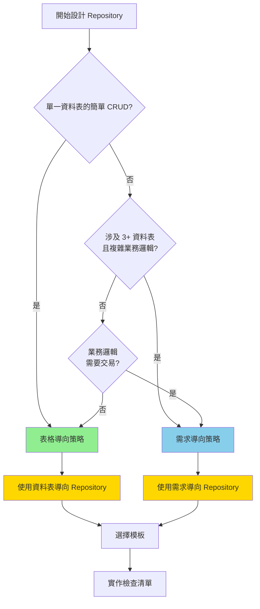

# Repository 設計決策檢查清單

## 快速決策流程



## 3-5 題快速判斷標準

回答以下問題，確定 Repository 設計方向：

### 判斷表

| # | 問題 | 資料表導向 | 需求導向 |
|---|------|---------|--------|
| 1 | 此操作涉及幾個資料表？ | 1-2 個 | 3+ 個 |
| 2 | 業務邏輯複雜度？ | 簡單（<50行） | 複雜（>50行） |
| 3 | 需要交易保證嗎？ | 否 | 是 |
| 4 | 多少個 API 端點共用此邏輯？ | 1-2 個 | 3+ 個 |
| 5 | 預期會擴展相關功能嗎？ | 否 | 是 |

**判斷規則**：
- **資料表導向**：問題 1-2 偏左側，問題 3 答「否」
- **需求導向**：至少 3 個問題偏右側，或問題 3 答「是」

---

## 模式適用場景表

### 資料表導向 Repository（Table-Driven）

| 特徵 | 說明 |
|------|------|
| **適用場景** | <ul><li>簡單主檔（會員、產品、分類）</li><li>無複雜業務規則</li><li>單一資料表 CRUD</li><li>API 端點 1-2 個</li></ul> |
| **專案規模** | 小（<10 個資料表）、初期快速開發 |
| **團隊規模** | 1-3 人 |
| **範例** | `MemberRepository`、`ProductRepository`、`CategoryRepository` |
| **命名規範** | `{TableName}Repository` |
| **優點** | <ul><li>簡單易懂</li><li>開發快速</li><li>適合原型</li></ul> |
| **缺點** | <ul><li>業務邏輯分散</li><li>難以重用</li><li>難以擴展</li></ul> |
| **演進路徑** | 當業務複雜時→重構為需求導向 |

### 需求導向 Repository（Domain-Driven）

| 特徵 | 說明 |
|------|------|
| **適用場景** | <ul><li>複雜業務邏輯</li><li>多表操作（訂單、庫存、付款）</li><li>需要交易一致性</li><li>多個 API 端點複用</li></ul> |
| **專案規模** | 中大型（>10 個資料表） |
| **團隊規模** | 4+ 人，明確分工 |
| **範例** | `OrderManagementRepository`、`InventoryRepository`、`SubscriptionRepository` |
| **命名規範** | `{BusinessDomain}Repository` 或 `{AggregateRoot}Repository` |
| **優點** | <ul><li>職責清晰</li><li>業務邏輯集中</li><li>易於維護和擴展</li><li>支援交易管理</li></ul> |
| **缺點** | <ul><li>設計複雜</li><li>需要較多規劃</li><li>學習曲線陡峭</li></ul> |
| **演進路徑** | 長期維護的首選 |

---

## 設計決策檢查清單

### Phase 1: 需求分析

- [ ] 確認此業務操作涉及的資料表清單
- [ ] 列舉所有相關的 API 端點
- [ ] 檢查是否需要交易保證（多表同時更新）
- [ ] 確認是否有複雜的業務規則
- [ ] 評估未來 3-6 個月的擴展方向

### Phase 2: 策略選擇

- [ ] 根據上述判斷標準決策方向
  - [ ] 資料表導向
  - [ ] 需求導向
  - [ ] 混合模式
- [ ] 與團隊確認選擇理由
- [ ] 如選「混合模式」，明確界定分界線

### Phase 3: 命名與設計

#### 資料表導向
- [ ] 命名為 `{TableName}Repository`
- [ ] 確認 CRUD 方法簽名
- [ ] 規劃查詢方法（GetByXxx、QueryByXxx）
- [ ] 定義分頁策略

#### 需求導向
- [ ] 命名為 `{BusinessDomain}Repository` 或 `{AggregateRoot}Repository`
- [ ] 定義高層業務方法（如 CreateCompleteOrderAsync）
- [ ] 規劃交易邊界
- [ ] 確認涉及的資料表與 Entity
- [ ] 規劃錯誤情況與補償邏輯

### Phase 4: 實作指南

- [ ] 遵循 DbContextFactory 模式
- [ ] 實作 Result Pattern 錯誤處理
- [ ] 支援 CancellationToken
- [ ] 使用 `AsNoTracking()` 優化唯讀查詢
- [ ] 添加詳細註解說明設計決策
- [ ] 準備單元測試覆蓋

### Phase 5: 驗收標準

- [ ] 代碼可讀性高（複雜邏輯有詳細註解）
- [ ] 業務邏輯清晰易懂
- [ ] 無 N+1 查詢問題
- [ ] 測試覆蓋核心邏輯（>80%）
- [ ] Code Review 通過
- [ ] 文件更新完成

---

## 常見錯誤與改正

### ❌ 錯誤 1: 過度設計簡單 Repository

**症狀**：
```csharp
// 過度設計：簡單會員查詢卻要設計複雜的 Repository
public class MemberManagementRepository
{
    public async Task<Result<MemberWithOrdersAndPayments>> GetMemberCompleteProfileAsync(...)
    { /* 100+ 行複雜邏輯 */ }
}
```

**改正**：
- ✅ 對於簡單 CRUD，保持資料表導向
- ✅ 只在真正需要時才重構為需求導向
- ✅ YAGNI 原則：You Ain't Gonna Need It

### ❌ 錯誤 2: 業務邏輯分散在多個 Repository

**症狀**：
```csharp
// 業務邏輯分散
await orderRepo.CreateAsync(order);
await orderItemRepo.InsertBatchAsync(items);
await inventoryRepo.DeductStockAsync(stockUpdates);
await paymentRepo.ProcessPaymentAsync(payment);
// 如果中間某步失敗，數據不一致！
```

**改正**：
- ✅ 複雜操作應在單一 Repository 中執行
- ✅ 使用交易保證原子性
- ✅ 邏輯集中便於維護

### ❌ 錯誤 3: Repository 與 Handler 責任邊界模糊

**症狀**：
```csharp
// 模糊的責任邊界
public class OrderRepository
{
    public async Task<Result> CreateAndNotifyAsync(Order order)
    {
        // 同時做資料存取 + 業務規則 + 發送通知
        // 難以單元測試，職責混亂
    }
}
```

**改正**：
- ✅ Repository：純資料操作
- ✅ Handler：業務規則、流程協調、外部服務調用
- ✅ 清晰的分層便於測試

### ❌ 錯誤 4: 查詢效能問題（N+1）

**症狀**：
```csharp
// N+1 問題
var members = await dbContext.Members.ToListAsync();
foreach (var member in members)
{
    var orders = await dbContext.Orders
        .Where(o => o.MemberId == member.Id)
        .ToListAsync(); // 循環查詢！
}
```

**改正**：
- ✅ 使用 `Include()` 或 `Join()` 一次查詢
- ✅ 使用 `Select()` 投影到 DTO
- ✅ 必要時使用分頁避免大量數據

### ❌ 錯誤 5: 忽視交易管理

**症狀**：
```csharp
// 無交易保護
await dbContext.Orders.AddAsync(order);
await dbContext.SaveChangesAsync();
await dbContext.Payments.AddAsync(payment);
await dbContext.SaveChangesAsync();
// 若第二個 SaveChanges 失敗，訂單已存在，付款未記錄
```

**改正**：
- ✅ 複雜操作使用 `using (var transaction = ...)`
- ✅ 確保原子性
- ✅ 定義補償邏輯

---

## 實際案例：訂單系統設計

### 需求分析

訂單系統涉及以下操作：
1. **建立訂單**：同時建立訂單主檔、明細、扣減庫存、建立付款記錄
2. **查詢訂單詳情**：獲取訂單 + 明細 + 付款資訊
3. **更新訂單狀態**：修改訂單狀態、記錄歷史
4. **取消訂單**：回滾库存、取消付款

### 設計決策

**判斷過程**：
- 問題 1: 涉及 4 個表（Orders, OrderItems, Inventory, Payments） → **需求導向**
- 問題 2: 業務邏輯複雜（>100行） → **需求導向**
- 問題 3: 需要交易保證 → **需求導向**
- 問題 4: 多個 API 端點共用（createOrder, getOrder, updateOrder, cancelOrder） → **需求導向**

**結論**：採用 **需求導向** Repository

### 命名與方法定義

```csharp
public class OrderManagementRepository
{
    // 核心業務方法
    public async Task<Result<OrderDetail>> CreateCompleteOrderAsync(
        CreateOrderRequest request, CancellationToken cancel = default);
    
    public async Task<Result<OrderDetail>> GetOrderDetailAsync(
        Guid orderId, CancellationToken cancel = default);
    
    public async Task<Result> UpdateOrderStatusAsync(
        Guid orderId, OrderStatus newStatus, CancellationToken cancel = default);
    
    public async Task<Result> CancelOrderAsync(
        Guid orderId, CancellationToken cancel = default);
}
```

### 實作亮點

✅ **交易管理**：確保多表操作原子性
✅ **庫存扣減**：同步更新 Inventory 表
✅ **付款記錄**：建立 Payment 關聯
✅ **錯誤處理**：使用 Result Pattern，完整記錄原始例外
✅ **可測試性**：使用 IDbContextFactory，支援 Testcontainers

---

## Repository 命名規範快速表

### 資料表導向

| 資料表 | Repository 名稱 | 主要方法 |
|--------|------------------|---------|
| Members | `MemberRepository` | GetAsync, InsertAsync, UpdateAsync, DeleteAsync |
| Products | `ProductRepository` | GetAsync, QueryAsync, UpdateStockAsync |
| Categories | `CategoryRepository` | GetAsync, InsertAsync, UpdateAsync |

### 需求導向

| 業務域 | Repository 名稱 | 主要方法 |
|--------|------------------|---------|
| 訂單管理 | `OrderManagementRepository` | CreateCompleteOrderAsync, GetOrderDetailAsync, CancelOrderAsync |
| 庫存管理 | `InventoryRepository` | AllocateStockAsync, DeallocateStockAsync, GetStockDetailAsync |
| 會員訂閱 | `SubscriptionRepository` | SubscribeMemberAsync, RenewSubscriptionAsync, CancelSubscriptionAsync |

---

## 設計決策樹（決策影響表）

| 決策 | 相依項 | 潛在問題 | 解決方案 |
|------|--------|---------|---------|
| **選擇資料表導向** | <ul><li>簡單 CRUD</li><li>單表操作</li></ul> | <ul><li>業務邏輯分散</li><li>難以複用</li></ul> | 當需求複雜時重構為需求導向 |
| **選擇需求導向** | <ul><li>複雜業務</li><li>多表操作</li></ul> | <ul><li>設計複雜</li><li>難以測試</li></ul> | 使用 Testcontainers，完整交易設計 |
| **混合模式** | <ul><li>簡單表用資料表導向</li><li>複雜域用需求導向</li></ul> | <ul><li>規則不清楚</li><li>可能混亂</li></ul> | 明確文檔化分界線，團隊對齊 |

---

## 核心原則總結

### ✅ 設計時遵循

1. **從需求出發，不是從資料表**
   - 先理解業務操作，再設計 Repository

2. **YAGNI 原則**
   - 簡單的用簡單方案，複雜的才用複雜方案

3. **清晰的責任邊界**
   - Repository：資料操作
   - Handler：業務邏輯
   - Controller：HTTP 層

4. **可測試性優先**
   - 使用 DbContextFactory
   - 支援 CancellationToken
   - 易於 Testcontainers 集成

5. **文件化設計決策**
   - 在 Repository 類別或方法中添加註解
   - 說明「為什麼」這樣設計，不只是「怎麼做」

### ❌ 避免的陷阱

1. 過度設計簡單 Repository
2. 業務邏輯分散在多個 Repository
3. Repository 與 Handler 責任混亂
4. 忽視 N+1 查詢問題
5. 無交易保護的多步驟操作

---

**檔案版本**：1.0
**最後更新**：2026-07-10
