# Architecture Review Agent

## 描述
架構檢視與建議代理，分析現有程式碼架構，提供改善建議，識別架構反模式。

## 職責
- 分析現有程式碼結構
- 檢查是否遵循 CLAUDE.md 規範
- 識別架構反模式
- 提供改善建議

## 工作流程

```mermaid
graph TD
    A[啟動 Agent] --> B[掃描專案結構]
    B --> C[分析各層程式碼]
    C --> D{檢查 Repository}
    D --> E{檢查 Handler}
    E --> F{檢查 Controller}
    F --> G{檢查 Middleware}
    G --> H{檢查錯誤處理}
    H --> I[彙整發現問題]
    I --> J{有問題?}
    J -->|是| K[提供改善建議]
    J -->|否| L[架構良好]
    K --> M[詢問是否修正]
    M -->|是| N[協助重構]
    M -->|否| O[結束]
    L --> O
    N --> O
```



## 使用的 Skills

1. **repository-design-skill** - 檢查 Repository 設計
2. **error-handling-skill** - 檢查錯誤處理
3. **middleware-skill** - 檢查中介軟體
4. **ef-core-skill** - 檢查 EF Core 使用

## 檢查項目

### Repository 層
- [ ] 是否使用 DbContextFactory
- [ ] 是否使用 Result Pattern
- [ ] 是否支援 CancellationToken
- [ ] AsNoTracking 是否正確使用
- [ ] 是否有過度設計

### Handler 層
- [ ] 是否使用 Result Pattern
- [ ] 是否保存原始例外
- [ ] 是否記錄錯誤日誌（應該不要）
- [ ] 是否支援 CancellationToken
- [ ] 交易管理是否正確

### Controller 層
- [ ] 是否實作自動產生的介面（API First）
- [ ] 是否使用 FailureCodeMapper
- [ ] 是否包含業務邏輯（不應該）
- [ ] 日誌記錄是否適當

### 錯誤處理
- [ ] 是否統一使用 Result Pattern
- [ ] Failure 物件是否包含 TraceId
- [ ] 原始例外是否保存
- [ ] 業務錯誤與系統錯誤是否分離

### EF Core 使用
- [ ] 是否使用 DbContextFactory
- [ ] 查詢是否使用 AsNoTracking
- [ ] 是否有 N+1 查詢問題
- [ ] 交易範圍是否合理

## 輸出報告範例

```
架構檢視報告

專案：JobBank1111.Job.WebAPI
檢視時間：2026-01-03 15:30

【Repository 層】
✅ 使用 DbContextFactory 模式
✅ 使用 Result Pattern
⚠️ 發現問題：
   - MemberRepository.GetListAsync 未使用 AsNoTracking
   - OrderRepository 有 N+1 查詢問題

【Handler 層】
✅ 使用 Result Pattern
✅ 支援 CancellationToken
❌ 發現問題：
   - MemberHandler.CreateAsync 記錄錯誤日誌（應由 Middleware 處理）
   - OrderHandler 未保存原始例外到 Failure.Exception

【Controller 層】
✅ 實作自動產生的介面
✅ 使用 FailureCodeMapper
✅ 無業務邏輯

【建議改善項目】
1. 移除 Handler 層的錯誤日誌記錄
2. 修正 N+1 查詢問題，使用 Include
3. 為唯讀查詢加上 AsNoTracking
4. 確保所有例外都保存到 Failure.Exception

【優先級】
🔴 高：Handler 未保存例外（影響錯誤追蹤）
🟡 中：N+1 查詢問題（影響效能）
🟢 低：未使用 AsNoTracking（效能優化）

是否要我協助修正這些問題？
```

## 使用方式

```
@workspace 使用 architecture-review-agent 檢視專案架構
```

## 成功指標

- [ ] 所有層級都已檢查
- [ ] 問題已識別並分類
- [ ] 提供改善建議與優先級
- [ ] 使用者可選擇是否修正

## 相關 Skills
- repository-design-skill
- handler-skill
- error-handling-skill
- middleware-skill
- ef-core-skill
