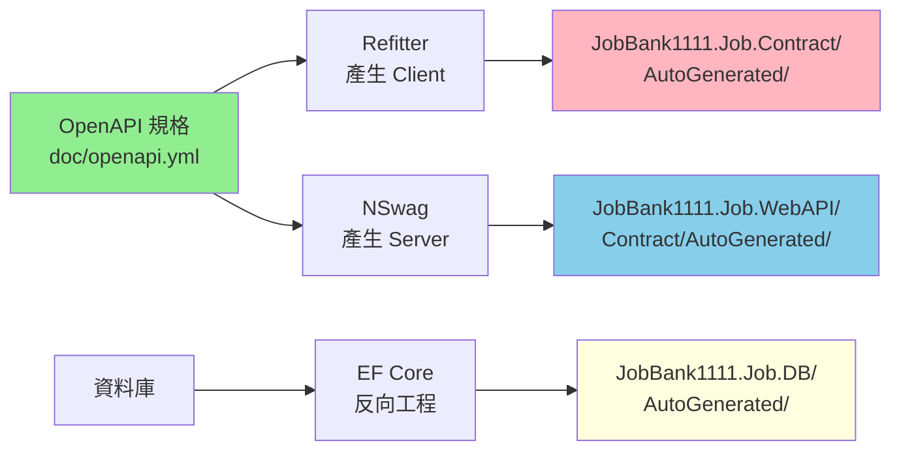

# 架構設計參考文件

## 核心專案

- **JobBank1111.Job.WebAPI**: 主要的 Web API 應用程式
- **JobBank1111.Infrastructure**: 跨領域基礎設施服務
- **JobBank1111.Job.DB**: Entity Framework Core 資料存取層
- **JobBank1111.Job.Contract**: 從 OpenAPI 規格自動產生的 API 客戶端合約

## 分層架構

### 分層模式（Controller → Handler → Repository）

```
┌─────────────┐
│ Controller  │ ← HTTP 請求/回應、路由、請求驗證、HTTP 狀態碼對應
└─────────────┘
       ↓
┌─────────────┐
│  Handler    │ ← 核心業務邏輯、流程協調、錯誤處理與結果封裝
└─────────────┘
       ↓
┌─────────────┐
│ Repository  │ ← 資料存取邏輯、EF Core 操作、資料庫查詢封裝
└─────────────┘
```

### 各層職責

#### Controller 層
- HTTP 請求/回應處理
- 路由定義
- 請求驗證
- HTTP 狀態碼對應
- Result Pattern 回應轉換

#### Handler 層
- 核心業務邏輯處理
- 流程協調
- 錯誤處理與結果封裝
- 使用 Result Pattern 回傳結果

#### Repository 層
- 資料存取邏輯
- EF Core 操作
- 資料庫查詢封裝
- 使用 Result Pattern 回傳結果

## 專案組織方式

### 方案 A：單一專案結構（當前採用）

```
JobBank1111.Job.WebAPI/
├── Member/
│   ├── MemberController.cs
│   ├── MemberHandler.cs
│   └── MemberRepository.cs
├── Order/
│   ├── OrderController.cs
│   ├── OrderHandler.cs
│   └── OrderRepository.cs
└── ...
```

**適用場景**：
- 小型團隊（3 人以下）
- 快速開發需求
- 專案規模較小

**優點**：
- ✅ 編譯快速
- ✅ 部署簡單
- ✅ 開發效率高

**缺點**：
- ❌ 程式碼耦合度較高
- ❌ 不適合大型團隊協作

### 方案 B：多專案結構

```
JobBank1111.Job.WebAPI/        ← Controller 層
JobBank1111.Job.Handlers/      ← Handler 層
JobBank1111.Job.Repositories/  ← Repository 層
JobBank1111.Job.DB/            ← 資料存取層
JobBank1111.Infrastructure/    ← 基礎設施層
```

**適用場景**：
- 大型團隊
- 明確分工需求
- 長期維護專案

**優點**：
- ✅ 職責清晰分離
- ✅ 便於團隊協作
- ✅ 易於測試

**缺點**：
- ❌ 專案結構較複雜
- ❌ 編譯時間較長

## 技術堆疊

### 核心框架
- **ASP.NET Core**: 8.0
- **Entity Framework Core**: 最新版本
- **.NET**: 8.0

### 資料庫與快取
- **資料庫**: SQL Server（支援 Code First 與 Database First）
- **快取**: Redis + 記憶體內快取備援

### 錯誤處理與驗證
- **Result Pattern**: CSharpFunctionalExtensions 3.1.0
- **驗證**: FluentValidation 11.10.0

### 測試
- **單元測試**: xUnit 2.9.2
- **整合測試**: Testcontainers 3.10.0
- **BDD 測試**: Reqnroll.xUnit 2.1.1

### 日誌與文件
- **日誌**: Serilog（結構化日誌）
- **API 文件**: Swagger/OpenAPI 3.0、ReDoc、Scalar

## 程式碼產生工作流程

### 完整流程圖



### 工作流程說明

1. **API 規格維護**: `doc/openapi.yml`
2. **產生客戶端程式碼**: `task codegen-api-client` → `JobBank1111.Job.Contract/AutoGenerated/`
3. **產生伺服器程式碼**: `task codegen-api-server` → `JobBank1111.Job.WebAPI/Contract/AutoGenerated/`
4. **反向工程資料庫**: `task ef-codegen` → `JobBank1111.Job.DB/AutoGenerated/`

### 重要規範

⚠️ **所有自動產生的程式碼都放在 `AutoGenerated` 資料夾中，不可手動編輯**

## 實作參考

### Controller 範例
📝 [src/be/JobBank1111.Job.WebAPI/Member/MemberController.cs](../../src/be/JobBank1111.Job.WebAPI/Member/MemberController.cs)

### Handler 範例
📝 [src/be/JobBank1111.Job.WebAPI/Member/MemberHandler.cs](../../src/be/JobBank1111.Job.WebAPI/Member/MemberHandler.cs)

### Repository 範例
📝 [src/be/JobBank1111.Job.WebAPI/Member/MemberRepository.cs](../../src/be/JobBank1111.Job.WebAPI/Member/MemberRepository.cs)

## 核心開發原則

### 不可變物件設計
- 使用 C# `record` 類型定義不可變物件
- 所有屬性使用 `init` 關鍵字
- 範例：`TraceContext`

### 架構守則
- ✅ 業務邏輯層不應直接處理 HTTP 相關邏輯
- ✅ 跨領域關注點（身分驗證、日誌、追蹤）在中介軟體層處理
- ✅ 使用不可變物件傳遞狀態
- ✅ 透過 DI 容器注入依賴

### 依賴注入最佳實踐
- ✅ 使用 C# 12 主建構函式注入（Primary Constructor）
- ✅ 使用 `IDbContextFactory<T>` 而非直接注入 `DbContext`
- ✅ 避免生命週期問題

## 命名規範

### 檔案命名
- **Handler**: `{Feature}Handler.cs`
- **Repository**: `{Feature}Repository.cs`
- **Controller**: `{Feature}Controller.cs` 或 `{Feature}ControllerImpl.cs`
- **Request DTO**: `{Action}{Feature}Request.cs`
- **Response DTO**: `{Feature}Response.cs`

### 範例
```
Member/
├── MemberController.cs          ← Controller 實作
├── MemberHandler.cs             ← Handler 業務邏輯
├── MemberRepository.cs          ← Repository 資料存取
├── CreateMemberRequest.cs       ← 建立會員請求 DTO
├── UpdateMemberRequest.cs       ← 更新會員請求 DTO
└── MemberResponse.cs            ← 會員回應 DTO
```

## 參考資源

- 📚 [CLAUDE.md](../../../CLAUDE.md) - 完整專案指導文件
- 📝 [Repository Pattern 設計](./repository-pattern.md) - Repository 設計策略
- 📝 [錯誤處理](./error-handling.md) - Result Pattern 與錯誤處理
- 📝 [中介軟體](./middleware.md) - 中介軟體架構設計
