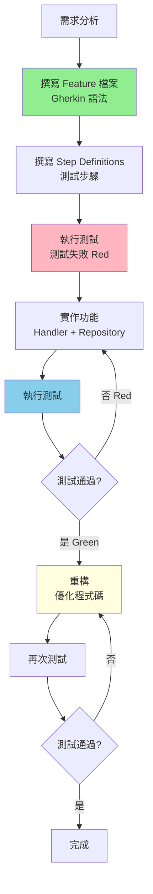

# BDD 流程參考文件

## BDD 開發循環

### 核心理念

**行為驅動開發（Behavior Driven Development, BDD）** 強調：
- ✅ 從使用者行為出發
- ✅ 使用自然語言描述需求（Gherkin 語法）
- ✅ 測試先於實作（Test-First）
- ✅ 需求、測試、實作三者一致

### 完整開發循環



## 階段一：需求分析與 Feature 檔案

### Gherkin 語法

**基本結構**：
```gherkin
Feature: 功能名稱
  As a [角色]
  I want to [目標]
  So that [價值]

  Background:
    Given [前置條件]

  Scenario: 情境名稱
    Given [前置條件]
    When [執行動作]
    Then [預期結果]
```

### 實際範例

```gherkin
Feature: 會員註冊功能
  As a 訪客
  I want to 註冊成為會員
  So that 我可以使用網站的會員專屬功能

  Background:
    Given 系統已啟動
    And 資料庫已清空

  Scenario: 成功註冊新會員
    Given 我準備以下會員資料:
      | Field | Value              |
      | Email | test@example.com   |
      | Name  | 測試會員            |
    When 我發送註冊請求到 "/api/members"
    Then 回應狀態碼應該是 201
    And 回應內容應該包含會員 ID
    And 資料庫應該包含這個會員

  Scenario: Email 已被使用時註冊失敗
    Given 系統已存在以下會員:
      | Email             | Name   |
      | test@example.com  | 現有會員 |
    And 我準備以下會員資料:
      | Field | Value              |
      | Email | test@example.com   |
      | Name  | 新會員              |
    When 我發送註冊請求到 "/api/members"
    Then 回應狀態碼應該是 409
    And 回應內容應該包含錯誤訊息 "Email 已被使用"

  Scenario Outline: 驗證錯誤 - 必填欄位
    Given 我準備以下會員資料:
      | Field | Value   |
      | Email | <Email> |
      | Name  | <Name>  |
    When 我發送註冊請求到 "/api/members"
    Then 回應狀態碼應該是 400
    And 回應內容應該包含錯誤訊息 "<ErrorMessage>"

    Examples:
      | Email             | Name | ErrorMessage     |
      |                   | Test | Email 不可為空    |
      | invalid-email     | Test | Email 格式不正確  |
      | test@example.com  |      | Name 不可為空     |
```

📝 **Feature 範例參考**: [src/be/JobBank1111.Job.IntegrationTest/_01_Demo/](../../src/be/JobBank1111.Job.IntegrationTest/_01_Demo/)

### Gherkin 關鍵字

| 關鍵字 | 說明 | 使用時機 |
|-------|------|---------|
| **Feature** | 功能描述 | 定義整個功能 |
| **Background** | 背景條件 | 所有 Scenario 共用的前置條件 |
| **Scenario** | 情境 | 單一測試情境 |
| **Scenario Outline** | 情境大綱 | 參數化測試（使用 Examples） |
| **Given** | 前置條件 | 設定測試環境與初始狀態 |
| **When** | 執行動作 | 觸發要測試的行為 |
| **Then** | 預期結果 | 驗證結果 |
| **And** / **But** | 連接詞 | 串接多個步驟 |

### 撰寫原則

1. **使用英文撰寫步驟定義**
   ```gherkin
   # ✅ 正確：使用英文
   Given I have a member with email "test@example.com"
   When I send a POST request to "/api/members"
   Then the response status code should be 201

   # ❌ 錯誤：使用中文
   Given 我有一個 email 為 "test@example.com" 的會員
   ```

2. **情境描述要具體**
   ```gherkin
   # ✅ 正確：具體明確
   Scenario: 成功註冊新會員

   # ❌ 錯誤：太模糊
   Scenario: 註冊
   ```

3. **每個 Scenario 應該獨立**
   - 不依賴其他 Scenario 的執行結果
   - 可以單獨執行

4. **使用 Background 避免重複**
   - 共用的前置條件放在 Background

## 階段二：測試實作（Step Definitions）

### Reqnroll 測試框架

本專案使用 **Reqnroll（Reqnroll.xUnit 2.1.1）** 作為 BDD 測試框架。

### Step Definitions 實作

```csharp
[Binding]
public class MemberRegistrationSteps(
    ITestOutputHelper output,
    TestServer testServer,
    TestAssistant testAssistant)
{
    private CreateMemberRequest _request = null!;
    private HttpResponseMessage _response = null!;

    [Given(@"I have a member with email ""(.*)""")]
    public void GivenIHaveAMemberWithEmail(string email)
    {
        _request = new CreateMemberRequest
        {
            Email = email,
            Name = "Test Member"
        };
    }

    [Given(@"the system already has a member:")]
    public async Task GivenTheSystemAlreadyHasAMember(Table table)
    {
        var email = table.Rows[0]["Email"];
        var name = table.Rows[0]["Name"];

        // 使用 TestAssistant 建立測試資料
        await testAssistant.CreateMemberAsync(new Member
        {
            Email = email,
            Name = name
        });
    }

    [When(@"I send a POST request to ""(.*)""")]
    public async Task WhenISendAPostRequestTo(string endpoint)
    {
        var client = testServer.CreateClient();
        _response = await client.PostAsJsonAsync(endpoint, _request);
    }

    [Then(@"the response status code should be (.*)")]
    public void ThenTheResponseStatusCodeShouldBe(int statusCode)
    {
        _response.StatusCode.Should().Be((HttpStatusCode)statusCode);
    }

    [Then(@"the response should contain member ID")]
    public async Task ThenTheResponseShouldContainMemberId()
    {
        var content = await _response.Content.ReadAsStringAsync();
        var member = JsonSerializer.Deserialize<MemberResponse>(content);
        member.Should().NotBeNull();
        member!.Id.Should().NotBeEmpty();
    }

    [Then(@"the database should contain this member")]
    public async Task ThenTheDatabaseShouldContainThisMember()
    {
        var exists = await testAssistant.MemberExistsAsync(_request.Email);
        exists.Should().BeTrue();
    }
}
```

### TestServer 配置

```csharp
public class TestServer : IAsyncLifetime
{
    private WebApplicationFactory<Program>? _factory;
    private IContainer? _sqlServerContainer;
    private IContainer? _redisContainer;

    public async Task InitializeAsync()
    {
        // 1. 啟動 SQL Server 容器
        _sqlServerContainer = new ContainerBuilder()
            .WithImage("mcr.microsoft.com/mssql/server:2022-latest")
            .WithEnvironment("ACCEPT_EULA", "Y")
            .WithEnvironment("SA_PASSWORD", "YourStrong@Password")
            .WithPortBinding(1433, true)
            .WithWaitStrategy(Wait.ForUnixContainer().UntilPortIsAvailable(1433))
            .Build();

        await _sqlServerContainer.StartAsync();

        // 2. 啟動 Redis 容器
        _redisContainer = new ContainerBuilder()
            .WithImage("redis:7-alpine")
            .WithPortBinding(6379, true)
            .WithWaitStrategy(Wait.ForUnixContainer().UntilPortIsAvailable(6379))
            .Build();

        await _redisContainer.StartAsync();

        // 3. 建立 WebApplicationFactory
        _factory = new WebApplicationFactory<Program>()
            .WithWebHostBuilder(builder =>
            {
                builder.ConfigureAppConfiguration((context, config) =>
                {
                    // 使用容器的連線字串
                    config.AddInMemoryCollection(new Dictionary<string, string>
                    {
                        ["ConnectionStrings:DefaultConnection"] = GetSqlServerConnectionString(),
                        ["ConnectionStrings:Redis"] = GetRedisConnectionString()
                    }!);
                });
            });
    }

    public HttpClient CreateClient() => _factory!.CreateClient();

    public async Task DisposeAsync()
    {
        await _sqlServerContainer?.StopAsync()!;
        await _redisContainer?.StopAsync()!;
        _factory?.Dispose();
    }
}
```

📝 **實作參考**: [src/be/JobBank1111.Job.IntegrationTest/TestServer.cs](../../src/be/JobBank1111.Job.IntegrationTest/TestServer.cs)

### TestAssistant 輔助工具

```csharp
public class TestAssistant(TestServer testServer)
{
    public async Task<Member> CreateMemberAsync(Member member)
    {
        // 使用 DbContext 直接建立測試資料
        await using var dbContext = GetDbContext();
        dbContext.Members.Add(member);
        await dbContext.SaveChangesAsync();
        return member;
    }

    public async Task<bool> MemberExistsAsync(string email)
    {
        await using var dbContext = GetDbContext();
        return await dbContext.Members.AnyAsync(m => m.Email == email);
    }

    public async Task CleanupAsync()
    {
        await using var dbContext = GetDbContext();
        dbContext.Members.RemoveRange(dbContext.Members);
        await dbContext.SaveChangesAsync();
    }

    private AppDbContext GetDbContext()
    {
        var factory = testServer.Services.GetRequiredService<IDbContextFactory<AppDbContext>>();
        return factory.CreateDbContext();
    }
}
```

📝 **實作參考**: [src/be/JobBank1111.Job.IntegrationTest/TestAssistant.cs](../../src/be/JobBank1111.Job.IntegrationTest/TestAssistant.cs)

## 階段三：Docker 測試環境

### 核心原則：Docker 優先，避免 Mock

```
真實環境測試（推薦）：
┌─────────────────┐
│ Testcontainers  │
├─────────────────┤
│ SQL Server      │ ← 真實資料庫容器
│ Redis           │ ← 真實快取容器
│ Seq             │ ← 真實日誌容器
└─────────────────┘

Mock 測試（僅在必要時）：
┌─────────────────┐
│ Mock Objects    │
├─────────────────┤
│ 第三方 API      │ ← 無法使用 Docker 的外部服務
│ 外部服務        │
└─────────────────┘
```

### 為什麼使用 Docker 容器？

**✅ 優勢**：
- 真實環境測試（與生產環境一致）
- 避免 Mock 的不可靠性
- 支援並行測試（容器隔離）
- 測試完成後自動清理

**❌ Mock 的問題**：
- 不真實（Mock 行為可能與實際不同）
- 維護成本高（需要同步更新 Mock）
- 容易產生誤導（測試通過但實際有問題）

### Testcontainers 使用

```csharp
// 1. 安裝套件
// Testcontainers 3.10.0

// 2. 建立容器
var sqlServerContainer = new ContainerBuilder()
    .WithImage("mcr.microsoft.com/mssql/server:2022-latest")
    .WithEnvironment("ACCEPT_EULA", "Y")
    .WithEnvironment("SA_PASSWORD", "YourStrong@Password")
    .WithPortBinding(1433, true)
    .WithWaitStrategy(Wait.ForUnixContainer().UntilPortIsAvailable(1433))
    .Build();

await sqlServerContainer.StartAsync();

// 3. 取得連線字串
var connectionString = $"Server=localhost,{sqlServerContainer.GetMappedPublicPort(1433)};Database=TestDb;User Id=sa;Password=YourStrong@Password;TrustServerCertificate=True";

// 4. 測試完成後清理
await sqlServerContainer.StopAsync();
```

## API 控制器測試指引

### 核心原則

**✅ 必須做的事**：
1. **所有 API 測試必須使用 BDD**（透過 .feature 檔案）
2. **使用 WebApplicationFactory**（完整的 Web API 管線）
3. **使用 Testcontainers**（Docker 容器作為測試替身）

**❌ 禁止的行為**：
1. **禁止直接測試 Controller**（單元測試）
2. **禁止使用 Mock 資料庫或 Mock Repository**
3. **禁止跳過 Middleware 管線**

### 正確的測試方式

```csharp
// ✅ 正確：透過 HTTP Client 測試完整管線
[When(@"I send a POST request to ""(.*)""")]
public async Task WhenISendAPostRequestTo(string endpoint)
{
    var client = testServer.CreateClient();  // ✅ 使用 WebApplicationFactory
    _response = await client.PostAsJsonAsync(endpoint, _request);
}

// ❌ 錯誤：直接實例化 Controller
[Test]
public async Task CreateMember_ShouldReturnOk()
{
    var controller = new MemberController(handler);  // ❌ 不應直接測試 Controller
    var result = await controller.CreateMember(request);
}
```

### 為什麼禁止直接測試 Controller？

1. **缺少 Middleware 管線**
   - 跳過身分驗證
   - 跳過錯誤處理
   - 跳過追蹤內容設定

2. **不真實**
   - 無法測試完整的 HTTP 請求/回應流程
   - 無法測試路由與模型綁定

3. **維護成本高**
   - 需要 Mock 大量依賴
   - 測試程式碼複雜

## 測試資料管理

### 策略選擇

| 策略 | 適用場景 | 優點 | 缺點 |
|------|---------|------|------|
| **動態產生** | 大部分測試 | 獨立、可並行 | 需要清理 |
| **固定 Seed Data** | 查詢測試 | 快速 | 不可並行 |
| **Fixture** | 複雜資料 | 重複使用 | 耦合度高 |

### 推薦：動態產生 + 自動清理

```csharp
[Binding]
public class Hooks(TestAssistant testAssistant)
{
    [BeforeScenario]
    public async Task BeforeScenario()
    {
        // 每個 Scenario 開始前清理資料
        await testAssistant.CleanupAsync();
    }

    [AfterScenario]
    public async Task AfterScenario()
    {
        // 每個 Scenario 結束後清理資料
        await testAssistant.CleanupAsync();
    }
}
```

## 執行測試

### 命令列

```bash
# 執行所有整合測試
task test-integration

# 執行特定 Feature
dotnet test --filter "FullyQualifiedName~MemberRegistration"

# 產生測試報告
dotnet test --logger "html;LogFileName=test-results.html"
```

### Taskfile 配置

```yaml
tasks:
  test-integration:
    desc: 執行整合測試
    cmds:
      - dotnet test src/be/JobBank1111.Job.IntegrationTest/JobBank1111.Job.IntegrationTest.csproj
```

## 程式碼範本

📝 [feature-file-template.feature](../assets/feature-file-template.feature) - Feature 檔案範本

## 參考資源

- 📚 [CLAUDE.md](../../../CLAUDE.md) - 完整專案指導文件
- 📝 [架構設計](./architecture.md) - 整體架構說明
- 📝 [測試範例](../../src/be/JobBank1111.Job.IntegrationTest/_01_Demo/) - BDD 測試範例
