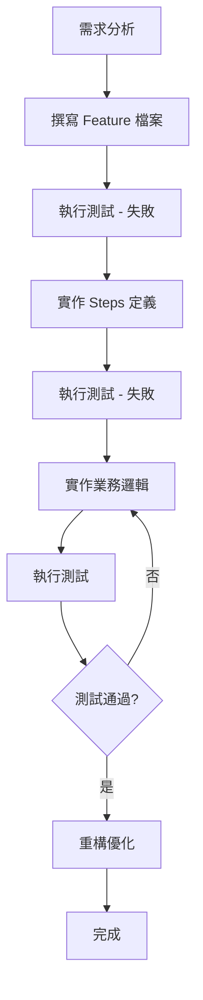

# BDD 測試指南

> 本專案採用 BDD (Behavior-Driven Development) 開發模式，使用 Docker 容器作為測試替身

## BDD 核心概念

### 什麼是 BDD？

**BDD (Behavior-Driven Development)** 是一種以行為為中心的開發方法論：
- 使用自然語言（Gherkin）描述功能需求
- 從使用者角度定義系統行為
- 確保需求、測試與實作的一致性

### Gherkin 語法

**基本結構**：
```gherkin
Feature: 功能名稱
  功能描述

  Scenario: 情境名稱
    Given 前置條件
    When 執行動作
    Then 預期結果
```

**範例**：
```gherkin
Feature: 會員註冊
  作為訪客
  我想要註冊成為會員
  以便使用系統功能

  Scenario: 成功註冊新會員
    Given 系統中不存在 Email "test@example.com" 的會員
    When 我使用以下資訊註冊：
      | Email              | Password  | Name   |
      | test@example.com   | Pass123!  | 測試者 |
    Then 註冊應該成功
    And 系統應該回傳會員 ID
    And 資料庫中應該存在該會員資料

  Scenario: 重複 Email 註冊失敗
    Given 系統中已存在 Email "test@example.com" 的會員
    When 我使用 Email "test@example.com" 註冊
    Then 註冊應該失敗
    And 錯誤訊息應該包含 "Email 已被使用"
```

## BDD 開發循環

### 完整開發流程



### 階段 1：需求分析與 Feature 定義

**步驟**：
1. 與 PO/使用者討論功能需求
2. 使用 Gherkin 語法撰寫 `.feature` 檔案
3. 定義所有情境（Happy Path + 異常情境）

**範例位置**：
- `src/be/JobBank1111.Job.IntegrationTest/_01_Demo/*.feature`

### 階段 2：測試實作

**步驟**：
1. 使用 Reqnroll 實作測試步驟 (Steps)
2. 設定 Docker 測試環境
3. 準備測試資料

**測試框架**：
- **Reqnroll** - BDD 測試框架（Gherkin 支援）
- **xUnit** - 測試執行器
- **Testcontainers** - Docker 容器管理

### 階段 3：功能實作

**步驟**：
1. 實作 Controller
2. 實作 Handler（業務邏輯）
3. 實作 Repository（資料存取）

### 階段 4：測試執行與驗證

**指令**：
```bash
task test-integration
```

## Docker 優先測試策略

### 核心原則

1. **真實環境**：
   - 使用 Docker 容器提供真實的資料庫、快取、訊息佇列等服務
   - 避免使用 Mock（除非外部服務無法容器化）

2. **測試替身優先順序**：
   - ✅ **第一優先**：Testcontainers (Docker 容器)
   - ✅ **第二優先**：真實外部服務（開發環境）
   - ⚠️ **最後選擇**：Mock（僅限第三方 API、外部服務）

3. **隔離測試**：
   - 每個測試使用獨立的資料
   - 測試完成後自動清理
   - 避免測試間相互影響

4. **並行執行**：
   - 利用 Docker 容器的隔離特性
   - 支援測試並行執行
   - 提升測試執行速度

### Docker 測試環境設定

**測試環境包含**：
- SQL Server 容器
- Redis 容器
- Seq 日誌容器

**設定檔案位置**：
- `src/be/JobBank1111.Job.IntegrationTest/TestServer.cs`

**範例程式碼**：
```csharp
public class TestServer : IAsyncLifetime
{
    private readonly MsSqlContainer _sqlContainer;
    private readonly RedisContainer _redisContainer;
    private WebApplicationFactory<Program> _factory;

    public TestServer()
    {
        // 建立 SQL Server 容器
        _sqlContainer = new MsSqlBuilder()
            .WithImage("mcr.microsoft.com/mssql/server:2022-latest")
            .Build();

        // 建立 Redis 容器
        _redisContainer = new RedisBuilder()
            .WithImage("redis:7-alpine")
            .Build();
    }

    public async Task InitializeAsync()
    {
        // 啟動容器
        await _sqlContainer.StartAsync();
        await _redisContainer.StartAsync();

        // 建立測試應用程式
        _factory = new WebApplicationFactory<Program>()
            .WithWebHostBuilder(builder =>
            {
                builder.ConfigureAppConfiguration((context, config) =>
                {
                    // 注入測試設定
                    config.AddInMemoryCollection(new Dictionary<string, string>
                    {
                        ["ConnectionStrings:DefaultConnection"] = _sqlContainer.GetConnectionString(),
                        ["Redis:ConnectionString"] = _redisContainer.GetConnectionString()
                    });
                });
            });
    }

    public async Task DisposeAsync()
    {
        // 清理資源
        await _factory.DisposeAsync();
        await _sqlContainer.StopAsync();
        await _redisContainer.StopAsync();
    }
}
```

## API 控制器測試指引

### 核心原則

1. **BDD 優先**：
   - ✅ 所有 Controller 功能必須優先使用 BDD 情境測試
   - ❌ 禁止單獨測試 Controller（直接實例化）

2. **強制使用 WebApplicationFactory**：
   - ✅ 所有測試必須透過完整的 Web API 管線執行
   - ✅ 包含所有 Middleware（認證、日誌、異常處理等）
   - ✅ 使用 HttpClient 呼叫 API

3. **情境驅動開發**：
   - 從使用者行為情境出發
   - 測試完整的 API 請求/回應流程
   - 驗證 HTTP 狀態碼、回應內容、資料庫狀態

### 測試範例

**Feature 檔案**：
```gherkin
Feature: 會員管理 API
  
  Scenario: 查詢會員列表 - 成功
    Given 資料庫中有以下會員：
      | Email            | Name   |
      | user1@test.com   | 使用者1 |
      | user2@test.com   | 使用者2 |
    When 我呼叫 GET "/api/members?pageNumber=0&pageSize=10"
    Then HTTP 狀態碼應該是 200
    And 回應應該包含 2 筆會員資料

  Scenario: 查詢不存在的會員 - 失敗
    Given 資料庫中不存在 ID 為 "00000000-0000-0000-0000-000000000001" 的會員
    When 我呼叫 GET "/api/members/00000000-0000-0000-0000-000000000001"
    Then HTTP 狀態碼應該是 404
```

**Steps 實作**：
```csharp
[Binding]
public class MemberSteps(TestServer testServer)
{
    private HttpClient _client = testServer.CreateClient();
    private HttpResponseMessage _response;

    [Given(@"資料庫中有以下會員：")]
    public async Task Given資料庫中有以下會員(Table table)
    {
        foreach (var row in table.Rows)
        {
            var member = new Member
            {
                Email = row["Email"],
                Name = row["Name"]
            };
            await testServer.InsertAsync(member);
        }
    }

    [When(@"我呼叫 GET ""(.*)""")]
    public async Task When我呼叫GET(string url)
    {
        _response = await _client.GetAsync(url);
    }

    [Then(@"HTTP 狀態碼應該是 (.*)")]
    public void ThenHTTP狀態碼應該是(int statusCode)
    {
        Assert.Equal(statusCode, (int)_response.StatusCode);
    }

    [Then(@"回應應該包含 (.*) 筆會員資料")]
    public async Task Then回應應該包含筆會員資料(int count)
    {
        var content = await _response.Content.ReadAsStringAsync();
        var members = JsonSerializer.Deserialize<List<Member>>(content);
        Assert.Equal(count, members.Count);
    }
}
```

## 測試資料準備策略

### 策略 1：動態產生測試資料

**適用場景**：
- 測試獨立性要求高
- 避免測試資料相互干擾

**範例**：
```csharp
[Given(@"系統中不存在 Email ""(.*)"" 的會員")]
public async Task Given系統中不存在Email的會員(string email)
{
    // 確保資料不存在
    await testServer.DeleteMemberByEmailAsync(email);
}
```

### 策略 2：使用 Seed Data

**適用場景**：
- 需要複雜的基礎資料
- 多個測試共用相同基礎資料

**範例**：
```csharp
public async Task InitializeAsync()
{
    // 初始化基礎資料
    await SeedCategories();
    await SeedProducts();
}
```

### 策略 3：測試後清理

**適用場景**：
- 確保測試環境乾淨
- 支援測試重複執行

**範例**：
```csharp
[AfterScenario]
public async Task CleanupAfterScenario()
{
    // 清理測試資料
    await testServer.TruncateAllTablesAsync();
}
```

## 測試輔助工具

### TestAssistant 類別

**功能**：
- 提供資料庫操作輔助方法
- 簡化測試資料準備
- 支援常見的測試情境

**位置**：
- `src/be/JobBank1111.Job.IntegrationTest/TestAssistant.cs`

**範例方法**：
```csharp
public class TestAssistant
{
    // 插入測試資料
    public async Task InsertAsync<T>(T entity) where T : class;
    
    // 查詢資料
    public async Task<T> GetByIdAsync<T>(Guid id) where T : class;
    
    // 刪除資料
    public async Task DeleteAsync<T>(Guid id) where T : class;
    
    // 清空資料表
    public async Task TruncateTableAsync<T>() where T : class;
    
    // 清空所有資料表
    public async Task TruncateAllTablesAsync();
}
```

## 最佳實踐

### 1. Feature 檔案組織

```
IntegrationTest/
├── _01_Member/
│   ├── MemberRegistration.feature      # 會員註冊
│   ├── MemberQuery.feature             # 會員查詢
│   └── MemberSteps.cs                  # 步驟實作
├── _02_Order/
│   ├── OrderCreation.feature
│   ├── OrderQuery.feature
│   └── OrderSteps.cs
└── TestServer.cs                       # 測試伺服器設定
```

### 2. 情境設計原則

**涵蓋範圍**：
- ✅ Happy Path（正常流程）
- ✅ 異常情境（錯誤處理）
- ✅ 邊界條件（極限值）
- ✅ 權限驗證（授權檢查）

**範例**：
```gherkin
Feature: 會員註冊

  Scenario: 成功註冊              # Happy Path
  Scenario: 重複 Email 註冊失敗    # 業務規則驗證
  Scenario: 無效 Email 格式       # 輸入驗證
  Scenario: 必填欄位遺漏          # 邊界條件
```

### 3. Steps 實作原則

**單一職責**：
```csharp
// ✅ 好的做法：每個 Step 專注於單一職責
[Given(@"資料庫中有會員 ""(.*)""")]
public async Task Given資料庫中有會員(string email) { }

[When(@"我呼叫註冊 API")]
public async Task When我呼叫註冊API() { }

[Then(@"註冊應該成功")]
public void Then註冊應該成功() { }

// ❌ 壞的做法：Step 做太多事情
[When(@"我註冊並驗證成功")]
public async Task When我註冊並驗證成功() { }  // 違反單一職責
```

### 4. 測試資料管理

**明確性優於簡潔性**：
```gherkin
# ✅ 好的做法：明確指定測試資料
Given 資料庫中有以下會員：
  | Email          | Name   | Status |
  | test@test.com  | 測試者  | Active |

# ❌ 壞的做法：隱含的測試資料
Given 資料庫中有一個會員  # 不清楚會員的屬性
```

### 5. 測試隔離

**每個測試獨立**：
```csharp
// ✅ 好的做法：每個測試準備自己的資料
[Given(@"系統中有會員 ""(.*)""")]
public async Task Given系統中有會員(string email)
{
    await _testServer.InsertAsync(new Member { Email = email });
}

// ❌ 壞的做法：依賴其他測試的資料
// 假設其他測試已經建立了資料
```

## 禁止的行為 ❌

### 1. 直接測試 Controller

```csharp
// ❌ 禁止：直接實例化 Controller
var controller = new MemberController(handler);
var result = controller.GetMembers();

// ✅ 正確：透過 BDD 情境測試
When 我呼叫 GET "/api/members"
Then HTTP 狀態碼應該是 200
```

### 2. 使用 Mock 取代 Docker

```csharp
// ❌ 禁止：Mock 資料庫
var mockRepo = new Mock<IMemberRepository>();

// ✅ 正確：使用 Testcontainers
var sqlContainer = new MsSqlBuilder().Build();
```

### 3. 測試間相互依賴

```gherkin
# ❌ 禁止：測試 B 依賴測試 A 的資料
Scenario: A - 建立會員
  When 我建立會員 "test@test.com"

Scenario: B - 查詢會員
  When 我查詢會員 "test@test.com"  # 依賴測試 A

# ✅ 正確：每個測試獨立
Scenario: 查詢會員
  Given 系統中有會員 "test@test.com"  # 自己準備資料
  When 我查詢會員 "test@test.com"
```

## 參考資源

**專案範例**：
- Feature 檔案：`src/be/JobBank1111.Job.IntegrationTest/_01_Demo/*.feature`
- Steps 實作：`src/be/JobBank1111.Job.IntegrationTest/_01_Demo/*Steps.cs`
- 測試伺服器：`src/be/JobBank1111.Job.IntegrationTest/TestServer.cs`
- 測試輔助：`src/be/JobBank1111.Job.IntegrationTest/TestAssistant.cs`

**外部文件**：
- Reqnroll: https://docs.reqnroll.net/
- Testcontainers: https://dotnet.testcontainers.org/
- Gherkin 語法: https://cucumber.io/docs/gherkin/

---

**參考來源**：CLAUDE.md - BDD 開發流程章節
