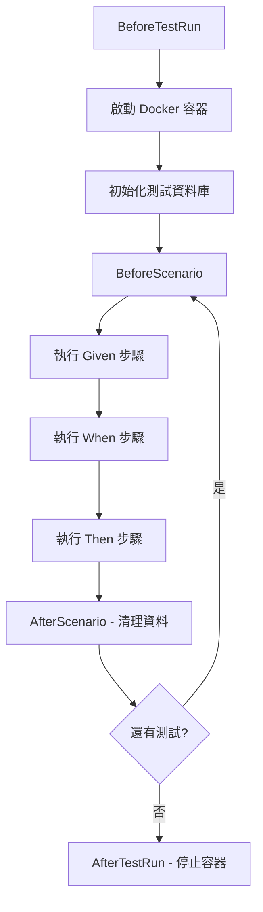

# BDD 開發工作流程

## BDD 開發循環

### 階段 1: 需求分析 → 編寫情境
使用 Gherkin 語法定義功能情境

```gherkin
Feature: 會員註冊
  作為一個訪客
  我想要註冊成為會員
  以便使用網站的完整功能

  Scenario: 成功註冊新會員
    Given 我是一個未註冊的訪客
    And 我的 Email 是 "test@example.com"
    When 我提交註冊表單
    Then 註冊應該成功
    And 我應該收到歡迎信件

  Scenario: 重複 Email 註冊失敗
    Given 系統中已存在 Email "existing@example.com" 的會員
    When 我使用相同 Email 註冊
    Then 註冊應該失敗
    And 錯誤訊息應該包含 "Email 已被使用"
```

### 階段 2: 實作測試步驟
使用 Reqnroll (SpecFlow 的社群版本) 實作測試步驟

```csharp
[Binding]
public class MemberRegistrationSteps
{
    private readonly HttpClient _client;
    private HttpResponseMessage _response;
    
    [Given(@"我是一個未註冊的訪客")]
    public void GivenIAmAnUnregisteredVisitor()
    {
        // 測試準備
    }
    
    [When(@"我提交註冊表單")]
    public async Task WhenISubmitRegistrationForm()
    {
        _response = await _client.PostAsJsonAsync("/api/members", request);
    }
    
    [Then(@"註冊應該成功")]
    public void ThenRegistrationShouldSucceed()
    {
        _response.StatusCode.Should().Be(HttpStatusCode.Created);
    }
}
```

### 階段 3: 執行測試 (紅燈) → 實作功能 → 測試通過 (綠燈) → 重構

## Docker 優先測試策略

### 核心原則
1. **真實環境**: 使用 Docker 容器提供真實服務
2. **避免 Mock**: 只有外部服務無法容器化時才使用 Mock
3. **隔離測試**: 每個測試使用獨立資料
4. **測試後清理**: 自動清理測試資料

### Docker 測試環境組成

```csharp
public class TestServer
{
    private static readonly MsSqlContainer _sqlContainer;
    private static readonly RedisContainer _redisContainer;
    private static readonly Container _seqContainer;
    
    static TestServer()
    {
        // SQL Server 容器
        _sqlContainer = new MsSqlBuilder()
            .WithImage("mcr.microsoft.com/mssql/server:2022-latest")
            .Build();
            
        // Redis 容器
        _redisContainer = new RedisBuilder()
            .WithImage("redis:7-alpine")
            .Build();
            
        // Seq 日誌容器
        _seqContainer = new ContainerBuilder()
            .WithImage("datalust/seq:latest")
            .Build();
    }
}
```

### 測試資料管理

#### 方式 1: 每個測試獨立資料
```csharp
[Given(@"系統中已存在會員 ""(.*)""")]
public async Task GivenMemberExists(string email)
{
    // 使用 TestAssistant 準備測試資料
    await _testAssistant.CreateMemberAsync(email);
}

[AfterScenario]
public async Task CleanUp()
{
    // 清理此測試產生的資料
    await _testAssistant.CleanUpTestDataAsync();
}
```

#### 方式 2: Seed Data (共用參考資料)
```csharp
public class TestDataSeeder
{
    public static async Task SeedAsync(DbContext context)
    {
        // 建立共用的參考資料（如：會員等級、產品分類）
        context.MemberLevels.AddRange(
            new MemberLevel { Id = 1, Name = "一般會員" },
            new MemberLevel { Id = 2, Name = "VIP 會員" }
        );
        await context.SaveChangesAsync();
    }
}
```

## Gherkin 語法最佳實踐

### 使用業務語言
```gherkin
# ✅ 好的寫法
Scenario: 會員升級為 VIP
  Given 會員累積消費金額達到 10000 元
  When 系統執行每日會員等級更新
  Then 會員等級應該升級為 "VIP"

# ❌ 避免技術細節
Scenario: Update member level in database
  Given MemberTotalAmount >= 10000
  When Execute UpdateMemberLevelJob
  Then Members.Level = "VIP"
```

### 參數化情境
```gherkin
Scenario Outline: 會員等級升級規則
  Given 會員累積消費金額為 <amount> 元
  When 系統執行會員等級更新
  Then 會員等級應該是 "<level>"
  
  Examples:
    | amount | level    |
    | 5000   | 一般會員 |
    | 10000  | VIP 會員 |
    | 50000  | 白金會員 |
```

### 背景資料 (Background)
```gherkin
Feature: 訂單管理

  Background:
    Given 系統中存在以下會員
      | Email              | Level |
      | user@example.com   | VIP   |
      | normal@example.com | 一般  |
    And 系統中存在以下產品
      | ProductId | Name     | Price |
      | 1         | 產品 A   | 100   |
      | 2         | 產品 B   | 200   |

  Scenario: VIP 會員下單享有折扣
    # ...
```

## API 控制器測試指引

### ✅ 正確：透過 WebApplicationFactory 測試
```csharp
public class MemberApiTests : IClassFixture<TestServer>
{
    private readonly HttpClient _client;
    
    public MemberApiTests(TestServer server)
    {
        _client = server.CreateClient();
    }
    
    [Fact]
    public async Task CreateMember_ShouldReturnCreated()
    {
        // 透過真實的 HTTP 請求測試完整管線
        var response = await _client.PostAsJsonAsync("/api/members", request);
        response.StatusCode.Should().Be(HttpStatusCode.Created);
    }
}
```

### ❌ 禁止：直接實例化 Controller
```csharp
// ❌ 不要這樣做
[Fact]
public void CreateMember_ShouldReturnOk()
{
    var controller = new MemberController(handler);
    var result = controller.CreateMember(request);
    // 這樣無法測試完整的 ASP.NET Core 管線
}
```

## 測試組織結構

```
JobBank1111.Job.IntegrationTest/
├── _01_Demo/                    # 示範測試
│   ├── Demo.feature
│   └── DemoSteps.cs
├── Member/                      # 會員功能測試
│   ├── MemberRegistration.feature
│   └── MemberRegistrationSteps.cs
├── Order/                       # 訂單功能測試
│   ├── OrderCreation.feature
│   └── OrderCreationSteps.cs
├── TestServer.cs               # 測試伺服器設定
├── TestAssistant.cs            # 測試輔助工具
└── Hooks.cs                    # 測試生命週期掛勾
```

## 測試執行流程



## 參考檔案位置

- .feature 範例: `src/be/JobBank1111.Job.IntegrationTest/_01_Demo/`
- TestServer 設定: `src/be/JobBank1111.Job.IntegrationTest/TestServer.cs`
- TestAssistant: `src/be/JobBank1111.Job.IntegrationTest/TestAssistant.cs`
