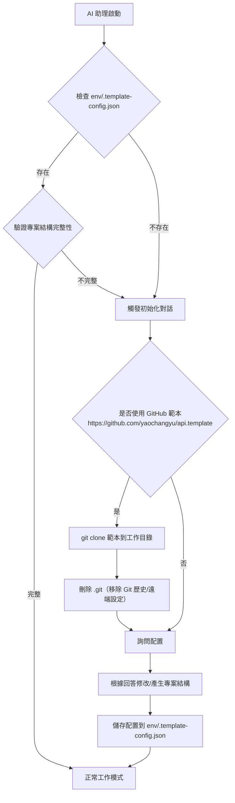

## AI 助理使用規則

### 核心互動原則

AI 助理在與使用者互動時，必須遵循以下核心原則：

1. **強制互動確認**
   - **Claude CLI**: 使用 `AskUserQuestion` 工具進行結構化詢問
   - **GitHub Copilot CLI / Cursor / 其他 AI**: 使用結構化的文字列表詢問
   - 在所有需要使用者決策的情境下，都必須明確詢問，不得擅自執行
   - 提供清晰的選項說明，幫助使用者做出明智選擇
   - 在執行任何有風險或需要使用者決策的操作前，你**必須**先向我提問，並等待我的確認。以結構化的清單（例如 1️⃣, 2️⃣, 3️⃣ 或 a, b, c）提

2. **不得擅自假設**
   - 即使文件標註「預設」值，仍須詢問使用者確認
   - 例外：使用者已在對話中明確指定（如「使用 SQL Server」）
   - 所有 AI 助理都必須遵守此原則

3. **分階段互動**
   - 單次詢問最多 3-4 個問題，避免資訊過載
   - 複雜流程應分階段進行，根據前一階段的回答決定後續問題

4. **完整性優先**
   - 必須收集所有必要資訊後才開始執行
   - 不可因「加速開發」而省略必要的互動步驟

### 專案狀態檢測機制

當 AI 助理首次接觸此專案時，**必須優先檢測專案狀態**：

#### 檢測條件（滿足以下任一條件視為空白專案）
1. **不存在** `env/.template-config.json` 配置檔案
2. **不存在** `.sln` 解決方案檔案
3. **不存在** `src/` 目錄或該目錄為空
4. **不存在** `appsettings.json` 或 `docker-compose.yml`

#### 檢測流程


#### GitHub 範本套用規則（初始化時）

當專案狀態檢測判定為「空白專案」時，初始化對話的第一個問題必須先詢問：

- 是否要使用 https://github.com/yaochangyu/api.template 作為專案範本

若使用者選擇「是」，AI 助理必須遵循：

1. **安全檢查（不得擅自覆蓋）**：
   - 僅在「工作目錄為空」或使用者已明確同意覆蓋/清空時，才可執行 clone。
   - 若工作目錄非空，必須先詢問使用者要「改用子資料夾」或「取消」。
2. **使用 git clone 下載範本**：
   - Windows PowerShell 範例（在空目錄中）：`git clone https://github.com/yaochangyu/api.template .`
3. **刪除 Git 相關資料**：
   - 刪除 `.git/` 目錄（移除歷史與遠端設定）。
   - Windows PowerShell 範例：`Remove-Item -Recurse -Force .git`
4. **接著才進入本專案的互動式配置**（資料庫/快取/專案結構等），並依照互動結果修改專案內容與寫入 `env/.template-config.json`。

#### 配置檔案格式（env/.template-config.json）
```json
{
  "database": {
    "type": "SQL Server",
    "version": "2022",
    "useEfCore": true
  },
  "cache": {
    "useRedis": true,
    "version": "7-alpine"
  },
  "projectOrganization": "single-project",
  "createdAt": "2025-12-15T14:22:22.741Z",
  "createdBy": "Claude CLI"
}
```

### 強制詢問情境

#### 1. 專案初始化與配置
- 資料庫類型選擇
- Redis 快取需求
- 專案結構組織方式（單一專案 vs 多專案）
- 是否使用 GitHub 範本（https://github.com/yaochangyu/api.template）

#### 2. 資料庫相關操作
- Code First vs Database First 模式選擇
- Migration 名稱與套用策略
- 資料表範圍選擇

#### 3. 功能實作

當使用者要求實作新功能時，**必須優先詢問**：

**a) API 開發流程選擇**
- ✅ **API First（推薦）**：先定義 OpenAPI 規格 (doc/openapi.yml)，再透過 `task codegen-api-server` 產生 Controller 骨架，確保 API 契約優先、文件與實作同步
- ✅ **Code First**：直接實作程式碼，後續手動維護 OpenAPI 規格或透過程式碼註解產生文件

**b) OpenAPI 規格定義狀態**（僅當選擇 API First 時詢問）
- 已定義：doc/openapi.yml 已包含此 API 規格定義
- 需要更新：需要修改 doc/openapi.yml 加入新的 endpoint
- 尚未定義：需要從頭建立 OpenAPI 規格

**c) 需要實作的分層**
- Controller：HTTP 請求處理與路由
- Handler：業務邏輯處理與流程協調
- Repository：資料存取與資料庫操作

**d) 測試需求與範圍**（詳見下方測試策略詢問）

#### 4. 測試策略詢問
當實作新功能或修改現有功能時，**必須詢問**使用者：

**a) 是否需要實作測試？**
- ✅ 是，需要實作完整測試（BDD 整合測試 + 單元測試）
- ✅ 是，僅需要 BDD 整合測試
- ✅ 是，僅需要單元測試
- ❌ 否，暫不實作測試（例如：快速原型、POC 驗證）

**b) 如果需要測試，測試範圍為何？**
- 新增功能的完整測試
- 僅測試核心業務邏輯
- 僅測試關鍵路徑（Happy Path）
- 包含異常情境與邊界條件

**c) BDD 測試情境**（如果選擇 BDD 測試）
- 是否已有 `.feature` 檔案？
- 需要新增哪些情境（Given-When-Then）？
- 是否需要 AI 協助撰寫 Gherkin 語法？

**d) 測試資料準備策略**
- 使用 Docker 容器（資料庫、Redis）
- 使用固定測試資料（Seed Data）
- 每次測試動態產生資料
- 測試後是否需要清理資料？

**e) 測試方法選擇**
- ✅ **API 端點測試必須使用 BDD 測試方法**（透過 Reqnroll 實作 .feature 檔案）
- ✅ **測試替身優先順序**：
  1. 優先使用 Testcontainers（Docker 容器）作為資料庫、Redis 的測試替身
  2. 僅在無法使用 Testcontainers 時才考慮使用 Mock（例如：第三方 API、外部服務）
- ✅ **禁止對 Controller 進行單元測試**：所有 API 測試必須透過完整的 Web API 管線執行

**測試決策範例**：
```markdown
使用者請求：「實作會員註冊功能」

AI 應詢問：
1. 是否需要實作測試？
   - [ ] 完整測試（BDD + 單元測試）
   - [ ] 僅 BDD 整合測試
   - [ ] 僅單元測試
   - [ ] 暫不實作

2. 如果需要 BDD 測試，情境包含：
   - [ ] 成功註冊新會員
   - [ ] 重複 Email 註冊失敗
   - [ ] 無效 Email 格式驗證
   - [ ] 必填欄位驗證

3. 測試環境：
   - [ ] 使用 Testcontainers (Docker SQL Server 容器)
   - [ ] 使用 Testcontainers (Docker Redis 容器)
   - [ ] 每次測試後清理資料
   
4. 測試方法：
   - [x] API 端點使用 BDD 測試（.feature 檔案）
   - [x] 優先使用 Testcontainers 作為測試替身
   - [ ] 僅在必要時使用 Mock（例如：外部 API）
```

#### 5. 效能最佳化
- 優化面向選擇（資料庫查詢/快取策略/非同步處理/記憶體使用）

### 禁止的行為 ❌
1. **擅自使用預設值** - 必須明確詢問使用者選擇
2. **跳過詢問步驟** - 即使有推薦選項,仍須確認
3. **一次詢問過多問題** - 每次最多 3-4 個問題
4. **提供不明確的選項** - 必須加入說明
5. **假設測試需求** - 不可假設使用者需要或不需要測試，必須明確詢問
6. **跳過測試實作詢問** - 實作新功能時必須詢問測試策略
