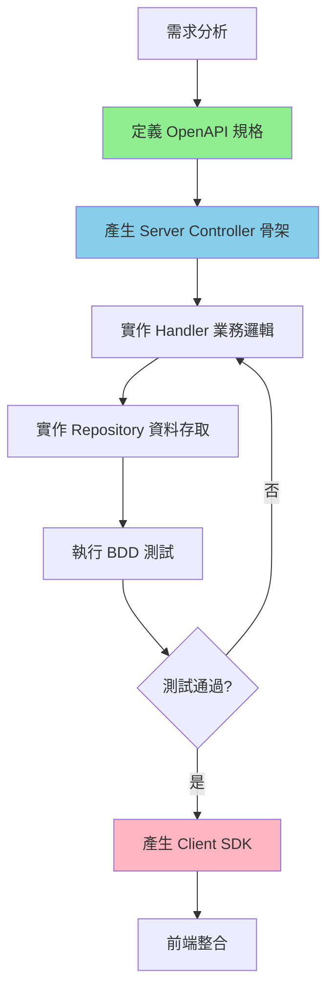

# 開發工作流程與指令

本文件定義了專案的標準開發流程，包括 Taskfile 指令、API 開發模式選擇，以及完整的開發步驟。

## 開發指令

### Taskfile 使用原則
- **優先使用 Taskfile**: 所有重複執行的開發指令應盡可能透過 `task` 命令執行
- **命令集中管理**: 複雜的多步驟指令應寫入 `Taskfile.yml`
- **提醒與建議**: 在建議執行長指令時，應提醒用戶「建議將此命令添加到 Taskfile.yml」

### 常用指令
- **開發模式執行 API**: `task api-dev`
- **建置解決方案**: `task build`
- **執行單元測試**: `task test-unit`
- **執行整合測試**: `task test-integration`
- **產生 API 程式碼**: `task codegen-api`
- **從資料庫反向工程產生實體**: `task ef-codegen`
- **建立新的 Migration**: `task ef-migration-add NAME=<MigrationName>`
- **更新資料庫**: `task ef-database-update`

**重要**: EF Core 相關指令必須透過 Taskfile 執行，不應直接執行 `dotnet ef` 指令。

## 開發工作流程

#### 標準開發流程
```
1. 需求分析
   ↓
2. 【互動】選擇 API 開發流程
   - API First（推薦）：先定義 OpenAPI 規格，再產生 server code
   - Code First：直接實作程式碼
   ↓
3. 【互動】詢問測試策略與範圍
   - 是否需要測試？
   - 測試類型（BDD/單元測試/兩者）
   - 測試範圍與情境
   ↓
4. 撰寫 BDD 情境 (.feature 檔案) - 如果需要 BDD 測試
   ↓
5a. API First 流程:
   ├→ 更新 OpenAPI 規格 (doc/openapi.yml)
   ├→ 產生 Server 程式碼 (task codegen-api-server)
   └→ 產生 Client 程式碼 (task codegen-api-client)
   ↓
5b. Code First 流程:
   └→ 直接實作程式碼（後續手動更新 OpenAPI）
   ↓
6. 實作 Handler 業務邏輯
   ↓
7. 實作 Repository 資料存取
   ↓
8. 實作 BDD 測試步驟 - 如果需要 BDD 測試
   ↓
9. 實作單元測試 - 如果需要單元測試
   ↓
10. 執行測試 (task test-integration / task test-unit)
   ↓
11. 手動測試 (Scalar UI)
   ↓
12. Code Review 與合併
```

**重要提醒**：
- 步驟 2 的 API 開發流程選擇是**強制性**的，不可跳過
- 步驟 3 的測試策略詢問是**強制性**的，不可跳過
- 根據使用者的選擇決定執行 5a 或 5b
- 根據使用者的測試選擇決定是否執行步驟 4、8、9、10
- 如果使用者選擇「暫不實作測試」，應跳過測試相關步驟，但需在 Code Review 時提醒

## API First 開發流程詳解

**核心理念**：先定義 API 契約（OpenAPI 規格），再產生程式碼骨架，確保：
- ✅ API 文件與實作 100% 同步
- ✅ 前後端可以並行開發（基於相同契約）
- ✅ 減少溝通成本與理解偏差
- ✅ 自動產生 Client SDK

**完整流程範例**：



**步驟 1: 定義 OpenAPI 規格**

📝 **專案 OpenAPI 規格檔案**：`doc/openapi.yml`

在現有規格中新增或修改 API 端點定義，包含：
- HTTP 方法與路徑
- 請求/回應的 Schema 定義
- 錯誤回應格式
- 參數驗證規則

**步驟 2: 產生 Server Controller 骨架**

執行命令產生 Controller 介面：
```bash
task codegen-api-server
```

產生位置：`JobBank1111.Job.WebAPI/Contract/AutoGenerated/`

**步驟 3: 實作 Controller**

實作自動產生的介面，整合 Handler 業務邏輯，處理 Result Pattern 回應轉換。

**步驟 4: 產生 Client SDK（前端使用）**

執行命令產生 Client：
```bash
task codegen-api-client
```

產生位置：`JobBank1111.Job.Contract/AutoGenerated/`

前端專案可直接引用自動產生的強型別 Client，享受完整的 IntelliSense 與編譯時檢查。

## API First vs Code First 對比：

| 比較項目 | API First（推薦） | Code First |
|---------|------------------|-----------|
| **文件同步** | ✅ 自動 100% 同步 | ❌ 需手動維護 |
| **前後端協作** | ✅ 可並行開發 | ⚠️ 需等後端完成 |
| **契約保證** | ✅ 編譯時檢查 | ❌ 執行時才發現 |
| **Client SDK** | ✅ 自動產生 | ❌ 需手動實作 |
| **開發速度** | ⚠️ 需先設計 API | ✅ 快速啟動 |
| **適用場景** | 中大型專案、團隊協作 | 小型專案、快速原型 |

**何時選擇 API First**：
- ✅ 前後端分離且團隊並行開發
- ✅ 需要提供 Client SDK 給第三方
- ✅ API 穩定性要求高
- ✅ 多個客戶端（Web、Mobile、Desktop）

**何時選擇 Code First**：
- ✅ 快速原型驗證
- ✅ 內部小型專案
- ✅ API 結構仍在快速變動中
- ✅ 單人開發或小團隊
