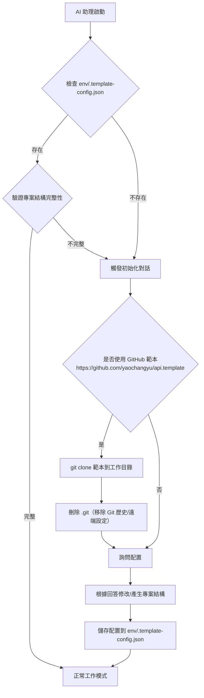

# 專案初始化指引

本文件包含專案狀態檢測機制與透過 GitHub 範本進行初始化的流程。

## 專案狀態檢測機制

當 AI 助理首次接觸此專案時，**必須優先檢測專案狀態**：

#### 檢測條件（滿足以下任一條件視為空白專案）
1. **不存在** `env/.template-config.json` 配置檔案
2. **不存在** `.sln` 解決方案檔案
3. **不存在** `src/` 目錄或該目錄為空
4. **不存在** `appsettings.json` 或 `docker-compose.yml`

#### 檢測流程


## GitHub 範本套用規則（初始化時）

當專案狀態檢測判定為「空白專案」時，初始化對話的第一個問題必須先詢問：

- 是否要使用 https://github.com/yaochangyu/api.template 作為專案範本

若使用者選擇「是」，AI 助理必須遵循：

1. **安全檢查（不得擅自覆蓋）**：
   - 僅在「工作目錄為空」或使用者已明確同意覆蓋/清空時，才可執行 clone。
   - 若工作目錄非空，必須先詢問使用者要「改用子資料夾」或「取消」。
2. **使用 git clone 下載範本**：
   - Windows PowerShell 範例（在空目錄中）：`git clone https://github.com/yaochangyu/api.template .`
3. **刪除 Git 相關資料**：
   - 刪除 `.git/` 目錄（移除歷史與遠端設定）。
   - Windows PowerShell 範例：`Remove-Item -Recurse -Force .git`
4. **接著才進入本專案的互動式配置**（資料庫/快取/專案結構等），並依照互動結果修改專案內容與寫入 `env/.template-config.json`。

## 配置檔案格式（env/.template-config.json ）
```json
{
  "database": {
    "type": "SQL Server",
    "version": "2022",
    "useEfCore": true
  },
  "cache": {
    "useRedis": true,
    "version": "7-alpine"
  },
  "projectOrganization": "single-project",
  "createdAt": "2025-12-15T14:22:22.741Z",
  "createdBy": "Claude CLI"
}
```