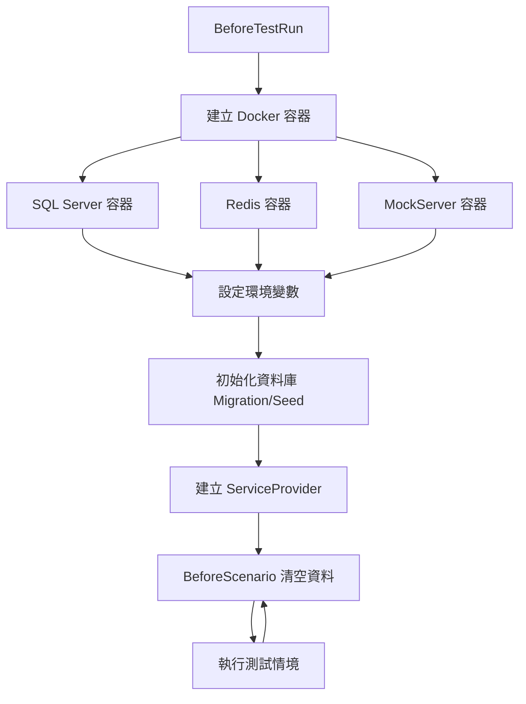
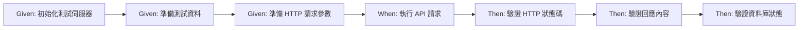

# Web API Testing Skill

## 描述
Web API 測試實作技能,協助開發者使用 Testcontainers + Reqnroll 撰寫完整的 API 整合測試,包含 Docker 測試環境、BDD 情境定義與測試步驟實作。

## 職責
- Web API 整合測試架構設計
- Docker 測試環境設定(Testcontainers)
- Gherkin .feature 檔案撰寫
- 測試步驟實作(Step Definitions)
- WebApplicationFactory 測試伺服器配置
- 外部 API 模擬(MockServer)

## 使用方式

### 在 GitHub Copilot 中使用
```
@workspace 我想要實作 Web API 測試
```

### 直接呼叫 Skill
```
使用 webapi-testing 撰寫 API 測試
```

## 核心原則

### Docker 優先測試策略
- ✅ **真實環境**:使用 Testcontainers 提供真實 SQL Server、Redis、MockServer
- ✅ **避免 Mock**:只在無法使用 Docker 的外部服務才使用 Mock
- ✅ **資料隔離**:每個測試獨立資料
- ✅ **自動清理**:測試後自動清理資料
- ✅ **並行支援**:利用 Docker 隔離特性支援測試並行執行

### API 測試必須使用 BDD
- ✅ 所有 Controller 功能必須使用 BDD 情境測試
- ❌ **禁止單獨測試 Controller**(不可直接實例化 Controller)
- ✅ 透過 WebApplicationFactory 執行完整 Web API 管線
- ✅ 從使用者行為情境出發

### BDD 開發循環
1. **需求分析**:撰寫 Gherkin 情境
2. **測試實作**:實作測試步驟
3. **功能開發**:實作業務邏輯
4. **測試驗證**:執行測試確保符合需求

## 測試架構組成

### 1. BaseStep.cs - BDD 測試步驟基底類別
管理測試生命週期與提供可重用的 Gherkin 步驟定義。

**核心職責**:
- 測試生命週期管理(BeforeTestRun, BeforeScenario)
- 通用 Gherkin 步驟定義(HTTP 請求、驗證、資料準備)
- JSON 驗證(JsonPath, JsonDiff)
- HTTP 請求/回應處理

**關鍵方法**:
```csharp
[BeforeTestRun]
public static async Task BeforeTestRun()
{
    // 建立 Docker 容器(SQL Server、Redis、MockServer)
    // 設定環境變數
    // 初始化資料庫
}

[BeforeScenario]
public async Task BeforeScenario()
{
    // 清空資料庫資料
}
```

**參考檔案**:`src/be/JobBank1111.Job.IntegrationTest/BaseStep.cs`

### 2. TestContainerFactory.cs - Docker 容器工廠
建立與管理測試所需的 Docker 容器。

**支援的容器**:
- **SQL Server 2019**:`CreateMsSqlContainerAsync()`
- **Redis 7.0**:`CreateRedisContainerAsync()`
- **PostgreSQL 13**:`CreatePostgreSqlContainerAsync()`
- **MockServer**:`CreateMockServerContainerAsync()`

**使用範例**:
```csharp
var msSqlContainer = await TestContainerFactory.CreateMsSqlContainerAsync();
var dbConnectionString = msSqlContainer.GetConnectionString();

var redisContainer = await TestContainerFactory.CreateRedisContainerAsync();
var redisUrl = redisContainer.GetConnectionString();

var mockServerContainer = await TestContainerFactory.CreateMockServerContainerAsync();
var externalUrl = TestContainerFactory.GetMockServerConnection(mockServerContainer);
```

**參考檔案**:`src/be/JobBank1111.Testing.Common/TestContainerFactory.cs`

### 3. TestServer.cs - WebApplicationFactory 測試伺服器
模擬 Web API 執行環境。

**核心功能**:
- 模擬身分驗證(AddFakeContextAccessor)
- 模擬時間(FakeTimeProvider)
- 整合 Docker 容器連線

**實作範例**:
```csharp
public class TestServer(DateTimeOffset now, string userId)
    : WebApplicationFactory<Program>
{
    private void ConfigureServices(IServiceCollection services)
    {
        // 註冊測試用 Controller
        services.AddControllers()
            .AddApplicationPart(typeof(TestController).Assembly);
        
        // 模擬身分
        services.AddFakeContextAccessor(userId);
        
        // 模擬現在時間
        var fakeTimeProvider = new FakeTimeProvider(now);
        services.AddSingleton<TimeProvider>(fakeTimeProvider);
    }

    protected override void ConfigureWebHost(IWebHostBuilder builder)
    {
        builder.ConfigureServices(this.ConfigureServices);
    }
}
```

**參考檔案**:`src/be/JobBank1111.Job.IntegrationTest/TestServer.cs`

### 4. ScenarioContextExtension.cs - 情境上下文擴充
管理測試情境中的狀態與資料。

**管理項目**:
- **HTTP 相關**:HttpClient、HttpResponse、HttpStatusCode、Headers、QueryString、RequestBody、ResponseBody
- **資料庫相關**:DbContextFactory、ServiceProvider
- **測試資料**:UserId、UtcNow、NextPageToken
- **JSON 驗證**:JsonNode

**常用方法**:
```csharp
// 設定測試伺服器
context.SetHttpClient(httpClient);
context.SetServiceProvider(server.Services);

// 設定測試資料
context.SetUserId("admin");
context.SetUtcNow(DateTimeOffset.Parse("2000-01-01T00:00:00+00:00"));

// 準備 HTTP 請求
context.AddHttpHeader("x-trace-id", "TEST-001");
context.AddQueryString("pageSize", "10");
context.SetHttpRequestBody(jsonBody);

// 取得回應
var statusCode = context.GetHttpStatusCode();
var responseBody = context.GetHttpResponseBody();
var jsonNode = context.GetJsonNode();

// 取得資料庫
var dbFactory = context.GetMemberDbContextFactory();
```

**參考檔案**:`src/be/JobBank1111.Job.IntegrationTest/ScenarioContextExtension.cs`

### 5. DbContextExtensions.cs - 資料庫測試輔助
資料庫測試相關的擴充方法。

**核心功能**:
```csharp
// 初始化測試資料庫(執行 Migration 或 EnsureCreated)
await dbContext.Initial();

// 清空所有資料表
dbContext.ClearAllData();

// 執行種子資料(執行 DB/Scripts/*.sql)
await dbContext.Seed();
```

**安全機制**:
```csharp
// 只允許 localhost 執行清空資料操作
SqlServerGenerateScript.OnlySupportLocal(connectionString);
```

**參考檔案**:`src/be/JobBank1111.Job.IntegrationTest/DbContextExtensions.cs`

### 6. MockedServerAssistant.cs - 外部 API 模擬
使用 MockServer 容器模擬外部 API。

**核心功能**:
```csharp
// 建立假端點
await MockedServerAssistant.PutNewEndPointAsync(
    client,
    httpMethod: "POST",
    relativePath: "/external/api/notify",
    statusCode: 200,
    body: "{\"success\": true}"
);

// 重置 MockServer
await MockedServerAssistant.ResetAsync(client);
```

**參考檔案**:`src/be/JobBank1111.Testing.Common/MockServer/MockedServerAssistant.cs`

## 測試環境架構

### Docker 容器生命週期



### 測試執行流程



## 互動問答範例

### 問題 1:測試範圍選擇

```
請選擇需要實作的測試範圍:

1️⃣ 完整測試(BDD 整合測試 + 單元測試)
   ✅ API 端點測試(透過 WebApplicationFactory)
   ✅ Handler 業務邏輯單元測試
   ✅ Repository 資料存取單元測試
   ⚠️ 開發時間較長

2️⃣ 僅 BDD 整合測試(推薦)
   ✅ API 端點測試(透過 WebApplicationFactory)
   ✅ 涵蓋 Controller → Handler → Repository 完整流程
   ⚠️ 無法單獨測試業務邏輯

3️⃣ 僅單元測試
   ✅ Handler 業務邏輯單元測試
   ✅ Repository 資料存取單元測試
   ⚠️ 無 API 端點測試

4️⃣ 暫不實作測試
   ⚠️ 快速原型、POC 驗證
   ❌ 無法保證程式碼品質
```

### 問題 2:測試情境定義

```
請提供需要測試的情境(可多選):

☑️ Happy Path(成功路徑)
   - 正常輸入,預期成功回應
   
☑️ 驗證失敗情境
   - 必填欄位缺失
   - 格式驗證失敗(Email、電話格式)
   - 業務規則驗證失敗

☑️ 業務錯誤情境
   - 重複資料(如 Email 已存在)
   - 資料不存在(如查無會員)
   - 狀態不符(如訂單已完成無法取消)

☑️ 邊界條件
   - 空字串、null 值
   - 最大/最小值
   - 特殊字元處理
   
☑️ 分頁與排序
   - Offset 分頁測試
   - Cursor 分頁測試
   - 排序欄位測試
```

### 問題 3:測試資料準備策略

```
請選擇測試資料準備策略:

1️⃣ 使用 Docker 容器(推薦)
   ✅ SQL Server Testcontainer
   ✅ Redis Testcontainer
   ✅ MockServer Testcontainer(模擬外部 API)
   ⚠️ 需要 Docker 環境

2️⃣ 使用固定測試資料(Seed Data)
   ✅ 每次測試前載入固定資料
   ✅ 測試結果可預期
   ⚠️ 需要手動維護種子資料(DB/Scripts/*.sql)

3️⃣ 動態產生測試資料
   ✅ 每次測試動態產生資料
   ✅ 避免資料衝突
   ⚠️ 測試結果較不穩定

測試資料清理策略:
☑️ 每個情境前清空所有資料(推薦)
☐ 每個情境後清空資料
☐ 所有測試結束後清空
```

### 問題 4:測試替身選擇

```
請選擇測試替身策略:

1️⃣ Docker 優先(推薦)
   ✅ 優先使用 Testcontainers(資料庫、Redis、MockServer)
   ✅ 僅在無法使用 Docker 時才用 Mock(如第三方 API)
   ✅ 真實環境,問題容易重現

2️⃣ Mock 優先
   ⚠️ 使用 Moq/NSubstitute 模擬所有依賴
   ⚠️ 測試速度快,但與真實環境有差異
   ❌ 不推薦用於 API 整合測試
```

### 問題 5:外部 API 模擬需求

```
是否需要模擬外部 API?

1️⃣ 是,需要模擬外部 API
   - 使用 MockServer 容器
   - 可設定回應內容、狀態碼、延遲時間
   - 範例:第三方支付 API、簡訊發送 API、Email 服務

2️⃣ 否,不需要外部 API
   - 此功能不涉及外部 API 呼叫
```

## Gherkin 語法完整範例

請參考檔案:`src/be/JobBank1111.Job.IntegrationTest/_01_Demo/飯粒.feature`

### Feature 檔案完整結構

```gherkin
Feature: 會員管理 API
  作為系統管理員
  我想要管理會員資料
  以便維護系統使用者

  Background:
    Given 初始化測試伺服器
      | Now                       | UserId |
      | 2000-01-01T00:00:00+00:00 | admin  |
    Given 調用端已準備 Header 參數
      | x-trace-id |
      | TEST-001   |

  Scenario: 成功建立新會員
    Given 調用端已準備 Body 參數(Json)
    """
    {
      "email": "user@example.com",
      "name": "張三",
      "age": 25
    }
    """
    When 調用端發送 "POST" 請求至 "api/v1/members"
    Then 預期得到 HttpStatusCode 為 "201"
    Then 預期回傳內容中路徑 "$.id" 的"字串等於" "1"
    Then 預期資料庫已存在 Member 資料為
      | Email             | Name | Age |
      | user@example.com  | 張三  | 25  |
```

### BaseStep 提供的通用步驟

#### 測試伺服器初始化
```gherkin
Given 初始化測試伺服器
  | Now                       | UserId |
  | 2000-01-01T00:00:00+00:00 | admin  |
```

#### 準備資料庫測試資料
```gherkin
Given 資料庫已存在 Member 資料
  | Id | Email            | Name | Age |
  | 1  | user@example.com | 張三  | 25  |
```

#### 準備 HTTP Header
```gherkin
Given 調用端已準備 Header 參數
  | x-trace-id | content-type     |
  | TEST-001   | application/json |
```

#### 準備 Query 參數
```gherkin
Given 調用端已準備 Query 參數
  | pageSize | pageIndex |
  | 10       | 0         |
```

#### 準備 Body 參數
```gherkin
Given 調用端已準備 Body 參數(Json)
"""
{
  "email": "user@example.com",
  "name": "張三"
}
"""
```

#### 建立假端點(模擬外部 API)
```gherkin
Given 建立假端點,HttpMethod = "POST",URL = "/external/api/notify",StatusCode = "200",ResponseContent =
"""
{
  "success": true
}
"""
```

#### 執行 HTTP 請求
```gherkin
When 調用端發送 "POST" 請求至 "api/v1/members"
When 調用端發送 "GET" 請求至 "api/v1/members/123"
```

#### 驗證 HTTP 狀態碼
```gherkin
Then 預期得到 HttpStatusCode 為 "200"
Then 預期得到 HttpStatusCode 為 "201"
Then 預期得到 HttpStatusCode 為 "400"
Then 預期得到 HttpStatusCode 為 "404"
Then 預期得到 HttpStatusCode 為 "409"
```

#### 驗證回應內容(JsonPath)
```gherkin
Then 預期回傳內容中路徑 "$.id" 的"字串等於" "1"
Then 預期回傳內容中路徑 "$.age" 的"數值等於" "25"
Then 預期回傳內容中路徑 "$.isActive" 的"布林值等於" "true"
Then 預期回傳內容中路徑 "$.createdAt" 的"時間等於" "2000-01-01T00:00:00+00:00"
```

#### 驗證回應內容(JSON 完整比對)
```gherkin
Then 預期回傳內容為
"""
{
  "id": "1",
  "email": "user@example.com",
  "name": "張三"
}
"""
```

#### 驗證資料庫資料
```gherkin
Then 預期資料庫已存在 Member 資料為
  | Id | Email            | Name | Age |
  | 1  | user@example.com | 張三  | 25  |
```

## 測試執行命令

```bash
# 執行所有整合測試
task test-integration

# 執行特定 Feature
dotnet test --filter "FullyQualifiedName~會員管理"

# 執行特定 Scenario
dotnet test --filter "FullyQualifiedName~成功建立新會員"
```

## 測試專案結構

```
JobBank1111.Job.IntegrationTest/
├── BaseStep.cs                      # 通用測試步驟基底類別
├── TestServer.cs                    # WebApplicationFactory 測試伺服器
├── TestAssistant.cs                 # 測試輔助工具
├── ScenarioContextExtension.cs      # 情境上下文擴充
├── DbContextExtensions.cs           # 資料庫測試擴充
├── ServiceCollectionExtension.cs    # DI 容器擴充
├── _01_Demo/
│   ├── 飯粒.feature                # BDD 情境定義範例
│   ├── 飯粒Step.cs                 # 自訂測試步驟範例
│   └── TestController.cs           # 測試用 Controller
└── DB/Scripts/                     # 種子資料(選用)

JobBank1111.Testing.Common/
├── TestContainerFactory.cs         # Docker 容器工廠
├── UrlBuilder.cs                   # URL 建構工具
├── SqlServerGenerateScript.cs      # SQL Server 清空資料腳本
├── NpgsqlGenerateScript.cs         # PostgreSQL 清空資料腳本
└── MockServer/
    ├── MockedServerAssistant.cs    # MockServer 輔助工具
    └── Contracts/                  # MockServer 請求/回應模型
```

## 最佳實踐

### 🔒 核心原則
1. **BDD 優先**:所有 API 功能都應有對應的 BDD 測試
2. **Docker 優先**:優先使用 Testcontainers,避免 Mock
3. **資料隔離**:每個情境前清空資料,確保測試獨立性
4. **真實管線**:透過 WebApplicationFactory 執行完整 HTTP 管線
5. **禁止直接測試 Controller**:不可實例化 Controller 進行單元測試

### 📋 Gherkin 撰寫建議
1. **情境命名**:使用業務語言,避免技術術語
2. **一個情境一個重點**:每個 Scenario 只測試一個業務行為
3. **Background 共用**:將重複的前置步驟放在 Background
4. **資料表驅動**:使用 Table 提供測試資料,提高可讀性

### ✅ 測試檢查清單
- [ ] Feature 檔案描述清楚業務價值
- [ ] Scenario 涵蓋 Happy Path 與異常情境
- [ ] 使用 Testcontainers 提供真實依賴服務
- [ ] 測試資料獨立,不依賴其他測試
- [ ] 驗證 HTTP 狀態碼與回應內容
- [ ] 驗證資料庫狀態變更(如需要)
- [ ] 外部 API 使用 MockServer 模擬

## 疑難排解

### Docker 容器啟動失敗
```
❌ 錯誤:無法啟動 SQL Server 容器

建議:
1. 確認 Docker Desktop 已啟動
2. 檢查環境變數 DOCKER_HOST=tcp://127.0.0.1:2375
3. 確認 Docker 有足夠資源(記憶體 >= 4GB、CPU >= 2 核心)
4. 查看 Docker 日誌:docker logs <container_id>
```

### 測試並行執行失敗
```
❌ 錯誤:測試並行執行時資料衝突

建議:
1. 確認已設定 DisableTestParallelization = true
2. 檢查 BaseStep.cs 的 CollectionDefinition 設定
3. 每個測試使用獨立的資料(不同 ID、Email)
```

### JSON 驗證失敗
```
❌ 錯誤:預期與實際 JSON 不符

建議:
1. 檢查 JSON 格式(空白、換行、大小寫)
2. 使用 JsonPath 驗證部分欄位而非完整比對
3. 注意日期時間格式與時區(統一使用 UTC)
```

## 相關 Skills
- `api-development` - API 開發流程
- `error-handling` - Result Pattern 錯誤處理
- `handler` - Handler 業務邏輯實作
- `ef-core` - EF Core 資料存取
- `bdd-testing` - BDD 基礎測試概念

## 相關 Agents
- `testing-strategy` - 測試策略規劃專家
- `feature-development` - 完整功能開發流程(包含測試)

## 參考檔案

### 核心測試架構
- `src/be/JobBank1111.Job.IntegrationTest/BaseStep.cs`
- `src/be/JobBank1111.Job.IntegrationTest/TestServer.cs`
- `src/be/JobBank1111.Job.IntegrationTest/ScenarioContextExtension.cs`
- `src/be/JobBank1111.Job.IntegrationTest/DbContextExtensions.cs`

### 測試基礎設施
- `src/be/JobBank1111.Testing.Common/TestContainerFactory.cs`
- `src/be/JobBank1111.Testing.Common/MockServer/MockedServerAssistant.cs`

### 測試範例
- `src/be/JobBank1111.Job.IntegrationTest/_01_Demo/飯粒.feature`
- `src/be/JobBank1111.Job.IntegrationTest/_01_Demo/飯粒Step.cs`

## 技術堆疊
- **測試框架**:xUnit 2.9.2
- **BDD 框架**:Reqnroll.xUnit 2.1.1
- **Docker 測試**:Testcontainers 3.10.0
- **測試伺服器**:WebApplicationFactory (ASP.NET Core 8.0)
- **JSON 驗證**:Json.Path、System.Text.Json.JsonDiffPatch
- **斷言庫**:FluentAssertions
- **外部 API 模擬**:MockServer (Docker 容器)

# 注意
- 需要依照真實需求調整命名空間、類別名稱