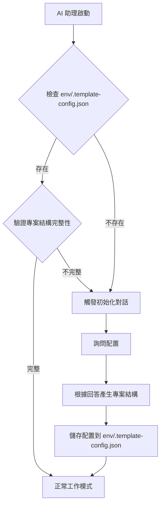

# CLAUDE.md

此檔案為 Claude Code (claude.ai/code) 在此專案中工作時的指導文件。
接下來的回覆、文件描述，均使用台灣用語的繁體中文

**📝 注意**: 本文件著重於概念、原則和規範說明。具體程式碼實作請參考專案內的實際檔案。

## 目錄 (Table of Contents)

### 核心指引
- [AI 助理使用規則](#ai-助理使用規則)
  - [專案狀態檢測機制](#專案狀態檢測機制)
- [開發指令](#開發指令)
- [架構概述](#架構概述)
  - [分層架構](#分層架構)
  - [技術堆疊](#技術堆疊)

### 開發實踐
- [BDD 開發流程](#bdd-開發流程-行為驅動開發)
- [核心開發原則](#核心開發原則)
- [專案最佳實踐](#專案最佳實踐-best-practices)

### 技術深入
- [追蹤內容管理 (TraceContext)](#追蹤內容管理-tracecontext)
- [錯誤處理與回應管理](#錯誤處理與回應管理)
- [中介軟體架構與實作](#中介軟體架構與實作)
- [效能最佳化與快取策略](#效能最佳化與快取策略)
- [API 設計與安全性](#api-設計與安全性強化)

### 營運與部署
- [監控與可觀測性](#監控與可觀測性)
- [容器化與部署](#容器化與部署最佳實務)

---

## AI 助理使用規則

### 核心互動原則

AI 助理在與使用者互動時，必須遵循以下核心原則：

1. **強制互動確認**
   - **Claude CLI**: 使用 `AskUserQuestion` 工具進行結構化詢問
   - **GitHub Copilot CLI / Cursor / 其他 AI**: 使用結構化的文字列表詢問
   - 在所有需要使用者決策的情境下，都必須明確詢問，不得擅自執行
   - 提供清晰的選項說明，幫助使用者做出明智選擇

2. **不得擅自假設**
   - 即使文件標註「預設」值，仍須詢問使用者確認
   - 例外：使用者已在對話中明確指定（如「使用 SQL Server」）
   - 所有 AI 助理都必須遵守此原則

3. **分階段互動**
   - 單次詢問最多 3-4 個問題，避免資訊過載
   - 複雜流程應分階段進行，根據前一階段的回答決定後續問題

4. **完整性優先**
   - 必須收集所有必要資訊後才開始執行
   - 不可因「加速開發」而省略必要的互動步驟

### 專案狀態檢測機制

當 AI 助理首次接觸此專案時，**必須優先檢測專案狀態**：

#### 檢測條件（滿足以下任一條件視為空白專案）
1. **不存在** `env/.template-config.json` 配置檔案
2. **不存在** `.sln` 解決方案檔案
3. **不存在** `src/` 目錄或該目錄為空
4. **不存在** `appsettings.json` 或 `docker-compose.yml`

#### 檢測流程


#### 配置檔案格式（env/.template-config.json）
```json
{
  "database": {
    "type": "SQL Server",
    "version": "2022",
    "useEfCore": true
  },
  "cache": {
    "useRedis": true,
    "version": "7-alpine"
  },
  "projectOrganization": "single-project",
  "createdAt": "2025-12-15T14:22:22.741Z",
  "createdBy": "Claude CLI"
}
```

### AI 互動模式

#### 模式 A: 工具驅動互動 (Tool-Driven Interaction)
適用於 Claude CLI，使用 `AskUserQuestion` 工具產生結構化詢問。

#### 模式 B: 文字驅動互動 (Text-Driven Interaction)
適用於 GitHub Copilot CLI / Cursor 等，使用結構化文字列表詢問。

**系統提示詞範本**：
```markdown
# AI 助理核心互動原則

你必須嚴格遵守以下四個核心原則：

1.  **主動提問，強制互動**：在執行任何有風險或需要使用者決策的操作前，你**必須**先向我提問，並等待我的確認。
2.  **禁止假設**：除非我已經在對話中明確指定，否則不要對任何事情做出假設。
3.  **分階段、少量提問**：將問題分階段提出，每次只問 2-3 個最關鍵的問題。
4.  **先收集資訊，再執行**：確保在開始執行任務前，已經透過提問收集了所有必要的資訊。
```

### 強制詢問情境

#### 1. 專案初始化與配置
- 資料庫類型選擇
- Redis 快取需求
- 專案結構組織方式（單一專案 vs 多專案）

#### 2. 資料庫相關操作
- Code First vs Database First 模式選擇
- Migration 名稱與套用策略
- 資料表範圍選擇

#### 3. 功能實作
- OpenAPI 規格定義狀態
- 需要實作的分層（Controller/Handler/Repository）
- BDD 測試需求

#### 4. 效能最佳化
- 優化面向選擇（資料庫查詢/快取策略/非同步處理/記憶體使用）

### 禁止的行為 ❌
1. **擅自使用預設值** - 必須明確詢問使用者選擇
2. **跳過詢問步驟** - 即使有推薦選項，仍須確認
3. **一次詢問過多問題** - 每次最多 3-4 個問題
4. **提供不明確的選項** - 必須加入說明

---

## 開發指令

### Taskfile 使用原則
- **優先使用 Taskfile**: 所有重複執行的開發指令應盡可能透過 `task` 命令執行
- **命令集中管理**: 複雜的多步驟指令應寫入 `Taskfile.yml`
- **提醒與建議**: 在建議執行長指令時，應提醒用戶「建議將此命令添加到 Taskfile.yml」

### 常用指令
- **開發模式執行 API**: `task api-dev`
- **建置解決方案**: `task build`
- **執行單元測試**: `task test-unit`
- **執行整合測試**: `task test-integration`
- **產生 API 程式碼**: `task codegen-api`
- **從資料庫反向工程產生實體**: `task ef-codegen`
- **建立新的 Migration**: `task ef-migration-add NAME=<MigrationName>`
- **更新資料庫**: `task ef-database-update`

**重要**: EF Core 相關指令必須透過 Taskfile 執行，不應直接執行 `dotnet ef` 指令。

---

## 架構概述

### 核心專案
- **JobBank1111.Job.WebAPI**: 主要的 Web API 應用程式
- **JobBank1111.Infrastructure**: 跨領域基礎設施服務
- **JobBank1111.Job.DB**: Entity Framework Core 資料存取層
- **JobBank1111.Job.Contract**: 從 OpenAPI 規格自動產生的 API 客戶端合約

### 分層架構

#### 分層模式（Controller → Handler → Repository）
- **Controller 層**: HTTP 請求/回應、路由、請求驗證、HTTP 狀態碼對應
- **Handler 層**: 核心業務邏輯、流程協調、錯誤處理與結果封裝
- **Repository 層**: 資料存取邏輯、EF Core 操作、資料庫查詢封裝

#### 組織方式

**方案 A：單一專案結構**
- 所有功能層都在 `JobBank1111.Job.WebAPI` 專案內
- 適合小型團隊（3 人以下）、快速開發
- 優點：編譯快速、部署簡單
- 缺點：程式碼耦合度較高

**方案 B：多專案結構**
- Controller、Handler、Repository 各自獨立專案
- 適合大型團隊、明確分工、長期維護
- 優點：職責清晰分離、便於團隊協作
- 缺點：專案結構較複雜、編譯時間較長

**📝 實作參考**:
- Controller 範例：[src/be/JobBank1111.Job.WebAPI/Member/MemberController.cs](src/be/JobBank1111.Job.WebAPI/Member/MemberController.cs)
- Handler 範例：[src/be/JobBank1111.Job.WebAPI/Member/MemberHandler.cs](src/be/JobBank1111.Job.WebAPI/Member/MemberHandler.cs)
- Repository 範例：[src/be/JobBank1111.Job.WebAPI/Member/MemberRepository.cs](src/be/JobBank1111.Job.WebAPI/Member/MemberRepository.cs)

### 技術堆疊
- **框架**: ASP.NET Core 8.0
- **資料庫**: Entity Framework Core 與 SQL Server
- **快取**: Redis 搭配記憶體內快取備援
- **錯誤處理**: CSharpFunctionalExtensions 3.1.0 (Result Pattern)
- **驗證**: FluentValidation 11.10.0
- **日誌記錄**: Serilog 結構化日誌
- **測試**: xUnit 2.9.2、Testcontainers 3.10.0、Reqnroll.xUnit 2.1.1 (BDD)
- **API 文件**: Swagger/OpenAPI 搭配 ReDoc 與 Scalar 檢視器

### 程式碼產生工作流程
1. API 規格維護在 `doc/openapi.yml`
2. 使用 Refitter 產生客戶端程式碼至 `JobBank1111.Job.Contract`
3. 使用 NSwag 產生伺服器控制器至 `JobBank1111.Job.WebAPI/Contract`
4. 使用 EF Core 反向工程產生資料庫實體至 `JobBank1111.Job.DB`

**重要規範**: 
- 所有自動產生的程式碼都放在 `AutoGenerated` 資料夾中，不可手動編輯
- EF Core 反向工程與 Migration 必須透過 Taskfile 執行

---

## BDD 開發流程 (行為驅動開發)

專案採用 BDD 開發模式，使用 Docker 容器作為測試替身，確保需求、測試與實作的一致性。

### BDD 開發循環

#### 1. 需求分析階段
使用 Gherkin 語法定義功能情境，參考：[src/be/JobBank1111.Job.IntegrationTest/_01_Demo/](src/be/JobBank1111.Job.IntegrationTest/_01_Demo/) 目錄下的 `.feature` 檔案。

#### 2. 測試實作階段
使用 Reqnroll 與真實 Docker 服務實作測試步驟，參考測試步驟實作檔案。

#### 3. Docker 測試環境
完全基於 Docker 的測試環境，避免使用 Mock。包含：
- SQL Server 容器
- Redis 容器
- Seq 日誌容器

📝 **測試環境設定參考**: [src/be/JobBank1111.Job.IntegrationTest/TestServer.cs](src/be/JobBank1111.Job.IntegrationTest/TestServer.cs)

### Docker 優先測試策略

#### 核心原則
- **真實環境**: 使用 Docker 容器提供真實的資料庫、快取、訊息佇列等服務
- **避免 Mock**: 只有在無法使用 Docker 替身的外部服務才考慮 Mock
- **隔離測試**: 每個測試使用獨立的資料，測試完成後自動清理
- **並行執行**: 利用 Docker 容器的隔離特性支援測試並行執行

📝 **測試輔助工具參考**: [src/be/JobBank1111.Job.IntegrationTest/TestAssistant.cs](src/be/JobBank1111.Job.IntegrationTest/TestAssistant.cs)

### API 控制器測試指引

#### 核心原則
- **BDD 優先**: 所有控制器功能必須優先使用 BDD 情境測試
- **禁止單獨測試控制器**: 不應直接實例化控制器進行單元測試
- **強制使用 WebApplicationFactory**: 所有測試必須透過完整的 Web API 管線與 Docker 測試環境
- **情境驅動開發**: 從使用者行為情境出發

---

## 核心開發原則

### 不可變物件設計 (Immutable Objects)
- 使用 C# record 類型定義不可變物件，例如 `TraceContext`
- 所有屬性使用 `init` 關鍵字
- 避免在應用程式各層間傳遞可變狀態

📝 **TraceContext 實作參考**: [src/be/JobBank1111.Job.WebAPI/TraceContext.cs](src/be/JobBank1111.Job.WebAPI/TraceContext.cs)

### 架構守則
- 業務邏輯層不應直接處理 HTTP 相關邏輯
- 所有跨領域關注點（如身分驗證、日誌、追蹤）應在中介軟體層處理
- 使用不可變物件傳遞狀態
- 透過 DI 容器注入 TraceContext

### 用戶資訊管理
- **不可變性原則**: 確保物件的不可變，身分驗證後的用戶資訊存放在 TraceContext
- **集中處理**: 集中在 TraceContextMiddleware 處理
- **依賴注入**: 透過 IContextSetter 設定用戶資訊，透過 IContextGetter 取得

📝 **中介軟體實作參考**: [src/be/JobBank1111.Job.WebAPI/TraceContextMiddleware.cs](src/be/JobBank1111.Job.WebAPI/TraceContextMiddleware.cs)

---

## 專案最佳實踐 (Best Practices)

### 1. 程式碼組織與命名規範

#### 命名規範
- **Handler**: `{Feature}Handler.cs`
- **Repository**: `{Feature}Repository.cs`
- **Controller**: `{Feature}Controller.cs` 或 `{Feature}ControllerImpl.cs`
- **Request/Response DTO**: `{Action}{Feature}Request.cs` / `{Feature}Response.cs`

### 2. 依賴注入最佳實踐

#### 主建構函式注入 (Primary Constructor)
使用 C# 12 的主建構函式簡化依賴注入，直接使用參數名稱，無需宣告欄位。

#### DbContextFactory 模式
使用 `IDbContextFactory<T>` 而非直接注入 `DbContext`，避免生命週期問題。

📝 **Repository 實作參考**: [src/be/JobBank1111.Job.WebAPI/Member/MemberRepository.cs](src/be/JobBank1111.Job.WebAPI/Member/MemberRepository.cs)

### 3. 非同步程式設計最佳實踐

#### 核心原則
- 所有 I/O 操作都必須使用 async/await
- 所有非同步方法都應支援 CancellationToken
- 避免使用 `.Result` 或 `.Wait()`（死鎖風險）

### 4. EF Core 查詢最佳化
- 使用 `AsNoTracking()` 提升唯讀查詢效能
- 使用 `Include` 或 `Join` 避免 N+1 查詢問題
- 適當使用分頁查詢

### 5. 快取策略最佳實踐

#### 快取鍵命名規範
- 使用冒號分隔命名空間：`{feature}:{operation}:{parameters}`
- 範例：`members:page:0:10`, `member:email:test@example.com`

📝 **快取實作參考**: [src/be/JobBank1111.Infrastructure/Caching/](src/be/JobBank1111.Infrastructure/Caching/)

### 6. 日誌記錄最佳實踐

#### 集中式日誌策略
**核心原則**: 日誌記錄集中在 Middleware 層，業務邏輯層不記錄錯誤日誌，只回傳 Failure。

#### 結構化日誌格式
使用 Serilog 的結構化日誌，自動包含 TraceId。

📝 **中介軟體實作參考**: 
- [src/be/JobBank1111.Job.WebAPI/ExceptionHandlingMiddleware.cs](src/be/JobBank1111.Job.WebAPI/ExceptionHandlingMiddleware.cs)
- [src/be/JobBank1111.Job.WebAPI/RequestParameterLoggerMiddleware.cs](src/be/JobBank1111.Job.WebAPI/RequestParameterLoggerMiddleware.cs)

### 7. 安全最佳實踐

#### 機敏設定管理
**核心原則**: 不要在 `appsettings.json` 儲存機密。

- ❌ **禁止**: 在 `appsettings.json` 放入連線字串、金鑰、權杖
- ✅ **改用**: 環境變數、.NET User Secrets（本機）、Docker Secrets（容器）、雲端祕密管家

### 8. 程式碼產生與維護

**核心原則**: 所有自動產生的程式碼都放在 `AutoGenerated` 資料夾中，不可手動編輯。

### 9. 開發工作流程

#### 標準開發流程
```
1. 需求分析
2. 撰寫 BDD 情境 (.feature 檔案)
3. 更新 OpenAPI 規格 (doc/openapi.yml)
4. 產生程式碼 (task codegen-api)
5. 實作 Handler 業務邏輯
6. 實作 Repository 資料存取
7. 實作 BDD 測試步驟
8. 執行測試 (task test-integration)
9. 手動測試 (Scalar UI)
10. Code Review 與合併
```

### 10. 常見錯誤與陷阱

#### ❌ 禁止的模式
1. **直接測試 Controller** - 必須透過 BDD 情境測試
2. **不使用 Result Pattern** - 不要拋出業務邏輯例外
3. **未保存原始例外** - 必須將例外寫入 `Failure.Exception`
4. **忘記傳遞 CancellationToken** - 所有非同步方法都應支援

---

## 追蹤內容管理 (TraceContext)

### 集中式管理架構
- **統一處理點**: 所有追蹤內容與使用者資訊統一在 `TraceContextMiddleware` 中處理
- **不可變性**: `TraceContext` 使用 record 定義，包含 `TraceId` 與 `UserId` 等不可變屬性
- **身分驗證整合**: 在 `TraceContextMiddleware` 中統一處理使用者身分驗證

### 生命週期與服務注入
- **生命週期**: 透過 `AsyncLocal<T>` 機制確保 TraceContext 在整個請求生命週期內可用
- **服務注入**: 使用 `IContextGetter<T>` 與 `IContextSetter<T>` 介面進行依賴注入
- **TraceId 處理**: 從請求標頭擷取或自動產生 TraceId
- **回應標頭**: 自動將 TraceId 加入回應標頭供追蹤使用

📝 **實作參考**: 
- [src/be/JobBank1111.Job.WebAPI/TraceContext.cs](src/be/JobBank1111.Job.WebAPI/TraceContext.cs)
- [src/be/JobBank1111.Job.WebAPI/TraceContextMiddleware.cs](src/be/JobBank1111.Job.WebAPI/TraceContextMiddleware.cs)

---

## 錯誤處理與回應管理

### Result Pattern 設計

#### 核心架構
- **Result 套件**: 使用 `CSharpFunctionalExtensions` 3.1.0 套件
- **應用範圍**: Repository 層和 Handler 層必須使用 `Result<TSuccess, TFailure>` 作為回傳類型
- **映射規則**: 使用 `FailureCodeMapper` 將錯誤代碼映射至 HTTP 狀態碼

#### FailureCode 列舉
```csharp
public enum FailureCode
{
    Unauthorized,        // 未授權存取
    DbError,            // 資料庫錯誤
    DuplicateEmail,     // 重複郵件地址
    DbConcurrency,      // 資料庫併發衝突
    ValidationError,    // 驗證錯誤
    InvalidOperation,   // 無效操作
    Timeout,           // 逾時
    InternalServerError, // 內部伺服器錯誤
    Unknown            // 未知錯誤
}
```

#### Failure 物件結構
- **Code**: 錯誤代碼
- **Message**: 例外的原始訊息
- **TraceId**: 追蹤識別碼
- **Exception**: 原始例外物件（不序列化到客戶端）
- **Data**: 結構化資料

📝 **實作參考**: 
- [src/be/JobBank1111.Job.WebAPI/Failure.cs](src/be/JobBank1111.Job.WebAPI/Failure.cs)
- [src/be/JobBank1111.Job.WebAPI/FailureCode.cs](src/be/JobBank1111.Job.WebAPI/FailureCode.cs)
- [src/be/JobBank1111.Job.WebAPI/FailureCodeMapper.cs](src/be/JobBank1111.Job.WebAPI/FailureCodeMapper.cs)

### 分層錯誤處理策略

#### 業務邏輯錯誤處理 (Handler 層)
- 使用 Result Pattern 處理預期的業務邏輯錯誤
- 回傳適當的 HTTP 狀態碼 (400, 401, 404, 409 等)
- 不應讓業務邏輯錯誤流到系統例外處理層

#### 系統層級例外處理 (ExceptionHandlingMiddleware)
- 僅捕捉未處理的系統層級例外
- 使用結構化日誌記錄例外詳細資訊
- 將系統例外轉換為標準化的 `Failure` 物件回應
- 統一設定為 500 Internal Server Error

📝 **實作參考**: [src/be/JobBank1111.Job.WebAPI/ExceptionHandlingMiddleware.cs](src/be/JobBank1111.Job.WebAPI/ExceptionHandlingMiddleware.cs)

### 錯誤處理最佳實務原則
- **不要重複拋出例外**: 處理過的例外不應再次 throw
- **統一錯誤碼**: 使用 `nameof(FailureCode.*)` 定義錯誤碼
- **例外封裝規則**: 所有捕捉到的例外都必須寫入 `Failure.Exception` 屬性
- **包含追蹤資訊**: 確保所有 Failure 物件都包含 TraceId
- **安全回應**: 不洩露內部實作細節給客戶端
- **分離關注點**: 業務錯誤與系統例外分別在不同層級處理
- **載體日誌職責**: 業務邏輯層不記錄錯誤日誌，由 Middleware 記錄

---

## 中介軟體架構與實作

### 中介軟體管線架構與職責

#### 管線順序與責任劃分
1. **ExceptionHandlingMiddleware**: 最外層，捕捉系統層級例外
2. **TraceContextMiddleware**: 處理使用者身分驗證與追蹤內容設定
3. **LoggerMiddleware**: 記錄請求與回應日誌
4. **RequestParameterLoggerMiddleware**: 當請求成功完成時記錄請求資訊

#### 職責分離原則
- **例外處理**: 僅在 `ExceptionHandlingMiddleware` 捕捉系統例外
- **追蹤管理**: 所有 TraceContext 相關處理集中在 `TraceContextMiddleware`
- **日誌記錄**: 分別在例外情況和正常完成時記錄，避免重複
- **請求資訊**: 使用 `RequestInfoExtractor` 統一擷取請求參數

📝 **實作參考**: 
- [src/be/JobBank1111.Job.WebAPI/ExceptionHandlingMiddleware.cs](src/be/JobBank1111.Job.WebAPI/ExceptionHandlingMiddleware.cs)
- [src/be/JobBank1111.Job.WebAPI/TraceContextMiddleware.cs](src/be/JobBank1111.Job.WebAPI/TraceContextMiddleware.cs)
- [src/be/JobBank1111.Job.WebAPI/RequestParameterLoggerMiddleware.cs](src/be/JobBank1111.Job.WebAPI/RequestParameterLoggerMiddleware.cs)
- [src/be/JobBank1111.Job.WebAPI/RequestInfoExtractor.cs](src/be/JobBank1111.Job.WebAPI/RequestInfoExtractor.cs)

### RequestInfoExtractor 功能
1. **路由參數**: 擷取 URL 路由中的參數
2. **查詢參數**: 擷取 URL 查詢字串參數
3. **請求標頭**: 擷取 HTTP 標頭，自動排除敏感標頭
4. **請求本文**: 對於 POST/PUT/PATCH 請求，擷取請求本文內容並嘗試解析 JSON
5. **基本資訊**: 記錄 HTTP 方法、路徑、內容類型、內容長度等

### 中介軟體最佳實務原則
- **專一職責**: 每個中介軟體專注於單一關注點
- **避免重複**: 透過管線設計避免重複處理和記錄
- **統一格式**: 所有請求資訊記錄使用相同的資料結構
- **效能考量**: 只有在需要時才擷取請求本文
- **錯誤容錯**: 記錄過程中發生錯誤不影響業務邏輯執行

---

## 效能最佳化與快取策略

### 快取架構設計

#### 多層快取策略
- **L1 快取 (記憶體內快取)**: 使用 `IMemoryCache` 存放頻繁存取的小型資料
- **L2 快取 (分散式快取)**: 使用 Redis 作為分散式快取，支援多實例共用
- **快取備援**: 當 Redis 不可用時，自動降級至記憶體快取
- **快取預熱**: 應用程式啟動時預載常用資料

📝 **快取實作參考**: [src/be/JobBank1111.Infrastructure/Caching/](src/be/JobBank1111.Infrastructure/Caching/)

#### 快取失效與管理策略
- **時間過期 (TTL)**: 設定合理的快取過期時間
- **版本控制**: 使用版本號管理快取一致性
- **標籤快取**: 支援批次清除相關快取項目
- **事件驅動**: 資料異動時主動清除對應快取

### ASP.NET Core 效能最佳化

#### 核心原則
- **連線池**: 使用 `AddDbContextPool` 重用 DbContext 實例
- **查詢最佳化**: 使用 `AsNoTracking()` 避免不必要的異動追蹤
- **批次操作**: 使用 `BulkInsert` / `BulkUpdate` 處理大量資料
- **非同步程式設計**: 使用 `ConfigureAwait(false)` 避免死鎖

### 記憶體管理與垃圾收集
- **物件池**: 使用 `ObjectPool<T>` 重用昂貴物件
- **Span<T> 與 Memory<T>**: 減少記憶體配置的現代化 API
- **字串最佳化**: 使用 `StringBuilder` 與字串插值最佳化

---

## API 設計與安全性強化

### RESTful API 設計原則

#### API 版本控制策略
支援 URL 路徑版本控制與標頭版本控制。

#### 內容協商與媒體類型
- **Accept 標頭處理**: 支援多種回應格式 (JSON, XML)
- **內容壓縮**: 自動 Gzip/Brotli 壓縮
- **API 文件**: 整合 Swagger/OpenAPI 3.0 規格

📝 **API 規格參考**: [doc/openapi.yml](doc/openapi.yml)

### API 安全性防護

#### 輸入驗證與清理
使用 FluentValidation 或 DataAnnotations 進行模型驗證，防止 SQL Injection、XSS 等攻擊。

#### CORS 與跨來源安全
根據環境設定不同的 CORS 政策，生產環境限制允許的來源。

#### HTTPS 強制與安全標頭
- HTTPS 重新導向與 HSTS
- 安全標頭：X-Content-Type-Options, X-Frame-Options, X-XSS-Protection, CSP

#### API 限流與頻率控制
使用 AspNetCoreRateLimit 套件實作限流機制，防止 DDoS 攻擊。

---

## 監控與可觀測性

### 健康檢查 (Health Checks)

#### 多層健康檢查架構
- **自我檢查**: API 服務本身狀態
- **資料庫檢查**: SQL Server 連線與查詢
- **快取檢查**: Redis 連線狀態
- **外部服務檢查**: 第三方 API 可用性

端點：
- `/health` - 完整健康檢查
- `/health/ready` - 就緒檢查（資料庫、快取）
- `/health/live` - 存活檢查（API 服務）

### OpenTelemetry 整合

#### 分散式追蹤設定
支援 Jaeger、Prometheus 等監控系統整合，提供分散式追蹤能力。

### 效能計數器與度量

#### 自訂度量收集
收集業務指標（如會員建立數、登入次數）與效能指標（如操作持續時間）。

### 日誌聚合與分析

#### Seq 結構化日誌設定
使用 Serilog 輸出結構化日誌到 Seq，支援日誌查詢與分析。

---

## 容器化與部署最佳實務

### Docker 容器化

#### 多階段建置
使用多階段 Dockerfile 減少映像大小，分離建置環境與執行環境。

#### 安全性考量
- 使用非 root 使用者執行
- 最小化映像大小
- 定期更新基礎映像

📝 **Docker 配置參考**: [docker-compose.yml](docker-compose.yml)

### CI/CD 管線

支援 GitHub Actions、Azure DevOps 等 CI/CD 工具，自動化測試、建置與部署流程。

### 生產環境設定管理

#### 環境變數與機密管理
- 開發環境：.NET User Secrets、`env/local.env`
- 容器環境：Docker/K8s Secrets
- 雲端環境：Azure Key Vault 等祕密管家

#### Kubernetes 部署
支援 Kubernetes 部署，包含 Deployment、Service、HPA 等資源配置。

---

## 附錄：快速參考

### 重要檔案路徑

#### Controller 層
- [src/be/JobBank1111.Job.WebAPI/Member/MemberController.cs](src/be/JobBank1111.Job.WebAPI/Member/MemberController.cs)

#### Handler 層
- [src/be/JobBank1111.Job.WebAPI/Member/MemberHandler.cs](src/be/JobBank1111.Job.WebAPI/Member/MemberHandler.cs)

#### Repository 層
- [src/be/JobBank1111.Job.WebAPI/Member/MemberRepository.cs](src/be/JobBank1111.Job.WebAPI/Member/MemberRepository.cs)

#### 中介軟體
- [src/be/JobBank1111.Job.WebAPI/TraceContextMiddleware.cs](src/be/JobBank1111.Job.WebAPI/TraceContextMiddleware.cs)
- [src/be/JobBank1111.Job.WebAPI/ExceptionHandlingMiddleware.cs](src/be/JobBank1111.Job.WebAPI/ExceptionHandlingMiddleware.cs)
- [src/be/JobBank1111.Job.WebAPI/RequestParameterLoggerMiddleware.cs](src/be/JobBank1111.Job.WebAPI/RequestParameterLoggerMiddleware.cs)

#### 錯誤處理
- [src/be/JobBank1111.Job.WebAPI/Failure.cs](src/be/JobBank1111.Job.WebAPI/Failure.cs)
- [src/be/JobBank1111.Job.WebAPI/FailureCode.cs](src/be/JobBank1111.Job.WebAPI/FailureCode.cs)
- [src/be/JobBank1111.Job.WebAPI/FailureCodeMapper.cs](src/be/JobBank1111.Job.WebAPI/FailureCodeMapper.cs)

#### 追蹤管理
- [src/be/JobBank1111.Job.WebAPI/TraceContext.cs](src/be/JobBank1111.Job.WebAPI/TraceContext.cs)

#### 快取
- [src/be/JobBank1111.Infrastructure/Caching/](src/be/JobBank1111.Infrastructure/Caching/)

#### 測試
- [src/be/JobBank1111.Job.IntegrationTest/](src/be/JobBank1111.Job.IntegrationTest/) - BDD 整合測試
- [src/be/JobBank1111.Job.Test/](src/be/JobBank1111.Job.Test/) - 單元測試

### 最佳實踐檢查清單

#### 開發前
- [ ] 檢查專案狀態（是否需要初始化）
- [ ] 確認技術選型（資料庫、快取、專案結構）
- [ ] 撰寫 BDD 情境 (.feature 檔案)
- [ ] 更新 OpenAPI 規格

#### 開發中
- [ ] 使用主建構函式注入
- [ ] 使用 Result Pattern 處理錯誤
- [ ] 所有 I/O 操作使用 async/await
- [ ] 傳遞 CancellationToken
- [ ] 使用 DbContextFactory 而非直接注入 DbContext
- [ ] 保存原始例外到 Failure.Exception
- [ ] 使用結構化日誌格式

#### 測試
- [ ] 透過 BDD 情境測試 API
- [ ] 使用 Docker 測試環境
- [ ] 避免直接測試 Controller
- [ ] 確保測試資料清理

#### 部署前
- [ ] 檢查機密未存放在 appsettings.json
- [ ] 所有測試通過
- [ ] 無編譯警告
- [ ] 文件已更新
- [ ] Code Review 完成

---

**文件版本**: 2.0 (精簡版)
**最後更新**: 2025-12-16
