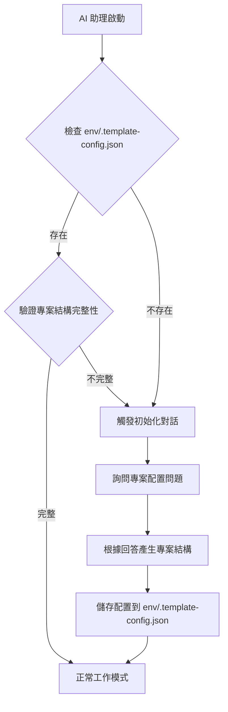
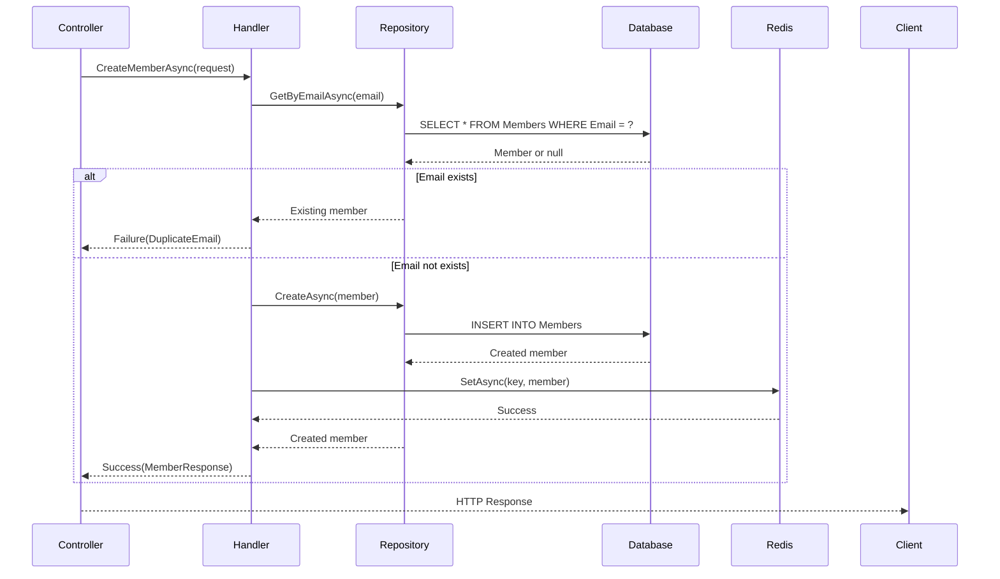

# CLAUDE.md

此檔案為 Claude Code (claude.ai/code) 在此專案中工作時的指導文件。
接下來的回覆、文件描述，均使用台灣用語的繁體中文

## AI 助理使用規則

### 專案狀態檢測機制
當 Claude CLI、GitHub Copilot CLI 或其他 AI 助理首次接觸此專案時，**必須優先檢測專案狀態**：

#### 檢測條件（滿足以下任一條件視為空白專案）
1. **不存在** `env/.template-config.json` 配置檔案
2. **不存在** `.sln` 解決方案檔案
3. **不存在** `src/` 目錄或該目錄為空
4. **不存在** `appsettings.json` 或 `docker-compose.yml`

#### 檢測流程


#### 必要行為規範
1. **禁止假設**: 不應假設專案已完成初始化，必須先執行檢測
2. **優先詢問**: 發現空白專案時，停止其他操作，優先進行互動式配置
3. **配置優先**: 詢問所有必要問題後，才開始產生程式碼或檔案
4. **記錄選擇**: 將用戶選擇寫入 `env/.template-config.json` 供後續參考

#### 初始化對話範例
```
AI: 偵測到這是一個空白的 API 專案範本，我需要先了解幾個配置選項：

1. **資料庫類型**（必選）
   - SQL Server (適合企業應用，預設)
   - PostgreSQL (開源、輕量)
   - MySQL (開源、廣泛支援)
   - 不使用資料庫 (僅記憶體操作)
   
   您的選擇：[等待用戶輸入]

2. **是否使用 Entity Framework Core**（依據資料庫選擇）
   - 是（預設，Code First + Migrations）
   - 否（使用 Dapper 或其他 ORM）
   
   您的選擇：[等待用戶輸入]

3. **資料庫版本**（依據資料庫類型）
   - SQL Server: 2019 | 2022 (預設) | 2025
   - PostgreSQL: 15 | 16 (預設) | 17
   - MySQL: 8.0 | 8.4 (預設) | 9.0
   
   您的選擇：[等待用戶輸入]

4. **快取需求**
   - 是 (使用 Redis，預設)
   - 否 (不使用快取)
   
   您的選擇：[等待用戶輸入]

5. **程式碼組織方式**
   - 單一專案（預設，所有層級在同一專案內用資料夾區分）
   - 多專案（Controller、Handler、Repository 各自獨立專案）
   
   您的選擇：[等待用戶輸入]

確認後，我將自動產生專案結構、配置檔案與必要的依賴項。
```

#### 配置檔案格式（env/.template-config.json）
```json
{
  "database": {
    "type": "SQL Server",
    "version": "2022",
    "useEfCore": true
  },
  "cache": {
    "useRedis": true,
    "version": "7-alpine"
  },
  "projectOrganization": "single-project",
  "createdAt": "2025-12-15T14:22:22.741Z",
  "createdBy": "Claude CLI"
}
```

## 開發指令

### Taskfile 使用原則
- **優先使用 Taskfile**: 所有重複執行的開發指令應盡可能透過 `task` 命令執行，而非直接執行 dotnet/npm/docker 指令
- **命令集中管理**: 複雜的多步驟指令應寫入 `Taskfile.yml`，提供簡潔的 `task` 別名
- **提醒與建議**: 在建議執行長指令時，應提醒用戶「建議將此命令添加到 Taskfile.yml」供日後重複使用
- **可讀性優先**: Taskfile 中的任務描述與變數定義應清晰，便於團隊協作與維護

### 建置與執行
- **開發模式執行 API**: `task api-dev` (使用 watch 模式與 --local 參數)
- **建置解決方案**: `task build` 或 `dotnet build src/be/JobBank1111.Job.Management.sln`
- **執行單元測試**: `task test-unit` 或 `dotnet test src/be/JobBank1111.Job.Test/JobBank1111.Job.Test.csproj`
- **執行整合測試**: `task test-integration` 或 `dotnet test src/be/JobBank1111.Job.IntegrationTest/JobBank1111.Job.IntegrationTest.csproj`

### 程式碼產生
- **產生 API 客戶端與伺服器端程式碼**: `task codegen-api`
- **僅產生 API 客戶端程式碼**: `task codegen-api-client`
- **僅產生 API 伺服器端程式碼**: `task codegen-api-server`
- **從資料庫反向工程產生 EF Core 實體**: `task ef-codegen`
  - **強制使用 Taskfile**: 必須透過 `task ef-codegen` 執行，不應直接執行 `dotnet ef dbcontext scaffold` 指令
  - **統一管理**: 資料庫連線字串、輸出路徑、命名空間等參數統一在 Taskfile.yml 中管理
  - **可追溯性**: 確保團隊成員使用相同的產生指令與參數
  - **環境變數整合**: 自動從 `env/local.env` 載入資料庫連線字串變數

### EF Core Migrations（Code First）
- **建立新的 Migration 檔案**: `task ef-migration-add NAME=<MigrationName>`
- **更新資料庫至最新版本**: `task ef-database-update`
- **回復至特定 Migration**: `task ef-database-update MIGRATION=<MigrationName>`
- **移除最後一個 Migration**: `task ef-migration-remove`
- **檢視 Migration 清單**: `task ef-migration-list`
- **產生 SQL 腳本**: `task ef-migration-script`
- **強制使用 Taskfile**: 
  - 必須透過 `task ef-migration-*` 執行，不應直接執行 `dotnet ef migrations` 或 `dotnet ef database update` 指令
  - 統一管理專案路徑、輸出目錄、連線字串等參數
  - 確保團隊成員使用一致的 Migration 流程
  - 自動從 `env/local.env` 載入環境變數

### 基礎設施
- **啟動 Redis**: `task redis-start`
- **啟動 Redis 管理介面**: `task redis-admin-start`
- **初始化開發環境**: `task dev-init`

### 文件
- **產生 API 文件**: `task codegen-api-doc`
- **預覽 API 文件**: `task codegen-api-preview`

## 架構概述

這是一個使用 Clean Architecture 模式的 .NET 8.0 Web API 專案，架構如下：

### 核心專案
- **JobBank1111.Job.WebAPI**: 主要的 Web API 應用程式，包含控制器、處理器與中介軟體
- **JobBank1111.Infrastructure**: 跨領域基礎設施服務 (快取、工具、追蹤內容)
- **JobBank1111.Job.DB**: Entity Framework Core 資料存取層，包含自動產生的實體
- **JobBank1111.Job.Contract**: 從 OpenAPI 規格自動產生的 API 客戶端合約

### 程式碼分層架構

#### 分層模式（Controller → Handler → Repository）
專案採用三層分層架構，確保關注點分離與程式碼可維護性：
- **Controller 層**: 處理 HTTP 請求/回應、路由、請求驗證、HTTP 狀態碼對應
- **Handler 層**: 實作核心業務邏輯、流程協調、錯誤處理與結果封裝
- **Repository 層**: 資料存取邏輯、EF Core 操作、資料庫查詢封裝

#### 組織方式（根據專案範本初始化選擇）

專案組織方式根據範本初始化時的選擇決定（參見「專案範本初始化」章節）：

**方案 A：單一專案結構（預設）**
```
JobBank1111.Job.WebAPI/
├── Controllers/          # 控制器層
├── Handlers/            # 業務邏輯處理器
├── Repositories/        # 儲存庫與資料存取
├── Middleware/          # 中介軟體
├── Models/              # DTO 與 Request/Response 模型
└── Extensions/          # 擴充方法
```

**方案 B：多專案結構**
```
JobBank1111.Job.WebAPI/        # 控制器層 + 中介軟體
JobBank1111.Job.Handler/       # 業務邏輯處理器（獨立專案）
JobBank1111.Job.Repository/    # 儲存庫（獨立專案）
JobBank1111.Job.DB/            # EF Core 資料存取層
JobBank1111.Infrastructure/    # 跨領域基礎設施
```

#### 分層職責規範

##### Controller 層職責
```csharp
// 單一專案：JobBank1111.Job.WebAPI/Controllers/MembersController.cs
// 多專案：JobBank1111.Job.WebAPI/Controllers/MembersController.cs

[ApiController]
[Route("api/v1/[controller]")]
public class MembersController : ControllerBase
{
    private readonly IMemberHandler _handler;
    
    public MembersController(IMemberHandler handler)
    {
        _handler = handler;
    }
    
    // Controller 負責：
    // 1. HTTP 請求/回應映射
    // 2. 路由與 HTTP 動詞對應
    // 3. 請求模型繫結與驗證
    // 4. 結果轉換為 HTTP 回應（200, 201, 400, 404 等）
    
    [HttpPost]
    public async Task<IActionResult> CreateMember([FromBody] CreateMemberRequest request)
    {
        var result = await _handler.CreateMemberAsync(request);
        return result.ToActionResult();
    }
}
```

##### Handler 層職責
```csharp
// 單一專案：JobBank1111.Job.WebAPI/Handlers/MemberHandler.cs
// 多專案：JobBank1111.Job.Handler/MemberHandler.cs

public interface IMemberHandler
{
    Task<Result<MemberResponse, Failure>> CreateMemberAsync(CreateMemberRequest request);
}

public class MemberHandler : IMemberHandler
{
    private readonly IMemberRepository _repository;
    private readonly IValidator<CreateMemberRequest> _validator;
    private readonly ILogger<MemberHandler> _logger;
    
    // Handler 負責：
    // 1. 業務邏輯實作與流程協調
    // 2. 驗證與業務規則檢查
    // 3. 呼叫 Repository 進行資料存取
    // 4. 錯誤處理與 Result Pattern 封裝
    
    public async Task<Result<MemberResponse, Failure>> CreateMemberAsync(CreateMemberRequest request)
    {
        // 1. 驗證
        var validationResult = await _validator.ValidateAsync(request);
        if (!validationResult.IsValid)
            return Failure.ValidationError(validationResult.Errors);
        
        // 2. 業務規則檢查
        var existing = await _repository.GetByEmailAsync(request.Email);
        if (existing != null)
            return Failure.DuplicateEmail();
        
        // 3. 資料存取
        var member = new Member { Name = request.Name, Email = request.Email };
        return await _repository.CreateAsync(member);
    }
}
```

##### Repository 層職責
```csharp
// 單一專案：JobBank1111.Job.WebAPI/Repositories/MemberRepository.cs
// 多專案：JobBank1111.Job.Repository/MemberRepository.cs

public interface IMemberRepository
{
    Task<Result<Member, Failure>> CreateAsync(Member member);
    Task<Member?> GetByEmailAsync(string email);
}

public class MemberRepository : IMemberRepository
{
    private readonly JobBankDbContext _dbContext;
    
    // Repository 負責：
    // 1. EF Core DbContext 操作與查詢封裝
    // 2. 資料庫異常處理與轉換為 Result Pattern
    // 3. 查詢最佳化（AsNoTracking、Include 等）
    // 4. 事務管理
    
    public async Task<Result<Member, Failure>> CreateAsync(Member member)
    {
        try
        {
            _dbContext.Members.Add(member);
            await _dbContext.SaveChangesAsync();
            return member;
        }
        catch (DbUpdateException ex)
        {
            return Failure.DbError("建立會員失敗", ex);
        }
    }
}
```

#### 依賴注入配置

```csharp
// Program.cs - 兩種方案的 DI 註冊方式相同

// 手動註冊
services
    .AddScoped<IMemberHandler, MemberHandler>()
    .AddScoped<IMemberRepository, MemberRepository>();

// 自動掃描註冊（推薦）
services.Scan(scan => scan
    .FromAssembliesOf(typeof(Program))  // 單一專案
    // .FromAssembliesOf(typeof(IMemberHandler), typeof(IMemberRepository))  // 多專案
    .AddClasses(classes => classes.AssignableTo<IMemberHandler>())
    .AsImplementedInterfaces()
    .WithScopedLifetime()
    .AddClasses(classes => classes.AssignableTo<IMemberRepository>())
    .AsImplementedInterfaces()
    .WithScopedLifetime());
```

#### 分層通訊規範

- **Controller ↔ Handler**: 透過介面，使用 Request/Response DTO
- **Handler ↔ Repository**: 使用 Result Pattern 傳遞結果與錯誤
- **Repository ↔ Database**: 使用 EF Core DbContext
- **依賴方向**: 單向依賴，避免循環參考（Controller → Handler → Repository → DB）

### 測試專案
- **JobBank1111.Job.Test**: 使用 xUnit 的單元測試
- **JobBank1111.Job.IntegrationTest**: 使用 xUnit、Testcontainers 與 Reqnroll (BDD) 的整合測試
  - **測試框架**: xUnit 2.9.2 + MSTest (混合框架支援)
  - **BDD 測試**: Reqnroll.xUnit 2.1.1 (Gherkin 語法與步驟定義)
  - **容器化測試**: Testcontainers 3.10.0 (Docker 測試環境)
  - **斷言庫**: FluentAssertions 6.12.1 + FluentAssertions.Json 6.1.0
  - **HTTP 測試**: Microsoft.AspNetCore.Mvc.Testing 8.0.10
  - **JSON 工具**: SystemTextJson.JsonDiffPatch.Xunit 2.0.0 + JsonPath.Net 1.1.6
  - **HTTP 客戶端**: Flurl 4.0.0 (流暢的 HTTP API)
  - **時間模擬**: Microsoft.Extensions.TimeProvider.Testing 8.10.0
  - **覆蓋率收集**: coverlet.collector 6.0.2
- **JobBank1111.Testing.Common**: 共享測試工具與模擬伺服器協助器

### 主要架構模式
- **處理器模式**: 商業邏輯封裝在處理器類別中 (例如 `MemberHandler`)
- **儲存庫模式**: 透過儲存庫類別進行資料存取 (例如 `MemberRepository`)
- **責任鏈模式**: 複雜操作的處理鏈 (例如 `MemberChain`)
- **中介軟體管線**: 用於追蹤內容與日誌記錄的自訂中介軟體
- **相依性注入**: 完整的 DI 容器設定與範圍驗證

### 技術堆疊
- **框架**: ASP.NET Core 8.0 with minimal APIs
- **資料庫**: Entity Framework Core 與 SQL Server
- **快取**: Redis 搭配 `CacheProviderFactory` 的記憶體內快取備援
- **錯誤處理**: CSharpFunctionalExtensions 3.1.0 (Result Pattern)
- **驗證**: FluentValidation 11.10.0
- **日誌記錄**: Serilog 結構化日誌輸出至控制台、檔案與 Seq
- **測試**: xUnit 2.9.2、FluentAssertions 6.12.1、Testcontainers 3.10.0、Reqnroll.xUnit 2.1.1 (BDD)
- **API 文件**: Swagger/OpenAPI 搭配 ReDoc 與 Scalar 檢視器
- **程式碼產生**: 客戶端使用 Refitter，伺服器控制器使用 NSwag

### 設定檔
- 使用 `--local` 參數時從 `env/local.env` 載入環境變數
- `JobBank1111.Job.WebAPI/appsettings.json` 中的應用程式設定
- Redis 與 Seq 日誌伺服器的 Docker Compose 設定
- `Taskfile.yml` 中的任務執行器設定

#### 機敏設定安全規範
- 機敏性資料不應放在 appsettings.json（例如：資料庫連線字串、帳號密碼、API Key）。
- 統一改用安全來源與環境變數管理設定：
    - 開發環境：使用 `.NET user-secrets` 與 `env/local.env`（不提交版本控制）。
    - 容器環境：透過 `docker-compose.yml` 的環境變數或 secrets 檔傳入。
    - 雲端／生產：使用雲端機密管理服務（例如 Azure Key Vault）並於啟動時載入。
- 設定覆寫優先順序：環境變數 > 使用者機密 > appsettings.*.json（appsettings 僅保留非機敏的預設值）。
- 連線字串建議以環境變數提供，例如 `ConnectionStrings__Default`，避免出現在原始碼或設定檔。
- 禁止將任何機密值提交到 Git；定期輪替憑證與密碼，並在程式中記錄來源（非內容）。

### 程式碼產生工作流程
專案使用 OpenAPI-first 與 Database-first 開發方式：
1. API 規格維護在 `doc/openapi.yml`
2. 使用 Refitter 產生客戶端程式碼至 `JobBank1111.Job.Contract`
3. 使用 NSwag 產生伺服器控制器至 `JobBank1111.Job.WebAPI/Contract`
4. 使用 EF Core 反向工程產生資料庫實體至 `JobBank1111.Job.DB`

#### EF Core 反向工程規範

**強制使用 Taskfile 執行**：
- **必須執行**: `task ef-codegen`
- **禁止直接執行**: 不應直接執行 `dotnet ef dbcontext scaffold` 指令
- **原因**: 
  - 統一管理產生參數（連線字串、輸出路徑、命名空間、資料表選擇）
  - 自動從 `env/local.env` 載入環境變數
  - 確保團隊成員使用相同的產生指令
  - 便於版本控制與追溯變更

**Taskfile 範例**：
```yaml
ef-codegen:
  desc: EF Core 反向工程產生實體
  cmds:
    - task: ef-codegen-member

ef-codegen-member:
  desc: EF Core 反向工程產生 MemberDbContext EF Entities
  dir: "src/be/JobBank1111.Job.DB"
  cmds:
    - dotnet ef dbcontext scaffold "$SYS_DATABASE_CONNECTION_STRING" Microsoft.EntityFrameworkCore.SqlServer -o AutoGenerated/Entities -c MemberDbContext --context-dir AutoGenerated/ -n JobBank1111.Job.DB -t Member --force --no-onconfiguring --use-database-names
```

**工作流程**：
1. 在資料庫中建立或修改資料表結構
2. 執行 `task ef-codegen` 更新 Entity Model
3. 檢查產生的實體類別與 DbContext
4. 提交產生的程式碼到版本控制

#### EF Core Migrations 規範（Code First 開發模式）

**強制使用 Taskfile 執行**：
- **必須執行**: `task ef-migration-add NAME=InitialCreate` 或 `task ef-database-update`
- **禁止直接執行**: 不應直接執行 `dotnet ef migrations add` 或 `dotnet ef database update` 指令
- **原因**:
  - 統一管理專案路徑與輸出目錄
  - 自動從 `env/local.env` 載入資料庫連線字串
  - 確保團隊成員使用一致的 Migration 流程
  - 便於 CI/CD 整合與自動化部署

**Taskfile 範例**：
```yaml
ef-migration-add:
  desc: 建立新的 EF Core Migration 檔案
  dir: "src/be/JobBank1111.Job.DB"
  cmds:
    - dotnet ef migrations add {{.NAME}} --project . --startup-project ../JobBank1111.Job.WebAPI --output-dir Migrations --context JobBankDbContext

ef-database-update:
  desc: 更新資料庫至最新或指定的 Migration 版本
  dir: "src/be/JobBank1111.Job.DB"
  cmds:
    - dotnet ef database update {{.MIGRATION | default "latest"}} --project . --startup-project ../JobBank1111.Job.WebAPI --context JobBankDbContext

ef-migration-remove:
  desc: 移除最後一個 Migration 檔案
  dir: "src/be/JobBank1111.Job.DB"
  cmds:
    - dotnet ef migrations remove --project . --startup-project ../JobBank1111.Job.WebAPI --context JobBankDbContext

ef-migration-list:
  desc: 列出所有 Migration 版本
  dir: "src/be/JobBank1111.Job.DB"
  cmds:
    - dotnet ef migrations list --project . --startup-project ../JobBank1111.Job.WebAPI --context JobBankDbContext

ef-migration-script:
  desc: 產生 SQL 腳本（FROM → TO）
  dir: "src/be/JobBank1111.Job.DB"
  cmds:
    - dotnet ef migrations script {{.FROM | default "0"}} {{.TO | default ""}} --project . --startup-project ../JobBank1111.Job.WebAPI --context JobBankDbContext --output ./Migrations/Scripts/migration_{{.FROM}}_to_{{.TO}}.sql
```

**Code First 工作流程**：
1. 在程式碼中修改或建立 Entity 類別與 DbContext 配置
2. 執行 `task ef-migration-add NAME=DescriptiveMigrationName` 建立 Migration 檔案
3. 檢查產生的 Migration 檔案（Up 與 Down 方法）
4. 執行 `task ef-database-update` 套用 Migration 至資料庫
5. 測試資料庫結構變更是否正確
6. 提交 Migration 檔案到版本控制

**常用情境**：
```bash
# 建立初始 Migration
task ef-migration-add NAME=InitialCreate

# 更新資料庫至最新版本
task ef-database-update

# 回復至特定 Migration
task ef-database-update MIGRATION=AddMemberTable

# 移除最後一個尚未套用的 Migration
task ef-migration-remove

# 檢視所有 Migration 清單
task ef-migration-list

# 產生 SQL 腳本供生產環境部署
task ef-migration-script FROM=InitialCreate TO=AddMemberTable
```

**最佳實務**：
- **描述性命名**: Migration 名稱應清楚描述變更內容（如 `AddMemberEmailIndex`）
- **小步提交**: 每次 Migration 專注於單一變更，避免過於複雜
- **測試先行**: 在開發環境測試 Migration 後才提交至版本控制
- **SQL 審查**: 檢查產生的 SQL 腳本，確保符合預期
- **向下相容**: 確保 Down 方法能正確回復變更
- **生產部署**: 使用 `ef-migration-script` 產生 SQL 腳本，由 DBA 審核後執行

### 開發工作流程
1. 更新 `doc/openapi.yml` 中的 OpenAPI 規格
2. 執行 `task codegen-api` 重新產生客戶端/伺服器端程式碼
3. **資料庫結構變更時**: 執行 `task ef-codegen` 從資料庫反向工程更新 Entity Model
4. **設計功能循序圖**: 使用 Mermaid 語法繪製功能互動流程，展示各層之間的呼叫關係
5. 在處理器與儲存庫中實作商業邏輯
6. 執行 `task api-dev` 進行熱重載開發
7. 使用 BDD 情境的整合測試進行測試

#### 標準開發流程（概要）
1. 撰寫／更新 OpenAPI 規格檔（doc/openapi.yml）
2. 透過工具產生 Controller 合約（必須使用 Taskfile：`task codegen-api` 或 `task codegen-api-server`）
3. 依合約實作 Controller
4. Controller 依賴 Handler（注入業務處理層）
5. Handler 實作業務流程，並依賴 Repository 或 Adapter

### 功能設計要求

#### 功能循序圖規範
- **必須提供**: 所有新功能實作前必須提供 Mermaid 循序圖
- **展示範圍**: 從 API 請求進入到回應返回的完整流程
- **包含層級**: 控制器 → 處理器 → 儲存庫 → 資料庫 → 快取 → 外部服務
- **錯誤處理**: 包含異常狀況與錯誤處理分支
- **範例格式**:


## BDD 開發流程 (行為驅動開發)

專案採用 BDD (Behavior-Driven Development) 開發模式，使用 Docker 容器作為測試替身，確保需求、測試與實作的一致性。

### BDD 開發循環

#### 1. 需求分析階段 (Specification)
```gherkin
# 範例：在 IntegrationTest 專案中建立 .feature 檔案
Feature: 會員註冊功能
  作為一個新用戶
  我想要註冊成為會員
  以便使用系統服務

  Scenario: 成功註冊新會員
    Given 我有有效的註冊資訊
    And 電子郵件地址尚未被使用
    When 我提交註冊請求
    Then 系統應該建立新的會員帳戶
    And 回傳成功的註冊確認

  Scenario: 重複電子郵件註冊失敗
    Given 我有有效的註冊資訊
    And 電子郵件地址已被其他會員使用
    When 我提交註冊請求
    Then 系統應該拒絕註冊
    And 回傳重複電子郵件錯誤訊息
```

#### 2. 測試實作階段 (Red Phase)
```csharp
// 使用 Reqnroll 與真實 Docker 服務實作測試步驟
[Binding]
public class MemberRegistrationSteps : IClassFixture<DockerTestEnvironment>
{
    private readonly DockerTestEnvironment _testEnvironment;
    private readonly HttpClient _client;
    private CreateMemberRequest _request;
    private HttpResponseMessage _response;

    public MemberRegistrationSteps(DockerTestEnvironment testEnvironment)
    {
        _testEnvironment = testEnvironment;
        _client = _testEnvironment.CreateClient();
    }

    [Given(@"我有有效的註冊資訊")]
    public void GivenValidRegistrationInfo()
    {
        _request = new CreateMemberRequest
        {
            Name = "測試用戶",
            Email = $"test-{Guid.NewGuid()}@example.com", // 確保每次測試使用不同信箱
            Phone = "0912345678"
        };
    }

    [Given(@"電子郵件地址尚未被使用")]
    public async Task GivenEmailNotExists()
    {
        // 使用真實資料庫檢查，不使用 Mock
        var response = await _client.GetAsync($"/api/v1/members/check-email?email={_request.Email}");
        response.StatusCode.Should().Be(HttpStatusCode.NotFound);
    }

    [Given(@"電子郵件地址已被其他會員使用")]
    public async Task GivenEmailAlreadyExists()
    {
        // 先在真實資料庫中建立會員
        var existingMember = new CreateMemberRequest
        {
            Name = "既有會員",
            Email = _request.Email,
            Phone = "0987654321"
        };
        
        var content = JsonContent.Create(existingMember);
        var response = await _client.PostAsync("/api/v1/members", content);
        response.StatusCode.Should().Be(HttpStatusCode.Created);
    }

    [When(@"我提交註冊請求")]
    public async Task WhenSubmitRegistration()
    {
        var content = JsonContent.Create(_request);
        _response = await _client.PostAsync("/api/v1/members", content);
    }

    [Then(@"系統應該建立新的會員帳戶")]
    public async Task ThenShouldCreateMember()
    {
        _response.StatusCode.Should().Be(HttpStatusCode.Created);
        
        var responseContent = await _response.Content.ReadAsStringAsync();
        var member = JsonSerializer.Deserialize<MemberResponse>(responseContent);
        
        member.Should().NotBeNull();
        member.Email.Should().Be(_request.Email);
        member.Name.Should().Be(_request.Name);

        // 驗證資料確實存在於真實資料庫中
        var verifyResponse = await _client.GetAsync($"/api/v1/members/{member.Id}");
        verifyResponse.StatusCode.Should().Be(HttpStatusCode.OK);
    }

    [Then(@"回傳重複電子郵件錯誤訊息")]
    public async Task ThenReturnDuplicateEmailError()
    {
        _response.StatusCode.Should().Be(HttpStatusCode.Conflict);
        
        var responseContent = await _response.Content.ReadAsStringAsync();
        var error = JsonSerializer.Deserialize<Failure>(responseContent);
        
        error.Code.Should().Be(nameof(FailureCode.DuplicateEmail));
        error.Message.Should().Contain("電子郵件地址已被使用");
    }
}
```

#### 3. Docker 測試環境設定
```csharp
// 完全基於 Docker 的測試環境，避免使用 Mock
public class DockerTestEnvironment : IAsyncLifetime
{
    private readonly MsSqlContainer _sqlServerContainer;
    private readonly RedisContainer _redisContainer;
    private readonly IContainer _seqContainer;
    private WebApplicationFactory<Program> _factory;

    public DockerTestEnvironment()
    {
        // SQL Server 容器
        _sqlServerContainer = new MsSqlBuilder()
            .WithImage("mcr.microsoft.com/mssql/server:2022-latest")
            .WithPassword("StrongTestPassword123!")
            .WithDatabase("JobBankTestDB")
            .WithPortBinding(1433, true)
            .WithWaitStrategy(Wait.ForUnixContainer()
                .UntilCommandIsCompleted("/opt/mssql-tools/bin/sqlcmd", "-S", "localhost", "-U", "sa", "-P", "StrongTestPassword123!", "-Q", "SELECT 1"))
            .Build();

        // Redis 容器
        _redisContainer = new RedisBuilder()
            .WithImage("redis:7-alpine")
            .WithPortBinding(6379, true)
            .WithWaitStrategy(Wait.ForUnixContainer()
                .UntilCommandIsCompleted("redis-cli", "ping"))
            .Build();

        // Seq 日誌容器
        _seqContainer = new ContainerBuilder()
            .WithImage("datalust/seq:latest")
            .WithEnvironment("ACCEPT_EULA", "Y")
            .WithPortBinding(5341, true)
            .WithWaitStrategy(Wait.ForUnixContainer()
                .UntilHttpRequestIsSucceeded(r => r.ForPort(5341)))
            .Build();
    }

    public async Task InitializeAsync()
    {
        // 並行啟動所有容器以節省時間
        var tasks = new[]
        {
            _sqlServerContainer.StartAsync(),
            _redisContainer.StartAsync(),
            _seqContainer.StartAsync()
        };
        
        await Task.WhenAll(tasks);

        // 建立 Web 應用程式工廠，使用真實的 Docker 服務
        _factory = new WebApplicationFactory<Program>()
            .WithWebHostBuilder(builder =>
            {
                builder.ConfigureTestServices(services =>
                {
                    // 移除原有的資料庫設定
                    var dbContextDescriptor = services.SingleOrDefault(
                        d => d.ServiceType == typeof(DbContextOptions<JobBankDbContext>));
                    if (dbContextDescriptor != null)
                        services.Remove(dbContextDescriptor);

                    // 使用真實的 Docker SQL Server
                    services.AddDbContext<JobBankDbContext>(options =>
                    {
                        options.UseSqlServer(_sqlServerContainer.GetConnectionString());
                    });

                    // 使用真實的 Docker Redis
                    services.AddStackExchangeRedisCache(options =>
                    {
                        options.Configuration = _redisContainer.GetConnectionString();
                    });

                    // 設定真實的 Seq 日誌
                    services.Configure<SeqOptions>(options =>
                    {
                        options.ServerUrl = $"http://localhost:{_seqContainer.GetMappedPublicPort(5341)}";
                    });
                });

                builder.ConfigureAppConfiguration(config =>
                {
                    config.AddInMemoryCollection(new Dictionary<string, string>
                    {
                        ["ConnectionStrings:DefaultConnection"] = _sqlServerContainer.GetConnectionString(),
                        ["ConnectionStrings:Redis"] = _redisContainer.GetConnectionString(),
                        ["ConnectionStrings:Seq"] = $"http://localhost:{_seqContainer.GetMappedPublicPort(5341)}"
                    });
                });
            });

        // 執行資料庫遷移與種子資料
        await InitializeDatabase();
    }

    private async Task InitializeDatabase()
    {
        using var scope = _factory.Services.CreateScope();
        var context = scope.ServiceProvider.GetRequiredService<JobBankDbContext>();
        
        // 確保資料庫建立並套用遷移
        await context.Database.EnsureCreatedAsync();
        
        // 可選：載入測試基礎資料
        await SeedTestData(context);
    }

    private async Task SeedTestData(JobBankDbContext context)
    {
        // 建立測試所需的基礎資料
        // 注意：每個測試情境都應該清理自己的測試資料
    }

    public HttpClient CreateClient()
    {
        return _factory.CreateClient();
    }

    public async Task DisposeAsync()
    {
        await _factory.DisposeAsync();
        
        // 並行關閉所有容器
        var tasks = new[]
        {
            _sqlServerContainer.DisposeAsync().AsTask(),
            _redisContainer.DisposeAsync().AsTask(),
            _seqContainer.DisposeAsync().AsTask()
        };
        
        await Task.WhenAll(tasks);
    }
}
```

#### 4. 最小實作階段 (Green Phase)
```csharp
// 實作最小功能讓測試通過 - 直接使用真實依賴項
[ApiController]
[Route("api/v1/[controller]")]
public class MembersController : ControllerBase
{
    private readonly IMemberHandler _memberHandler;

    public MembersController(IMemberHandler memberHandler)
    {
        _memberHandler = memberHandler;
    }

    [HttpPost]
    public async Task<IActionResult> CreateMember([FromBody] CreateMemberRequest request)
    {
        var result = await _memberHandler.CreateMemberAsync(request);
        return result.ToActionResult();
    }

    [HttpGet("check-email")]
    public async Task<IActionResult> CheckEmailExists([FromQuery] string email)
    {
        var exists = await _memberHandler.CheckEmailExistsAsync(email);
        return exists ? Ok() : NotFound();
    }
}

// Handler 層實作 - 不使用 Mock，直接整合測試
public class MemberHandler : IMemberHandler
{
    private readonly IMemberRepository _repository;
    private readonly ILogger<MemberHandler> _logger;

    public MemberHandler(IMemberRepository repository, ILogger<MemberHandler> logger)
    {
        _repository = repository;
        _logger = logger;
    }

    public async Task<Result<MemberResponse, Failure>> CreateMemberAsync(CreateMemberRequest request)
    {
        _logger.LogInformation("正在建立會員，信箱: {Email}", request.Email);

        // 檢查電子郵件是否已存在 - 真實資料庫查詢
        var existingMember = await _repository.GetByEmailAsync(request.Email);
        if (existingMember != null)
        {
            _logger.LogWarning("建立會員失敗，信箱已存在: {Email}", request.Email);
            return Failure.Create(FailureCode.DuplicateEmail, "電子郵件地址已被使用");
        }

        // 建立新會員 - 真實資料庫操作
        var member = new Member
        {
            Name = request.Name,
            Email = request.Email,
            Phone = request.Phone,
            CreatedAt = DateTime.UtcNow
        };

        var created = await _repository.CreateAsync(member);
        _logger.LogInformation("成功建立會員，ID: {MemberId}, 信箱: {Email}", created.Id, created.Email);

        return new MemberResponse
        {
            Id = created.Id,
            Name = created.Name,
            Email = created.Email,
            Phone = created.Phone
        };
    }

    public async Task<bool> CheckEmailExistsAsync(string email)
    {
        var member = await _repository.GetByEmailAsync(email);
        return member != null;
    }
}
```

### Docker 優先測試策略

#### 核心原則
- **真實環境**: 使用 Docker 容器提供真實的資料庫、快取、訊息佇列等服務
- **避免 Mock**: 只有在無法使用 Docker 替身的外部服務才考慮 Mock
- **隔離測試**: 每個測試使用獨立的資料，測試完成後自動清理
- **並行執行**: 利用 Docker 容器的隔離特性支援測試並行執行

#### 測試資料管理
```csharp
// 測試基底類別提供資料清理功能
public abstract class BddTestBase : IClassFixture<DockerTestEnvironment>
{
    protected readonly DockerTestEnvironment TestEnvironment;
    protected readonly HttpClient Client;
    private readonly List<string> _testEmails = new();

    public BddTestBase(DockerTestEnvironment testEnvironment)
    {
        TestEnvironment = testEnvironment;
        Client = testEnvironment.CreateClient();
    }

    // 建立測試專用信箱，測試結束時自動清理
    protected string CreateTestEmail(string prefix = "test")
    {
        var email = $"{prefix}-{Guid.NewGuid()}@example.com";
        _testEmails.Add(email);
        return email;
    }

    // 測試完成後清理資料
    protected async Task CleanupTestData()
    {
        foreach (var email in _testEmails)
        {
            try
            {
                await Client.DeleteAsync($"/api/v1/members/by-email/{email}");
            }
            catch (Exception ex)
            {
                // 記錄清理失敗，但不影響測試結果
                Console.WriteLine($"清理測試資料失敗 {email}: {ex.Message}");
            }
        }
        _testEmails.Clear();
    }
}

// 使用範例
[Binding]
public class MemberRegistrationSteps : BddTestBase
{
    public MemberRegistrationSteps(DockerTestEnvironment testEnvironment) 
        : base(testEnvironment) { }

    [Given(@"我有有效的註冊資訊")]
    public void GivenValidRegistrationInfo()
    {
        _request = new CreateMemberRequest
        {
            Name = "測試用戶",
            Email = CreateTestEmail("registration"), // 自動管理測試資料
            Phone = "0912345678"
        };
    }

    [AfterScenario]
    public async Task Cleanup()
    {
        await CleanupTestData();
    }
}
```

#### 外部服務整合測試
```csharp
// 當需要測試外部 API 呼叫時，使用 WireMock 容器而非程式內 Mock
public class ExternalServiceTestContainer
{
    private readonly IContainer _wireMockContainer;

    public ExternalServiceTestContainer()
    {
        _wireMockContainer = new ContainerBuilder()
            .WithImage("wiremock/wiremock:latest")
            .WithPortBinding(8080, true)
            .WithWaitStrategy(Wait.ForUnixContainer()
                .UntilHttpRequestIsSucceeded(r => r.ForPort(8080).ForPath("/__admin")))
            .Build();
    }

    public async Task StartAsync()
    {
        await _wireMockContainer.StartAsync();
        await SetupMockResponses();
    }

    private async Task SetupMockResponses()
    {
        var client = new HttpClient();
        var baseUrl = $"http://localhost:{_wireMockContainer.GetMappedPublicPort(8080)}";
        
        // 設定模擬的外部 API 回應
        var mockSetup = new
        {
            request = new { method = "POST", url = "/api/external/validate" },
            response = new { status = 200, body = new { isValid = true } }
        };

        await client.PostAsJsonAsync($"{baseUrl}/__admin/mappings", mockSetup);
    }

    public string GetUrl() => $"http://localhost:{_wireMockContainer.GetMappedPublicPort(8080)}";

    public async Task DisposeAsync() => await _wireMockContainer.DisposeAsync();
}
```

### BDD 工作流程指令

#### 測試執行命令
- **啟動測試環境**: 自動透過 Testcontainers 啟動 Docker 容器
- **執行所有 BDD 測試**: `dotnet test src/be/JobBank1111.Job.IntegrationTest/ --filter Category=BDD`
- **執行特定功能測試**: `dotnet test src/be/JobBank1111.Job.IntegrationTest/ --filter DisplayName~Member`
- **並行執行測試**: `dotnet test --parallel` (利用 Docker 隔離特性)

#### 開發循環檢查清單
1. ✅ **Red**: 撰寫基於真實 Docker 服務的失敗測試情境
2. ✅ **Green**: 實作最小功能讓測試通過，使用真實依賴項
3. ✅ **Refactor**: 重構程式碼但保持測試通過，持續使用 Docker 服務驗證
4. ✅ **Integrate**: 整合到主分支前確保所有基於 Docker 的測試通過

### 測試策略分層與原則

#### 核心測試原則
- **BDD 優先**: 所有控制器功能必須優先使用 BDD 情境測試，不得直接進行控制器單元測試
- **禁止單獨測試控制器**: 不應直接實例化控制器進行單元測試
- **強制使用 WebApplicationFactory**: 所有測試必須透過完整的 Web API 管線與 Docker 測試環境
- **情境驅動開發**: 從使用者行為情境出發，透過 Gherkin 語法定義測試案例

#### 測試分層架構
1. **BDD 驗收測試 (最高優先級)**
   - 完整的端到端測試，使用真實的基礎設施
   - 從使用者角度驗證業務需求
   - 確保實作符合業務價值且在真實環境中運作正常
   - 所有控制器測試都必須通過 BDD 情境進行

2. **整合測試 (Integration Tests with Docker)**
   - 使用真實的 Docker 容器服務 (SQL Server, Redis, 外部 API Mock)
   - 驗證系統各元件間的協作
   - 使用 Testcontainers 提供一致且隔離的測試環境

3. **單元測試 (Unit Tests - 限制範圍)**
   - 僅測試純函數與業務邏輯運算
   - 避免測試涉及外部依賴的類別
   - 專注於演算法與驗證邏輯

### API 控制器測試指引

#### BDD 情境範例 (API 層)
```gherkin
# 專門針對 API 控制器的 BDD 情境
Feature: 會員管理 API
  作為一個 API 用戶
  我想要透過 HTTP 請求管理會員資料
  以便整合到我的應用程式中

  Background:
    Given API 服務已經啟動
    And 資料庫已經初始化

  Scenario: 成功建立新會員
    Given 我有有效的會員建立請求
    When 我發送 POST 請求到 "/api/v1/members"
    Then 回應狀態碼應該是 201 Created
    And 回應內容包含新建立的會員資訊
    And 會員資料已儲存到資料庫中

  Scenario: 建立會員時電子郵件重複
    Given 資料庫中已存在會員使用 "existing@example.com"
    When 我使用相同電子郵件發送 POST 請求到 "/api/v1/members"
    Then 回應狀態碼應該是 409 Conflict
    And 錯誤訊息指出電子郵件地址已被使用
```

#### API 測試步驟實作
```csharp
// API 控制器的 BDD 測試步驟實作
[Binding]
public class MembersApiSteps : BddTestBase
{
    private CreateMemberRequest _createRequest;
    private HttpResponseMessage _response;
    private MemberResponse _memberResponse;

    public MembersApiSteps(DockerTestEnvironment testEnvironment) 
        : base(testEnvironment) { }

    [Given(@"我有有效的會員建立請求")]
    public void GivenValidCreateRequest()
    {
        _createRequest = new CreateMemberRequest
        {
            Name = "BDD 測試用戶",
            Email = CreateTestEmail("bdd-test"),
            Phone = "0912345678"
        };
    }

    [When(@"我發送 POST 請求到 ""(.*)""")]
    public async Task WhenPostRequest(string endpoint)
    {
        // 透過真實的 HTTP 請求測試整個控制器管線
        _response = await Client.PostAsJsonAsync(endpoint, _createRequest);
    }

    [Then(@"回應狀態碼應該是 (\d+) (.*)")]
    public void ThenStatusCodeShouldBe(int statusCode, string statusText)
    {
        ((int)_response.StatusCode).Should().Be(statusCode);
    }

    [Then(@"會員資料已儲存到資料庫中")]
    public async Task ThenMemberStoredInDatabase()
    {
        // 透過 API 驗證資料確實存在於真實資料庫
        var verifyResponse = await Client.GetAsync($"/api/v1/members/{_memberResponse.Id}");
        verifyResponse.StatusCode.Should().Be(HttpStatusCode.OK);
    }
}
```

#### 禁止的測試模式
```csharp
// ❌ 錯誤做法：直接測試控制器實例
[TestFixture]
public class MembersControllerTests
{
    [Test]
    public async Task CreateMember_ValidRequest_ReturnsCreated()
    {
        // 這種做法被明確禁止：
        // 1. 跳過了中介軟體管線
        // 2. 跳過了模型驗證
        // 3. 跳過了路由處理
        // 4. 使用 Mock 而非真實服務
        var mockHandler = new Mock<IMemberHandler>();
        var controller = new MembersController(mockHandler.Object);
        
        var result = await controller.CreateMember(request);
        // 這不是真實的 API 行為測試
    }
}

// ✅ 正確做法：BDD 情境測試
// 在 .feature 檔案中定義情境，透過真實 HTTP 請求測試完整的 API 行為
```

### 持續改進原則
- **BDD 優先**: 所有新功能都必須先寫 BDD 情境，再實作程式碼
- **真實性優先**: 測試環境盡可能接近生產環境
- **容器化測試**: 所有外部依賴都透過 Docker 容器提供
- **自動化清理**: 測試資料自動建立與清理，確保測試獨立性
- **情境獨立**: 每個 BDD 情境都應該能獨立執行，不依賴其他情境
- **快速回饋**: 雖使用真實服務，但透過容器化確保測試執行效率
- **活文檔維護**: 保持 BDD 情境與實際需求同步，作為活的規格文檔

## 核心開發原則

### 不可變物件設計 (Immutable Objects)
- 使用 C# record 類型定義不可變物件，例如 `TraceContext`
- 所有屬性使用 `init` 關鍵字，確保物件在建立後無法修改
- 避免在應用程式各層間傳遞可變狀態

### 架構守則
- 業務邏輯層不應直接處理 HTTP 相關邏輯
- 所有跨領域關注點 (如身分驗證、日誌、追蹤) 應在中介軟體層處理
- 使用不可變物件傳遞狀態，避免意外修改
- 透過 DI 容器注入 TraceContext，而非直接傳遞參數

### 用戶資訊管理
- **不可變性原則**: 確保物件的不可變，例如身分驗證後的用戶資訊，存放在 TraceContext (詳細說明見「追蹤內容管理」章節)
- **集中處理**: 集中在 Middleware 處理，例如 TraceContextMiddleware
- **依賴注入**: 透過 IContextSetter 設定用戶資訊
- **資訊取得**: 透過 IContextGetter 取得用戶資訊

## 追蹤內容管理 (TraceContext)

### 集中式管理架構
- **統一處理點**: 所有追蹤內容與使用者資訊統一在 `TraceContextMiddleware` 中處理 (中介軟體實作詳情見「中介軟體架構與實作」)
- **不可變性**: `TraceContext` 使用 record 定義，包含 `TraceId` 與 `UserId` 等不可變屬性
- **身分驗證整合**: 在 `TraceContextMiddleware` 中統一處理使用者身分驗證

### 生命週期與服務注入
- **生命週期**: 透過 `AsyncLocal<T>` 機制確保 TraceContext 在整個請求生命週期內可用
- **服務注入**: 使用 `IContextGetter<T>` 與 `IContextSetter<T>` 介面進行依賴注入
- **TraceId 處理**: 從請求標頭擷取或自動產生 TraceId
- **回應標頭**: 自動將 TraceId 加入回應標頭供追蹤使用

### 日誌增強與整合
- **自動增強**: 自動將 TraceId 與 UserId 附加到結構化日誌中 (詳見「日誌與安全指引」章節)
- **追蹤完整性**: 確保追蹤資訊在整個請求處理過程中的連續性
- **錯誤追蹤**: 在錯誤處理中自動包含 TraceId 資訊

## 錯誤處理與回應管理

專案採用分層錯誤處理架構，明確區分業務邏輯錯誤與系統層級例外處理：

### Result Pattern 設計

#### 基礎設施層 (Infrastructure Layer)
- **Result 套件**: 使用 `CSharpFunctionalExtensions` 3.1.0 套件提供的 `Result<T>` 類型
- **應用範圍**: Repository 層和 Handler 層必須使用 `Result<TSuccess, TFailure>` 作為回傳類型
- **Repository 層**: 資料存取操作回傳 `Result<T>` 封裝資料庫操作結果與錯誤
- **Handler 層**: 業務邏輯處理回傳 `Result<T>` 封裝處理結果與業務錯誤

#### Web API 層
- **映射規則**: 使用 `FailureCodeMapper` 將錯誤代碼映射至 HTTP 狀態碼
- **Action 方法**: 使用 `ResultActionResult<T>` 與擴充方法 `.ToActionResult()` 統一處理成功/失敗回應

#### 實作要點
- **回傳類型**: 使用 `Result<TSuccess, TFailure>` 作為回傳類型
- **驗證鏈**: 使用連續驗證模式，遇到失敗時立即回傳
- **例外處理**: 統一捕捉例外並轉換為 `Failure` 物件
- **例外封裝**: 捕捉到的例外必須寫入 `Failure.Exception` 屬性中保存
- **追蹤資訊**: 在 `Failure` 物件中包含 TraceId 用於日誌追蹤 (關於 TraceId 生成與管理，參閱「追蹤內容管理」)

### FailureCode 定義與 Failure 物件結構

#### FailureCode 列舉
```csharp
public enum FailureCode
{
    Unauthorized,        // 未授權存取
    DbError,            // 資料庫錯誤
    DuplicateEmail,     // 重複郵件地址
    DbConcurrency,      // 資料庫併發衝突
    ValidationError,    // 驗證錯誤
    InvalidOperation,   // 無效操作
    Timeout,           // 逾時
    InternalServerError, // 內部伺服器錯誤
    Unknown            // 未知錯誤
}
```

#### Failure 物件結構
- **Code**: 錯誤代碼，使用 `nameof(FailureCode.*)` 定義錯誤碼
- **Message**: 顯示例外的原始訊息，供開發除錯使用
- **TraceId**: 追蹤識別碼，用於日誌關聯與問題追蹤 (由 TraceContextMiddleware 統一管理)
- **Exception**: 原始例外物件，不會序列化到客戶端回應
- **Data**: 包含例外類型與時間戳記的結構化資料

### 分層錯誤處理策略

#### 業務邏輯錯誤處理 (Handler 層)
- 在 Handler 層使用 Result Pattern 處理預期的業務邏輯錯誤
- 回傳適當的 HTTP 狀態碼 (400, 401, 404, 409 等)
- 不應讓業務邏輯錯誤流到系統例外處理層

#### 系統層級例外處理 (ExceptionHandlingMiddleware)
- 僅捕捉未處理的系統層級例外（如資料庫連線失敗、記憶體不足等）
- 使用結構化日誌記錄例外詳細資訊與完整請求參數 (日誌格式詳見「日誌與安全指引」)
- 將系統例外轉換為標準化的 `Failure` 物件回應 (中介軟體完整實作見「中介軟體架構與實作」)
- 統一設定為 500 Internal Server Error
- 序列化 `Failure` 物件為 JSON 格式回傳

### 安全回應處理
```csharp
// 不洩露內部實作細節給客戶端
var failure = new Failure
{
    Code = nameof(FailureCode.InternalServerError),
    Message = _env.IsDevelopment() ? ex.Message : "內部伺服器錯誤", // 開發環境顯示詳細訊息
    TraceId = traceContext?.TraceId,
    Data = _env.IsDevelopment() ? new { ExceptionType = ex.GetType().Name } : null
};
```

### 錯誤處理最佳實務原則
- **不要重複拋出例外**: 處理過的例外不應再次 throw
- **統一錯誤碼**: 使用 `nameof(FailureCode.*)` 定義錯誤碼
- **例外封裝規則**: 所有捕捉到的例外都必須寫入 `Failure.Exception` 屬性
- **包含追蹤資訊**: 確保所有 Failure 物件都包含 TraceId
- **結構化資料**: 將相關資料存放在 Failure.Data 中供除錯使用
- **安全回應**: 不洩露內部實作細節給客戶端，根據環境決定訊息詳細程度
- **追蹤整合**: 自動整合 TraceContext 資訊到錯誤回應中 (完整 TraceContext 管理機制見「追蹤內容管理」)
- **分離關注點**: 業務錯誤與系統例外分別在不同層級處理
- **載體日誌職責**: 業務邏輯層不記錄錯誤日誌，由應用程式載體 (Middleware) 從 `Failure.Exception` 讀取並記錄

## 中介軟體架構與實作

專案使用完整的中介軟體管線處理跨領域關注點，每個中介軟體都有明確的職責分工。

### 中介軟體管線架構與職責

#### 管線順序與責任劃分
- **ExceptionHandlingMiddleware**: 最外層中介軟體，專門捕捉系統層級例外
- **TraceContextMiddleware**: 處理使用者身分驗證與追蹤內容設定
- **LoggerMiddleware**: 記錄請求與回應日誌
- **RequestParameterLoggerMiddleware**: 當請求成功完成時記錄請求資訊

#### 職責分離原則
- **例外處理**: 僅在 `ExceptionHandlingMiddleware` 捕捉系統例外，業務邏輯錯誤在 Handler 層處理
- **追蹤管理**: 所有 TraceContext 相關處理集中在 `TraceContextMiddleware`
- **日誌記錄**: 分別在例外情況和正常完成時記錄，避免重複 (詳細策略見「日誌與安全指引」)
- **請求資訊**: 使用 `RequestInfoExtractor` 統一擷取請求參數

### 請求資訊擷取機制

#### RequestInfoExtractor 功能
1. **路由參數**: 擷取 URL 路由中的參數
2. **查詢參數**: 擷取 URL 查詢字串參數
3. **請求標頭**: 擷取 HTTP 標頭，自動排除敏感標頭
4. **請求本文**: 對於 POST/PUT/PATCH 請求，擷取請求本文內容並嘗試解析 JSON
5. **基本資訊**: 記錄 HTTP 方法、路徑、內容類型、內容長度等基本資訊

#### 使用方式
```csharp
// 統一的請求資訊擷取
var requestInfo = await RequestInfoExtractor.ExtractRequestInfoAsync(context, jsonOptions);

// 例外時記錄 (ExceptionHandlingMiddleware)
_logger.LogError(exception, "Unhandled exception - RequestInfo: {@RequestInfo}", requestInfo);

// 正常完成時記錄 (RequestParameterLoggerMiddleware)  
_logger.LogInformation("Request completed - RequestInfo: {@RequestInfo}", requestInfo);
```

### 中介軟體實作指引

#### 建議做法
```csharp
// ✅ 建議：讓流程自然進行，避免不必要的攔截
await _next(context);
```

#### 避免的做法
```csharp
// ❌ 避免：攔截例外後再次拋出，造成重複處理
try
{
    await _next(context);
}
catch (Exception ex)
{
    _logger.LogError(ex, "錯誤發生");
    throw; // 會造成重複記錄
}
```

### 中介軟體最佳實務原則
- **專一職責**: 每個中介軟體專注於單一關注點
- **避免重複**: 透過管線設計避免重複處理和記錄
- **統一格式**: 所有請求資訊記錄使用相同的資料結構
- **效能考量**: 只有在需要時才擷取請求本文
- **可擴展性**: 透過靜態方法設計，便於重用
- **錯誤容錯**: 記錄過程中發生錯誤不影響業務邏輯執行

## 日誌與安全指引

### 集中式日誌管理

#### 日誌記錄核心原則
- **集中處理**: 所有日誌記錄集中在 Middleware 層，避免在 Handler 層重複記錄
- **結構化日誌**: 使用 Serilog 結構化日誌格式，統一包含 TraceId 與 UserId
- **請求追蹤**: 記錄請求進入、處理時間、回應狀態等關鍵資訊
- **錯誤日誌**: 統一捕捉並記錄例外與錯誤資訊，包含完整的錯誤堆疊
- **自動增強**: 自動將 TraceId 與 UserId 附加到結構化日誌中
- **追蹤完整性**: 確保追蹤資訊在整個請求處理過程中的連續性

#### 分層日誌記錄策略
- **例外情況**: 在 `ExceptionHandlingMiddleware` 中記錄所有請求資訊與例外詳細資訊
- **正常完成**: 在 `RequestParameterLoggerMiddleware` 中記錄請求資訊
- **錯誤追蹤**: 在錯誤處理中自動包含 TraceId 資訊供問題追蹤
- **避免重複**: 透過中介軟體管線控制，確保同一請求不會重複記錄

### 安全考量與敏感資訊過濾

#### 敏感資訊過濾機制
```csharp
// 敏感標頭過濾清單
private static readonly string[] SensitiveHeaders = 
{
    "Authorization", "Cookie", "X-API-Key", "X-Auth-Token", 
    "Set-Cookie", "Proxy-Authorization"
};

// 過濾敏感資訊
var headers = context.Request.Headers
    .Where(h => !SensitiveHeaders.Contains(h.Key, StringComparer.OrdinalIgnoreCase))
    .ToDictionary(h => h.Key, h => h.Value.ToString());
```

#### 環境區分安全策略
```csharp
// 根據環境調整資訊揭露程度
if (_env.IsProduction())
{
    // 生產環境：隱藏詳細錯誤資訊
    _logger.LogError("例外發生 - TraceId: {TraceId}, Type: {ExceptionType}", 
        traceId, ex.GetType().Name);
}
else
{
    // 開發環境：顯示完整錯誤資訊
    _logger.LogError(ex, "例外發生 - TraceId: {TraceId}", traceId);
}
```

#### 客戶端回應安全
- **不洩露內部細節**: 客戶端回應不包含內部實作資訊
- **環境區分**: 開發環境可顯示詳細訊息，生產環境隱藏敏感資訊
- **結構化錯誤**: 使用統一的 `Failure` 格式回應錯誤
- **追蹤整合**: 確保所有回應都包含 TraceId 供追蹤使用

### 實作細節與配置
- **JSON 序列化**: 使用專案統一的 JsonSerializerOptions 設定
- **結構化格式**: 使用 `{@RequestInfo}` 格式記錄結構化資料
- **自動過濾**: 系統自動排除敏感標頭，無需手動處理
- **追蹤完整性**: 確保 TraceId 在整個處理過程中的連續性

## 效能最佳化與快取策略

專案採用多層快取架構，結合記憶體快取與分散式快取，提供高效能的資料存取。

### 快取架構設計

#### 多層快取策略
- **L1 快取 (記憶體內快取)**: 使用 `IMemoryCache` 存放頻繁存取的小型資料
- **L2 快取 (分散式快取)**: 使用 Redis 作為分散式快取，支援多實例共用
- **快取備援**: 當 Redis 不可用時，自動降級至記憶體快取
- **快取預熱**: 應用程式啟動時預載常用資料

```csharp
// CacheProviderFactory 使用範例
public class MemberService
{
    private readonly ICacheProvider _cache;
    
    public MemberService(ICacheProviderFactory cacheFactory)
    {
        _cache = cacheFactory.Create();
    }
    
    public async Task<Member> GetMemberAsync(int id)

        return await _cache.GetOrSetAsync(cacheKey, 
            () => _repository.GetMemberAsync(id),
            TimeSpan.FromMinutes(30));
    }
}
```

#### 快取失效策略
- **時間過期 (TTL)**: 設定合理的快取過期時間
- **版本控制**: 使用版本號管理快取一致性
- **標籤快取**: 支援批次清除相關快取項目
- **事件驅動**: 資料異動時主動清除對應快取

### ASP.NET Core 效能最佳化

#### 回應壓縮與靜態檔案
```csharp
// Program.cs 設定
builder.Services.AddResponseCompression(options =>
{
    options.EnableForHttps = true;
    options.Providers.Add<BrotliCompressionProvider>();
    options.Providers.Add<GzipCompressionProvider>();
});

// 靜態檔案快取
app.UseStaticFiles(new StaticFileOptions
{
    OnPrepareResponse = ctx =>
    {
        ctx.Context.Response.Headers.Append("Cache-Control", "public,max-age=31536000");
    }
});
```

#### 連線池與資料庫最佳化
- **EF Core 連線池**: 使用 `AddDbContextPool` 重用 DbContext 實例
- **查詢最佳化**: 使用 `AsNoTracking()` 避免不必要的異動追蹤
- **批次操作**: 使用 `BulkInsert` / `BulkUpdate` 處理大量資料
- **索引策略**: 建立適當的資料庫索引以加速查詢

#### 非同步程式設計最佳實務
```csharp
// ✅ 正確的非同步模式
public async Task<Result<Member, Failure>> CreateMemberAsync(CreateMemberRequest request)
{
    // 使用 ConfigureAwait(false) 避免死鎖
    var existingMember = await _repository.FindByEmailAsync(request.Email)
        .ConfigureAwait(false);
    
    if (existingMember != null)
        return Failure.DuplicateEmail();
    
    // 非同步資料庫操作
    var member = await _repository.CreateAsync(request).ConfigureAwait(false);
    
    // 非同步快取更新
    await _cache.SetAsync($"member:{member.Id}", member, TimeSpan.FromHours(1))
        .ConfigureAwait(false);
    
    return member;
}

// ❌ 避免的反模式
public Member CreateMember(CreateMemberRequest request)
{
    // 不要在同步方法中呼叫 .Result 或 .Wait()
    return CreateMemberAsync(request).Result; // 可能造成死鎖
}
```

### 記憶體管理與垃圾收集
- **物件池**: 使用 `ObjectPool<T>` 重用昂貴物件
- **Span<T> 與 Memory<T>**: 減少記憶體配置的現代化 API
- **字串最佳化**: 使用 `StringBuilder` 與字串插值最佳化
- **大物件堆積 (LOH)**: 避免頻繁配置大型物件

## API 設計與安全性強化

建立標準化、安全且易維護的 Web API 設計原則。

### RESTful API 設計原則

#### API 版本控制策略
```csharp
// API 版本控制設定
builder.Services.AddApiVersioning(options =>
{
    options.DefaultApiVersion = new ApiVersion(1, 0);
    options.AssumeDefaultVersionWhenUnspecified = true;
    options.ApiVersionReader = ApiVersionReader.Combine(
        new UrlSegmentApiVersionReader(),
        new HeaderApiVersionReader("X-API-Version")
    );
});

// 控制器版本宣告
[ApiController]
[Route("api/v{version:apiVersion}/[controller]")]
[ApiVersion("1.0")]
[ApiVersion("2.0")]
public class MemberController : ControllerBase
{
    [HttpGet("{id}")]
    [MapToApiVersion("1.0")]
    public async Task<ActionResult<MemberV1Response>> GetMemberV1(int id) { }
    
    [HttpGet("{id}")]
    [MapToApiVersion("2.0")]
    public async Task<ActionResult<MemberV2Response>> GetMemberV2(int id) { }
}
```

#### 內容協商與媒體類型
- **Accept 標頭處理**: 支援多種回應格式 (JSON, XML, MessagePack)
- **內容壓縮**: 自動 Gzip/Brotli 壓縮
- **語言本地化**: 根據 Accept-Language 回傳在地化內容
- **API 文件**: 整合 Swagger/OpenAPI 3.0 規格

### API 安全性防護

#### 輸入驗證與清理
```csharp
// 模型驗證
public class CreateMemberRequest
{
    [Required(ErrorMessage = "姓名為必填欄位")]
    [StringLength(50, MinimumLength = 2, ErrorMessage = "姓名長度需介於 2-50 字元")]
    [RegularExpression(@"^[\u4e00-\u9fa5a-zA-Z\s]+$", ErrorMessage = "姓名只能包含中文、英文和空格")]
    public string Name { get; set; }
    
    [Required(ErrorMessage = "電子郵件為必填欄位")]
    [EmailAddress(ErrorMessage = "請輸入有效的電子郵件格式")]
    public string Email { get; set; }
    
    [Phone(ErrorMessage = "請輸入有效的電話號碼格式")]
    public string? Phone { get; set; }
}

// 自訂驗證屬性
public class NoScriptInjectionAttribute : ValidationAttribute
{
    protected override ValidationResult IsValid(object value, ValidationContext validationContext)
    {
        if (value is string stringValue && ContainsScriptTags(stringValue))
        {
            return new ValidationResult("輸入內容包含不安全的腳本標籤");
        }
        return ValidationResult.Success;
    }
    
    private static bool ContainsScriptTags(string input) =>
        input.Contains("<script", StringComparison.OrdinalIgnoreCase) ||
        input.Contains("javascript:", StringComparison.OrdinalIgnoreCase);
}
```

#### CORS 與跨來源安全
```csharp
// CORS 政策設定
builder.Services.AddCors(options =>
{
    options.AddPolicy("ProductionPolicy", policy =>
    {
        policy.WithOrigins("https://yourdomain.com", "https://api.yourdomain.com")
              .WithMethods("GET", "POST", "PUT", "DELETE")
              .WithHeaders("Content-Type", "Authorization", "X-API-Key")
              .SetPreflightMaxAge(TimeSpan.FromMinutes(10));
    });
    
    options.AddPolicy("DevelopmentPolicy", policy =>
    {
        policy.AllowAnyOrigin()
              .AllowAnyMethod()
              .AllowAnyHeader();
    });
});

// 環境區分 CORS 使用
if (app.Environment.IsDevelopment())
{
    app.UseCors("DevelopmentPolicy");
}
else
{
    app.UseCors("ProductionPolicy");
}
```

#### HTTPS 強制與安全標頭
```csharp
// HTTPS 重新導向與 HSTS
app.UseHttpsRedirection();
app.UseHsts(); // 僅生產環境

// 安全標頭中介軟體
app.Use(async (context, next) =>
{
    context.Response.Headers.Append("X-Content-Type-Options", "nosniff");
    context.Response.Headers.Append("X-Frame-Options", "DENY");
    context.Response.Headers.Append("X-XSS-Protection", "1; mode=block");
    context.Response.Headers.Append("Referrer-Policy", "strict-origin-when-cross-origin");
    context.Response.Headers.Append("Content-Security-Policy", 
        "default-src 'self'; script-src 'self' 'unsafe-inline'; style-src 'self' 'unsafe-inline'");
    
    await next();
});
```

### API 限流與頻率控制
```csharp
// 使用 AspNetCoreRateLimit 套件
builder.Services.AddMemoryCache();
builder.Services.Configure<IpRateLimitOptions>(options =>
{
    options.EnableEndpointRateLimiting = true;
    options.StackBlockedRequests = false;
    options.HttpStatusCode = 429;
    options.GeneralRules = new List<RateLimitRule>
    {
        new RateLimitRule
        {
            Endpoint = "*",
            Period = "1m",
            Limit = 100
        },
        new RateLimitRule
        {
            Endpoint = "POST:/api/*/members",
            Period = "1m", 
            Limit = 10
        }
    };
});

app.UseIpRateLimiting();
```

## 監控與可觀測性

建立完整的系統監控、效能度量與故障診斷機制，確保生產環境的穩定運行。

### 健康檢查 (Health Checks)

#### 多層健康檢查架構
```csharp
// Program.cs 健康檢查設定
builder.Services.AddHealthChecks()
    .AddCheck("self", () => HealthCheckResult.Healthy(), tags: new[] { "api" })
    .AddSqlServer(
        connectionString: builder.Configuration.GetConnectionString("DefaultConnection"),
        healthQuery: "SELECT 1;",
        name: "database",
        tags: new[] { "database" })
    .AddRedis(
        connectionString: builder.Configuration.GetConnectionString("Redis"),
        name: "redis",
        tags: new[] { "cache" })
    .AddUrlGroup(
        uri: new Uri("https://external-api.example.com/health"),
        name: "external-service",
        tags: new[] { "external" });

// 健康檢查端點設定
app.MapHealthChecks("/health", new HealthCheckOptions
{
    Predicate = _ => true,
    ResponseWriter = UIResponseWriter.WriteHealthCheckUIResponse
});

app.MapHealthChecks("/health/ready", new HealthCheckOptions
{
    Predicate = check => check.Tags.Contains("database") || check.Tags.Contains("cache")
});

app.MapHealthChecks("/health/live", new HealthCheckOptions
{
    Predicate = check => check.Tags.Contains("api")
});
```

#### 自訂健康檢查
```csharp
// 自訂健康檢查實作
public class MemberServiceHealthCheck : IHealthCheck
{
    private readonly IMemberService _memberService;
    
    public MemberServiceHealthCheck(IMemberService memberService)
    {
        _memberService = memberService;
    }
    
    public async Task<HealthCheckResult> CheckHealthAsync(
        HealthCheckContext context, 
        CancellationToken cancellationToken = default)
    {
        try
        {
            // 執行簡單的服務檢查
            var testResult = await _memberService.HealthCheckAsync(cancellationToken);
            
            return testResult.IsSuccess 
                ? HealthCheckResult.Healthy("Member service is working correctly")
                : HealthCheckResult.Unhealthy("Member service failed health check");
        }
        catch (Exception ex)
        {
            return HealthCheckResult.Unhealthy(
                "Member service health check threw exception", ex);
        }
    }
}
```

### OpenTelemetry 整合

#### 分散式追蹤設定
```csharp
// OpenTelemetry 設定
builder.Services.AddOpenTelemetry()
    .WithTracing(tracing => tracing
        .AddAspNetCoreInstrumentation(options =>
        {
            options.RecordException = true;
            options.Filter = context => 
                !context.Request.Path.StartsWithSegments("/health");
        })
        .AddEntityFrameworkCoreInstrumentation(options =>
        {
            options.SetDbStatementForText = true;
            options.SetDbStatementForStoredProcedure = true;
        })
        .AddRedisInstrumentation()
        .AddHttpClientInstrumentation()
        .AddJaegerExporter()
        .AddConsoleExporter())
    .WithMetrics(metrics => metrics
        .AddAspNetCoreInstrumentation()
        .AddRuntimeInstrumentation()
        .AddProcessInstrumentation()
        .AddPrometheusExporter());

// 自訂追蹤活動
public class MemberService
{
    private static readonly ActivitySource ActivitySource = new("JobBank1111.MemberService");
    
    public async Task<Member> CreateMemberAsync(CreateMemberRequest request)
    {
        using var activity = ActivitySource.StartActivity("CreateMember");
        activity?.SetTag("member.email", request.Email);
        activity?.SetTag("operation.type", "create");
        
        try
        {
            var result = await _repository.CreateAsync(request);
            activity?.SetTag("member.id", result.Id.ToString());
            activity?.SetStatus(ActivityStatusCode.Ok);
            return result;
        }
        catch (Exception ex)
        {
            activity?.SetStatus(ActivityStatusCode.Error, ex.Message);
            throw;
        }
    }
}
```

### 效能計數器與度量

#### 自訂度量收集
```csharp
// 自訂度量提供者
public class MemberMetrics
{
    private readonly Counter<int> _memberCreatedCounter;
    private readonly Counter<int> _memberLoginCounter;
    private readonly Histogram<double> _memberOperationDuration;
    
    public MemberMetrics(IMeterFactory meterFactory)
    {
        var meter = meterFactory.Create("JobBank1111.Member");
        
        _memberCreatedCounter = meter.CreateCounter<int>(
            "member_created_total",
            description: "Total number of members created");
            
        _memberLoginCounter = meter.CreateCounter<int>(
            "member_login_total", 
            description: "Total number of member logins");
            
        _memberOperationDuration = meter.CreateHistogram<double>(
            "member_operation_duration_seconds",
            description: "Duration of member operations");
    }
    
    public void IncrementMemberCreated() => _memberCreatedCounter.Add(1);
    
    public void IncrementMemberLogin(string provider) => 
        _memberLoginCounter.Add(1, new("provider", provider));
        
    public void RecordOperationDuration(double seconds, string operation) =>
        _memberOperationDuration.Record(seconds, new("operation", operation));
}

// 使用度量
public class MemberHandler
{
    private readonly MemberMetrics _metrics;
    
    public async Task<Result<Member, Failure>> CreateMemberAsync(CreateMemberRequest request)
    {
        var stopwatch = Stopwatch.StartNew();
        
        try
        {
            var result = await _memberService.CreateMemberAsync(request);
            
            if (result.IsSuccess)
            {
                _metrics.IncrementMemberCreated();
            }
            
            return result;
        }
        finally
        {
            _metrics.RecordOperationDuration(stopwatch.Elapsed.TotalSeconds, "create");
        }
    }
}
```

### 應用程式效能監控 (APM)

#### Application Insights 整合
```csharp
// Application Insights 設定
builder.Services.AddApplicationInsightsTelemetry(options =>
{
    options.ConnectionString = builder.Configuration.GetConnectionString("ApplicationInsights");
});

// 自訂遙測初始化器
public class CustomTelemetryInitializer : ITelemetryInitializer
{
    private readonly IContextGetter<TraceContext> _contextGetter;
    
    public CustomTelemetryInitializer(IContextGetter<TraceContext> contextGetter)
    {
        _contextGetter = contextGetter;
    }
    
    public void Initialize(ITelemetry telemetry)
    {
        var context = _contextGetter.Get();
        if (context != null)
        {
            telemetry.Context.User.Id = context.UserId?.ToString();
            telemetry.Context.Operation.Id = context.TraceId;
        }
    }
}
```

### 日誌聚合與分析

#### Seq 結構化日誌設定
```csharp
// Serilog 進階設定
builder.Host.UseSerilog((context, services, configuration) => configuration
    .ReadFrom.Configuration(context.Configuration)
    .ReadFrom.Services(services)
    .Enrich.FromLogContext()
    .Enrich.WithMachineName()
    .Enrich.WithEnvironmentUserName()
    .Enrich.WithProperty("Application", "JobBank1111.Job.WebAPI")
    .WriteTo.Console(new JsonFormatter())
    .WriteTo.File(
        formatter: new JsonFormatter(),
        path: "logs/application-.json",
        rollingInterval: RollingInterval.Day,
        retainedFileCountLimit: 30)
    .WriteTo.Seq(
        serverUrl: context.Configuration.GetConnectionString("Seq"),
        apiKey: context.Configuration["Seq:ApiKey"]));

// 結構化日誌記錄範例
public class MemberHandler
{
    private readonly ILogger<MemberHandler> _logger;
    
    public async Task<Result<Member, Failure>> CreateMemberAsync(CreateMemberRequest request)
    {
        _logger.LogInformation("Creating member with email {Email}", request.Email);
        
        try
        {
            var result = await _memberService.CreateMemberAsync(request);
            
            _logger.LogInformation("Successfully created member {MemberId} with email {Email}", 
                result.Value.Id, request.Email);
                
            return result;
        }
        catch (Exception ex)
        {
            _logger.LogError(ex, "Failed to create member with email {Email}", request.Email);
            throw;
        }
    }
}
```

## 容器化與部署最佳實務

建立標準化的容器化部署流程，確保應用程式在不同環境中的一致性運行。

### Docker 容器化

#### 多階段建置 Dockerfile
```dockerfile
# 多階段建置 Dockerfile
FROM mcr.microsoft.com/dotnet/sdk:8.0 AS build
WORKDIR /src

# 複製專案檔案並還原套件
COPY ["src/be/JobBank1111.Job.WebAPI/JobBank1111.Job.WebAPI.csproj", "JobBank1111.Job.WebAPI/"]
COPY ["src/be/JobBank1111.Infrastructure/JobBank1111.Infrastructure.csproj", "JobBank1111.Infrastructure/"]
COPY ["src/be/JobBank1111.Job.DB/JobBank1111.Job.DB.csproj", "JobBank1111.Job.DB/"]

RUN dotnet restore "JobBank1111.Job.WebAPI/JobBank1111.Job.WebAPI.csproj"

# 複製完整原始碼並建置
COPY src/be/ .
RUN dotnet build "JobBank1111.Job.WebAPI/JobBank1111.Job.WebAPI.csproj" -c Release -o /app/build

# 發佈階段
FROM build AS publish
RUN dotnet publish "JobBank1111.Job.WebAPI/JobBank1111.Job.WebAPI.csproj" -c Release -o /app/publish --no-restore

# 執行時映像
FROM mcr.microsoft.com/dotnet/aspnet:8.0-alpine AS final
WORKDIR /app

# 建立非 root 使用者
RUN addgroup -g 1000 appuser && adduser -u 1000 -G appuser -s /bin/sh -D appuser
USER appuser

# 複製發佈檔案
COPY --from=publish --chown=appuser:appuser /app/publish .

# 健康檢查
HEALTHCHECK --interval=30s --timeout=10s --start-period=60s --retries=3 \
    CMD curl -f http://localhost:8080/health || exit 1

# 設定環境變數
ENV ASPNETCORE_URLS=http://+:8080
ENV ASPNETCORE_ENVIRONMENT=Production

EXPOSE 8080

ENTRYPOINT ["dotnet", "JobBank1111.Job.WebAPI.dll"]
```

#### Docker Compose 開發環境
```yaml
# docker-compose.yml
version: '3.8'

services:
  webapi:
    build: 
      context: .
      dockerfile: Dockerfile
    ports:
      - "5000:8080"
    environment:
      - ASPNETCORE_ENVIRONMENT=Development
      - ConnectionStrings__DefaultConnection=Server=sqlserver;Database=JobBankDB;User Id=sa;Password=YourStrong@Passw0rd;TrustServerCertificate=True
      - ConnectionStrings__Redis=redis:6379
      - ConnectionStrings__Seq=http://seq:5341
    depends_on:
      - sqlserver
      - redis
      - seq
    networks:
      - jobbank-network

  sqlserver:
    image: mcr.microsoft.com/mssql/server:2022-latest
    environment:
      - ACCEPT_EULA=Y
      - SA_PASSWORD=YourStrong@Passw0rd
      - MSSQL_PID=Developer
    ports:
      - "1433:1433"
    volumes:
      - sqlserver-data:/var/opt/mssql
    networks:
      - jobbank-network

  redis:
    image: redis:7-alpine
    ports:
      - "6379:6379"
    volumes:
      - redis-data:/data
    networks:
      - jobbank-network

  seq:
    image: datalust/seq:latest
    environment:
      - ACCEPT_EULA=Y
    ports:
      - "5341:80"
    volumes:
      - seq-data:/data
    networks:
      - jobbank-network

volumes:
  sqlserver-data:
  redis-data:
  seq-data:

networks:
  jobbank-network:
    driver: bridge
```

### CI/CD 管線

#### GitHub Actions 工作流程
```yaml
# .github/workflows/ci-cd.yml
name: CI/CD Pipeline

on:
  push:
    branches: [ main, develop ]
  pull_request:
    branches: [ main ]

jobs:
  test:
    runs-on: ubuntu-latest
    
    services:
      sqlserver:
        image: mcr.microsoft.com/mssql/server:2022-latest
        env:
          ACCEPT_EULA: Y
          SA_PASSWORD: TestPassword123!
        ports:
          - 1433:1433
        options: >-
          --health-cmd "/opt/mssql-tools/bin/sqlcmd -S localhost -U sa -P TestPassword123! -Q 'SELECT 1'"
          --health-interval 10s
          --health-timeout 5s
          --health-retries 5
          
      redis:
        image: redis:7-alpine
        ports:
          - 6379:6379
        options: >-
          --health-cmd "redis-cli ping"
          --health-interval 10s
          --health-timeout 5s
          --health-retries 5
    
    steps:
    - uses: actions/checkout@v4
    
    - name: Setup .NET
      uses: actions/setup-dotnet@v3
      with:
        dotnet-version: 8.0.x
        
    - name: Restore dependencies
      run: dotnet restore src/be/JobBank1111.Job.Management.sln
      
    - name: Build
      run: dotnet build src/be/JobBank1111.Job.Management.sln --no-restore
      
    - name: Test
      run: |
        dotnet test src/be/JobBank1111.Job.Test/JobBank1111.Job.Test.csproj --no-build --verbosity normal --collect:"XPlat Code Coverage"
        dotnet test src/be/JobBank1111.Job.IntegrationTest/JobBank1111.Job.IntegrationTest.csproj --no-build --verbosity normal
      env:
        ConnectionStrings__DefaultConnection: Server=localhost,1433;Database=JobBankTestDB;User Id=sa;Password=TestPassword123!;TrustServerCertificate=True
        ConnectionStrings__Redis: localhost:6379

  build-and-push:
    needs: test
    runs-on: ubuntu-latest
    if: github.ref == 'refs/heads/main'
    
    steps:
    - uses: actions/checkout@v4
    
    - name: Log in to Container Registry
      uses: docker/login-action@v2
      with:
        registry: ghcr.io
        username: ${{ github.actor }}
        password: ${{ secrets.GITHUB_TOKEN }}
    
    - name: Build and push Docker image
      uses: docker/build-push-action@v4
      with:
        context: .
        push: true
        tags: |
          ghcr.io/${{ github.repository }}:latest
          ghcr.io/${{ github.repository }}:${{ github.sha }}
        
  deploy:
    needs: build-and-push
    runs-on: ubuntu-latest
    if: github.ref == 'refs/heads/main'
    environment: production
    
    steps:
    - name: Deploy to Azure Container Apps
      uses: azure/container-apps-deploy-action@v1
      with:
        containerAppName: jobbank-api
        resourceGroup: jobbank-rg
        imageToDeploy: ghcr.io/${{ github.repository }}:${{ github.sha }}
```

### 生產環境設定管理

#### 環境變數與機密管理
```csharp
// 設定提供者優先順序
public static class ConfigurationExtensions
{
    public static IHostBuilder ConfigureAppSettings(this IHostBuilder builder)
    {
        return builder.ConfigureAppConfiguration((context, config) =>
        {
            var env = context.HostingEnvironment;
            
            config
                .AddJsonFile("appsettings.json", optional: false, reloadOnChange: true)
                .AddJsonFile($"appsettings.{env.EnvironmentName}.json", optional: true, reloadOnChange: true);
            
            // Azure Key Vault 整合
            if (env.IsProduction())
            {
                var keyVaultUri = config.Build()["KeyVault:Uri"];
                if (!string.IsNullOrEmpty(keyVaultUri))
                {
                    config.AddAzureKeyVault(new Uri(keyVaultUri), new DefaultAzureCredential());
                }
            }
            
            // 環境變數 (最高優先順序)
            config.AddEnvironmentVariables("JOBBANK_");
            
            // 開發環境使用 User Secrets
            if (env.IsDevelopment())
            {
                config.AddUserSecrets<Program>();
            }
        });
    }
}

// Program.cs 使用
builder.Host.ConfigureAppSettings();
```

#### Kubernetes 部署配置
```yaml
# k8s/deployment.yaml
apiVersion: apps/v1
kind: Deployment
metadata:
  name: jobbank-api
  labels:
    app: jobbank-api
spec:
  replicas: 3
  selector:
    matchLabels:
      app: jobbank-api
  template:
    metadata:
      labels:
        app: jobbank-api
    spec:
      containers:
      - name: webapi
        image: ghcr.io/your-org/jobbank-api:latest
        ports:
        - containerPort: 8080
        env:
        - name: ASPNETCORE_ENVIRONMENT
          value: "Production"
        - name: ConnectionStrings__DefaultConnection
          valueFrom:
            secretKeyRef:
              name: jobbank-secrets
              key: database-connection
        - name: ConnectionStrings__Redis
          valueFrom:
            configMapKeyRef:
              name: jobbank-config
              key: redis-connection
        resources:
          requests:
            memory: "256Mi"
            cpu: "250m"
          limits:
            memory: "512Mi"
            cpu: "500m"
        livenessProbe:
          httpGet:
            path: /health/live
            port: 8080
          initialDelaySeconds: 30
          periodSeconds: 10
        readinessProbe:
          httpGet:
            path: /health/ready
            port: 8080
          initialDelaySeconds: 5
          periodSeconds: 5
          
---
apiVersion: v1
kind: Service
metadata:
  name: jobbank-api-service
spec:
  selector:
    app: jobbank-api
  ports:
  - port: 80
    targetPort: 8080
  type: LoadBalancer
```

### 效能監控與擴展

#### 水平自動擴展 (HPA)
```yaml
# k8s/hpa.yaml
apiVersion: autoscaling/v2
kind: HorizontalPodAutoscaler
metadata:
  name: jobbank-api-hpa
spec:
  scaleTargetRef:
    apiVersion: apps/v1
    kind: Deployment
    name: jobbank-api
  minReplicas: 2
  maxReplicas: 10
  metrics:
  - type: Resource
    resource:
      name: cpu
      target:
        type: Utilization
        averageUtilization: 70
  - type: Resource
    resource:
      name: memory
      target:
        type: Utilization
        averageUtilization: 80
  behavior:
    scaleUp:
      stabilizationWindowSeconds: 60
      policies:
      - type: Percent
        value: 50
        periodSeconds: 60
    scaleDown:
      stabilizationWindowSeconds: 300
      policies:
      - type: Percent
        value: 10
        periodSeconds: 60
```

